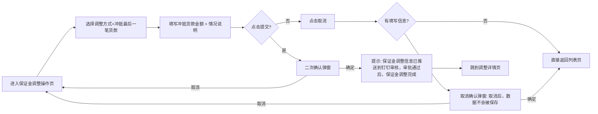

# 02.10.1 保证金调整 v1.7.99.196 终版

> **状态**：v1.7.99.196 终版（**v1.0 基础上 + v1.7.99.196 重构需求描述**）
> **生成时间**：2026-08-07 11:50
> **配套文档**：[00-项目总览与对接.md](../00-项目总览与对接.md) / [01-模块拆解大框架.md](../01-模块拆解大框架.md) / [p-margin-pool.md](./p-margin-pool.md) / [p-margin-adjust-detail.md](./p-margin-adjust-detail.md)
> **当前页**：`margin-adjust.html`（保证金调整操作页）

## 0. 章节导航

1. 业务定位
2. 业务流程全景
3. 3 种调整方式字段定义
4. 字段规则
5. 按钮交互
6. 异常处理
7. 跨模块流转
8. 文档版本

---

## 1. 业务定位

**保证金调整**是保证金管理的核心业务——业务人员按客户/合同维度发起保证金调整，支持 3 种调整方式：
- **冲抵最后一笔货款**（最常用）
- **转移为另外一笔业务的保证金**
- **保证金退款**

### 1.1 入口

| 入口 | URL | 说明 |
|------|------|------|
| 列表操作列"保证金调整"按钮 | `./margin-adjust.html?contractNo={合同编号}` | 主入口 |
| 详情页"调整"按钮 | `./margin-adjust.html?contractNo={合同编号}` | 调整后重提 |

### 1.2 v1.7.99.196 关键改动

- **重写 3 种调整方式字段定义**（按 user 2026-08-07 截图 4/5/6 黄底需求描述）
- **决策依据**（v1.7.99.196）：user 截图明确给出 3 种调整方式的不同字段 + 校验规则 + 操作流程

---

## 2. 业务流程全景

```mermaid
flowchart TB
    A[列表操作列点击"保证金调整"] --> B[进入保证金调整操作页]
    B --> C[选择调整方式]
    C --> D{调整方式?}
    D -->|冲抵最后一笔货款| E1[显示: 当前保证金 + 冲抵货款金额 + 情况说明]
    D -->|转移为另一笔业务| E2[显示: 当前保证金 + 转移金额 + 情况说明 + 选择合同]
    D -->|保证金退款| E3[显示: 当前保证金 + 申请退款金额 + 收款账号 + 退款日期 + 情况说明]
    E1 --> F1[校验: 冲抵金额 <= 当前保证金]
    E2 --> F2[校验: 转移金额 <= 当前保证金 + 关联合同状态=执行中/待上传双签合同]
    E3 --> F3[校验: 申请退款金额 <= 当前保证金 + 收款账号必填]
    F1 --> G[点击提交]
    F2 --> G
    F3 --> G
    G --> H[二次确认弹窗]
    H --> I[提示: 保证金调整信息已推送到钉钉审核]
    I --> J[OA 审核]
    J -->|通过| K[已调整]
    J -->|驳回| L[OA 驳回]
    K --> M[联动: 客户额度 + 敞口比例 + 追保函]
    E3 --> N[OA 通过 → NC 审核 → 实际退款]
    N --> O[回传实际退款时间和金额 → 详情页操作记录 tab]
```

---

## 3. 3 种调整方式字段定义（v1.7.99.196 关键）

### 3.1 调整方式 = 冲抵最后一笔货款（v1.7.99.196 按 user 截图 4）

#### 3.1.1 字段定义

| 字段 | 类型 | 必填 | 默认值 | 校验 |
|------|------|------|--------|------|
| 调整方式 | select | 是 | 冲抵最后一笔货款 | 必填，下拉列表 |
| 当前保证金（元）| input | - | 系统带入 | 灰置文本框，不可更改 |
| 冲抵货款金额（元）| input | 是 | - | 文本框，输入数值；校验：冲抵金额 <= 当前保证金，否则无法调整 |
| 情况说明 | textarea | 是 | - | 文本框，最多 1000 字符 |
| 附件 | upload | 否 | - | 相关凭证附件：非必填，支持上传多个 |

#### 3.1.2 操作流程



#### 3.1.3 弹窗

**取消确认弹窗**：
- 标题：取消确认
- 内容：确定要进行取消操作吗？取消后，数据不会被保存。
- 按钮：取消 / 确定

**提交确认弹窗**：
- 标题：提交确认
- 内容：请确认信息填写完成并提交？提交后，保证金调整信息将推送钉钉进行审核，审批通过后，保证金调整完成。
- 按钮：取消 / 确定

---

### 3.2 调整方式 = 转移为另外一笔业务的保证金（v1.7.99.196 按 user 截图 5）

#### 3.2.1 字段定义

| 字段 | 类型 | 必填 | 默认值 | 校验 |
|------|------|------|--------|------|
| 调整方式 | select | 是 | - | 必填，下拉列表 |
| 当前保证金（元）| input | - | 系统带入 | 灰置文本框，不可更改 |
| 转移金额（元）| input | 是 | - | 文本框，输入数值；校验：转移金额 <= 当前保证金，否则无法调整 |
| 情况说明 | textarea | 是 | - | 文本框，最多 1000 字符 |
| 选择调整后的销售订单（贸易）合同 | modal | 是 | - | 需关联另外一笔业务的销售贸易合同（**状态限制：执行中、待上传双签合同**）|

#### 3.2.2 关联合同选择交互

```mermaid
flowchart LR
    A[进入保证金调整操作页] --> B[选择调整方式=转移为另外一笔业务]
    B --> C[点击"选择销售订单/单批次合同"按钮]
    C --> D[弹窗: 销售合同列表]
    D --> E{选中的合同状态?}
    E -->|执行中/待上传双签合同| F[完成关联]
    E -->|其他状态| G[提示: 该合同状态不支持，请选择执行中或待上传双签合同]
    F --> H[回显新合同信息]
    H --> I[继续填写转移金额 + 情况说明]
    I --> J[点击提交 → 二次确认]
```

#### 3.2.3 关键决策

- **合同状态限制**（v1.7.99.196 关键决策）：仅支持"执行中"或"待上传双签合同"状态的合同——避免转移到一个已完结的合同导致余额错乱
- **回显新合同信息**（v1.7.99.196 决策）：选择合同后，回显该合同的销售订单/单批次合同编号、买方企业、品名等基本信息

---

### 3.3 调整方式 = 保证金退款（v1.7.99.196 按 user 截图 6）

#### 3.3.1 字段定义

| 字段 | 类型 | 必填 | 默认值 | 校验 |
|------|------|------|--------|------|
| 调整方式 | select | 是 | 保证金退款 | 必填，下拉列表 |
| 当前保证金（元）| input | - | 系统带入 | 灰置文本框，不可更改 |
| 申请退款金额（元）| input | 是 | - | 文本框，输入数值；校验：申请退款金额 <= 当前保证金，否则无法调整 |
| 收款账号名称 | select | 是 | - | 下拉选择，**自动带出账号和开户行信息** |
| 收款账号开户行 | input | - | 系统带入 | 灰置 |
| 收款账号 | input | - | 系统带入 | 灰置 |
| 退款日期 | date-picker | 是 | 当前日期 | 日期选择器 |
| 情况说明 | textarea | 是 | - | 文本框，最多 1000 字符 |

#### 3.3.2 关键决策（v1.7.99.196）

- **"申请退款金额" 字段命名**（v1.7.99.196 关键决策）：跟"冲抵货款金额"/"转移金额"区分，单独字段命名
- **"提交"保证金退款"申请后"流程**（v1.7.99.196 关键决策）：
  1. OA 审核通过 → 数据推送 NC
  2. NC 完成打款 → **会回传实际的退款时间和退款金额**
  3. 供应商需在 **"调整记录中（详情页）"** 记录真实的退款时间和金额
  4. **详情页操作记录 tab** 自动回显实际退款时间和金额（NC 推送数据联动）

#### 3.3.3 流程图


---

## 4. 字段规则

### 4.1 通用字段

| 字段 | 规则 |
|------|------|
| 调整方式 | 必填，下拉列表，3 种：冲抵最后一笔货款/转移为另一笔业务/保证金退款 |
| 当前保证金（元）| 系统带入，灰置不可改 |
| 情况说明 | 必填，最多 1000 字符 |
| 附件 | 非必填，可上传多个 |

### 4.2 校验规则

| 调整方式 | 校验 |
|----------|------|
| 冲抵最后一笔货款 | 冲抵金额 <= 当前保证金，否则无法调整 |
| 转移为另一笔业务 | 转移金额 <= 当前保证金 + 关联合同状态=执行中/待上传双签合同 |
| 保证金退款 | 申请退款金额 <= 当前保证金 + 收款账号必填 |

---

## 5. 按钮交互

### 5.1 操作按钮

| 按钮 | 位置 | 行为 |
|------|------|------|
| 取消 | 底部 | 点击取消，如果有填写信息，弹取消确认（"取消后，数据不会被保存"）；如果无信息，直接返回列表页 |
| 提交 | 底部 | 点击进行二次确认，二次确认后，完成提交，**tips 提示**："保证金调整信息已推送到钉钉审核，审批通过后，保证金调整完成" |

### 5.2 辅助按钮

| 按钮 | 位置 | 行为 |
|------|------|------|
| 选择销售订单/单批次合同 | 转移为另一笔业务时 | 弹窗选择合同（仅显示"执行中/待上传双签合同"）|

---

## 6. 异常处理

### 6.1 校验失败

| 场景 | 提示 |
|------|------|
| 冲抵金额 > 当前保证金 | "冲抵金额不能大于当前保证金" |
| 转移金额 > 当前保证金 | "转移金额不能大于当前保证金" |
| 申请退款金额 > 当前保证金 | "申请退款金额不能大于当前保证金" |
| 转移时关联合同状态≠执行中/待上传双签合同 | "请选择执行中或待上传双签合同" |

### 6.2 业务流程异常

| 场景 | 处理 |
|------|------|
| 调整方式=保证金退款，OA 审核通过但 NC 拒收 | 状态=NC 审核中（自动重试 3 次）→ 已作废（人工介入）|
| NC 完成打款但回传金额 > 申请退款金额 | 系统按实际金额调整保证金余额 + 提示"实际退款金额 > 申请金额" |
| NC 完成打款但回传金额 < 申请退款金额 | 系统按实际金额调整保证金余额 + 提示"实际退款金额 < 申请金额" |

---

## 7. 跨模块流转

### 7.1 与 OA 系统联动

- 提交 → 自动推送到 OA → 触发审批流
- OA 审核通过 → 回写状态
- OA 驳回 → 回写状态 + 通知业务人员

### 7.2 与 NC 系统联动（仅保证金退款）

- OA 通过 → 推送 NC → 触发退款流程
- NC 完成打款 → 回传实际退款时间 + 金额 → 详情页操作记录 tab 回显

### 7.3 与客户额度联动

- 保证金调整后 → 触发客户额度重算

### 7.4 与追保函管理联动

- 保证金退款触发后 → 系统生成追保函（如果需要追加保证金）

---

## 8. 文档版本

- **v1.0（2026-07-24 14:55）**：基于 46-48 截图 + sitemap 首次终版，作为范本用于后端开发
- **v1.7.99.x（2026-07-28）**：基于 30+ 版本迭代同步
- **v1.7.99.196（2026-08-07 11:50）**：**重写需求描述**——按 user 2026-08-07 截图 4/5/6 黄底需求重写 3 种调整方式的字段定义、校验规则、操作流程、跨系统联动（OA + NC）——user 反馈"重写对应此部分的 md 需求文档，文档需要参考我给你的截图 4 5 6 7去重写"
修改记录：见 `06-修改记录.md`
