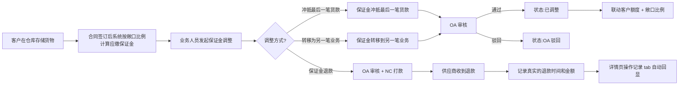
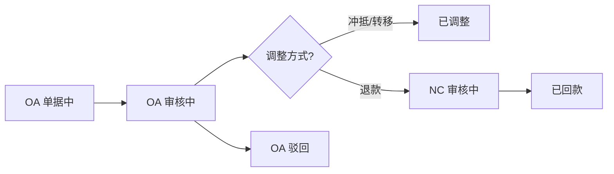

# 02.10 保证金管理 v1.7.99.196 终版

> **状态**：v1.7.99.196 终版（**v1.0 基础上 + v1.7.99.196 重构**）
> **生成时间**：2026-08-07 11:50
> **配套文档**：[00-项目总览与对接.md](../00-项目总览与对接.md) / [01-模块拆解大框架.md](../01-模块拆解大框架.md) / [02.09-追保函管理.md](./02.09-追保函管理.md) / [02.08-盯市价格管理.md](./02.08-盯市价格管理.md) / [p-margin-adjust.md](./p-margin-adjust.md) / [p-margin-adjust-detail.md](./p-margin-adjust-detail.md)
> **复用度**：🟡 **50%（部分复用+新建）**

---

> **当前页**：`margin-pool.html`（保证金管理列表）
> **关联页**：`margin-adjust.html`（保证金调整操作页） / `margin-adjust-detail.html`（保证金调整记录详情页）
> **关联文档**：[p-margin-adjust.md](./p-margin-adjust.md) / [p-margin-adjust-detail.md](./p-margin-adjust-detail.md)

## 0. 章节导航

1. 业务定位
2. 业务流程全景
3. 核心实体（3 张表）
4. 状态机
5. 字段规则
6. 按钮交互
7. 异常处理
8. 跨模块流转

10. 文档版本

---

## 1. 业务定位

**保证金管理**是港通供应链的**客户保证金池管理**（**v1.0 新顶级模块**）——按客户维度管理保证金池，支持保证金调整（追加/扣减/冲抵/转移/退款）和调整记录追溯。

### 1.1 页面清单

| # | 页面 | 文件 | 入口 | 说明 |
|---|--------|------|------|------|
| 1 | **保证金管理（列表）** | `margin-pool.html` | 数字供应链 → 资金管理 → 保证金管理 | 客户保证金池列表 + KPI 卡片 + 调整入口 |
| 2 | **保证金调整（操作）** | `margin-adjust.html` | 列表行"保证金调整"按钮 | 发起保证金调整（3 种调整方式）|
| 3 | **保证金调整记录（详情）** | `margin-adjust-detail.html` | 列表行"查看"按钮 / sidemenu 入口 | 调整记录详情 + 操作记录 tab |

### 1.2 v1.7.99.196 关键改动

- **去掉"调整记录" tab**（原 v1.7.99.67 第 2 个 tab）—— 调整记录从"列表 tab"模式改为"详情页"模式
- **列表操作列加"查看"按钮** —— 路由到 `margin-adjust-detail.html?adjustNo=...`
- **保留"保证金调整"按钮** —— 路由到 `margin-adjust.html?contractNo=...`
- **sidemenu 调整记录入口** —— 改为指向 `margin-adjust-detail.html`（默认显示"已调整"状态那条记录）

---

## 2. 业务流程全景

**v1.7.99.196 关键流程变化**：
- ❌ 旧版：调整记录 = 列表 tab（含 7 字段筛选 + 8 列状态表格）
- ✅ v1.7.99.196：调整记录 = 详情页（tap1 保证金调整信息 + tap2 操作记录 10 条）

---

## 4. 状态机

### 4.1 调整状态机（6 状态）

| 状态 | 触发 | 下一状态 |
|------|------|----------|
| OA 单据中 | 业务提交后自动写入 OA | OA 审核中 / OA 驳回 |
| OA 审核中 | OA 流程启动 | 已调整 / OA 驳回 |
| NC 审核中 | 调整方式=保证金退款 + OA 通过 | 已回款 / 已作废 |
| 已调整 | OA 审核通过 | 终态 |
| OA 驳回 | OA 审核驳回 | 终态（可修改重提）|
| 已回款 | NC 完成打款 + 实际金额回传 | 终态 |
| 已作废 | 业务手动作废 | 终态 |

### 4.2 调整方式 → 状态流转差异

---

## 5. 字段规则

### 5.1 列表页（margin-pool.html）5 数据卡片

| 指标 | 字段 | 示例 |
|------|------|------|
| 付款总金额（元）| `SUM(pay_total)` | 6,378,213.37 |
| 已回款总金额（元）| `SUM(rec_total)` | 6,378,213.37 |
| 敞口金额（元）| `SUM(deposit)` | 7,207,381.19 |
| 当前保证金金额（元）| `SUM(margin)` | 7,207,381.19 |
| 当前保证金比例 | `SUM(margin) / SUM(deposit)` | 17.22% |

### 5.2 列表页筛选（5 字段）

| 字段 | 类型 | 说明 |
|------|------|------|
| 合同编号 | input | 模糊匹配 |
| 企业名称 | input | 模糊匹配 |
| 品名 | input | 模糊匹配 |
| 业务类型 | select | 全部/存货业务/预付业务/账期业务/购销业务 |
| 签订日期 | date-range | 起止日期 |

### 5.3 列表页表格（11 列）

| 列 | 字段 | 宽度 | 说明 |
|----|------|------|------|
| 1 | 销售订单/单批次合同编号 | 10% | 蓝字链接 |
| 2 | 买方企业 | 12% | - |
| 3 | 品名 | 8% | - |
| 4 | 合同数量（吨）| 8% | 右对齐 |
| 5 | 当前比例/合同应缴比例（%）| 10% | 红字显示 |
| 6 | 付款总金额（元）| 9% | 右对齐 |
| 7 | 已回款总金额（元）| 9% | 右对齐 |
| 8 | 敞口金额（元）| 9% | 右对齐 |
| 9 | 保证金金额（元）| 9% | 右对齐 |
| 10 | 合同签订日期 | 8% | - |
| 11 | 操作 | 8% | **v1.7.99.196 加"查看"按钮** |

### 5.4 详情页（margin-adjust-detail.html）字段定义

详见 [p-margin-adjust-detail.md](./p-margin-adjust-detail.md)

---

## 6. 按钮交互

### 6.1 列表页操作列（v1.7.99.196 关键改动）

| 按钮 | 路由 | 说明 |
|------|------|------|
| **查看**（v1.7.99.196 新增）| `./margin-adjust-detail.html?adjustNo=DLXLC-DSRMT-{NNN}` | 跳到该合同对应调整记录详情页（默认显示已调整）|
| **保证金调整** | `./margin-adjust.html?contractNo={合同编号}` | 跳到保证金调整操作页（3 种调整方式）|

**v1.7.99.196 决策**：
- **去掉"调整记录" tab**（v1.7.99.196 关键决策）—— user 2026-08-07 反馈"去掉图 2 中的「调整业务」tap"
- **操作列加"查看"按钮**（v1.7.99.196 关键决策）—— user 2026-08-07 反馈"在列表的操作列，增加「查看」按钮，查看按钮的详情页为图 1"
- **查看按钮的详情页 = margin-adjust-detail.html**（v1.7.99.196 关键决策）—— 详情页 2 tab：保证金调整信息（tap1）/ 操作记录 (10)（tap2）

### 6.2 列表页顶部按钮

| 按钮 | 路由 | 说明 |
|------|------|------|
| 数据导出 | `javascript:void(0)` | 导出当前筛选条件的数据到 Excel（mock）|

---

## 7. 异常处理

### 7.1 状态机异常分支

| 场景 | 处理 |
|------|------|
| 列表行点击"保证金调整"时合同已作废 | 提示"合同已作废，无法调整" |
| 调整方式=转移为另一笔业务，关联合同状态≠执行中/待上传双签合同 | 提示"关联合同状态必须为执行中或待上传双签合同" |
| 调整方式=冲抵最后一笔货款，冲抵金额 > 当前保证金 | 提示"冲抵金额不能大于当前保证金" |
| 调整方式=保证金退款，申请退款金额 > 当前保证金 | 提示"申请退款金额不能大于当前保证金" |

---

## 8. 跨模块流转

### 8.1 与客户额度联动

- 保证金调整后 → 触发客户额度重算 → 客户额度管理列表更新

### 8.2 与敞口比例联动

- 保证金金额变化 → 敞口比例变化 → 触发预警（敞口比例 < 阈值）

### 8.3 与追保函管理联动

- 保证金退款触发后 → 系统生成追保函（如果需要追加保证金）

---

## 10. 文档版本

- **v1.0（2026-07-24 14:55）**：基于 46-48 截图 + sitemap 首次终版，作为范本用于后端开发
- **v1.7.99.67（2026-07-31）**：列表页 11 列 + 5 数据卡片
- **v1.7.99.110（2026-08-04）**：表头"敞口金额"修正
- **v1.7.99.111（2026-08-04）**：业务类型筛选项 5 个 option
- **v1.7.99.195（2026-08-07）**：margin-list.html 重命名为 margin-pool.html（旧版 list-card 卡片式被新版 5 数据卡片覆盖）
- **v1.7.99.196（2026-08-07 11:50）**：**重构**——去掉"调整记录" tab（v1.7.99.67 第 2 个 tab）+ 列表操作列加"查看"按钮（路由到 margin-adjust-detail.html）+ 新增保证金调整记录详情页（2 tab：保证金调整信息/操作记录）+ docs 同步
修改记录：见 `06-修改记录.md`
