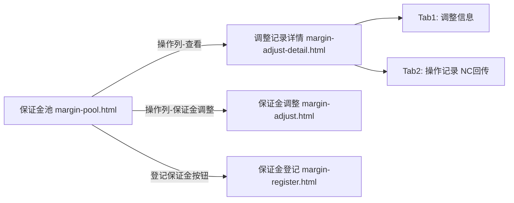

# 02.10.2 保证金调整记录（margin-record.html）— 已废弃

> **状态**：**v1.7.99.196 起此页停用**，由 [p-margin-adjust-detail.md](./p-margin-adjust-detail.md) 取代
> **生成时间**：2026-09-24 12:30（基于飞书《用户使用手册》第 6.4 节沉淀 + 历史页面归档）
> **配套文档**：[00-项目总览与对接.md](../00-项目总览与对接.md) / [p-margin-pool.md](./p-margin-pool.md) / [p-margin-adjust-detail.md](./p-margin-adjust-detail.md) / [v1.7.99-changelog.md](./v1.7.99-changelog.md)
> **来源**：[../pages/margin-record.html](../pages/margin-record.html)（v1.0 时代页面骨架，**实际已停用**）
> **复用度**：🔴 **归档**（v1.7.99.196 起仅 changelog.html 历史引用）

---

> **当前页**：`margin-record.html`（保证金调整记录列表 — **已废弃**）
> **替代页**：`margin-adjust-detail.html`（保证金调整记录详情 — v1.7.99.196 终版，**当前主入口**）

## 0. 章节导航

1. 页面状态说明（v1.7.99.196 起停用）
2. v1.0 时代页面定位（历史归档）
3. v1.7.99.196 替换原因与新模式
4. v1.0 字段规则（历史参考）
5. v1.0 异常处理（历史参考）
6. 迁移指引
7. 文档版本

---

## 1. 页面状态说明

> **本节为 2026-09-24 写入**

**`margin-record.html` 在 v1.7.99.196 重构后已停用**——

| 检查项 | 结果 |
|--------|------|
| `app.html` 主菜单是否引用 | ❌ 否（主菜单指向 `margin-adjust-detail.html`）|
| 任意业务页面是否引用 | ❌ 否（仅 `changelog.html` 历史提及）|
| sidemenu 是否启用 | ❌ 否（v1.7.99.196 起所有页面的侧边菜单"调整记录"入口改指向 `margin-adjust-detail.html`）|
| 当前是否可访问 | ✅ 仅通过 URL 直链打开（已无业务入口）|

**业务影响**：用户已无业务场景触达此页；保留 HTML 文件是为了 changelog 版本对照，不参与日常业务流。

**为什么写这份 PRD**：
- 27 缺口页面之一，本仓库此前无 PRD
- 飞书手册第 6.4 节提到的"调整记录"内容（详见 02.10 第 11.8 节）已落到 `p-margin-adjust-detail.md`
- 本文档作为**历史归档 + 迁移指引**，避免后续维护误以为它是主页面

---

## 2. v1.0 时代页面定位（历史归档）

**保证金调整记录**（v1.0）是保证金管理的**列表页**——按客户维度聚合展示所有保证金调整历史（含追加/扣减/冲抵/追保函触发），供业务人员做月度对账。

### 2.1 v1.0 页面要素

| 维度 | v1.0 设计 |
|------|----------|
| 标题 | 保证金调整记录 |
| 入口 | sidemenu → 资金管理 → 保证金管理 → 调整记录 |
| 顶部按钮 | + 新增保证金调整记录（跳 margin-adjust.html）|
| 筛选字段 | 客户（input 模糊）+ 调整类型（select 追加/减少/全额释放）|
| 状态 tab | 全部 / 已生效 / 已驳回 |
| 表格列 | 调整编号 / 客户 / 调整类型 / 金额 / 调整前余额 / 调整后余额 / 状态 / 调整时间 / 操作 |
| 操作列 | 查看（详情页）|

### 2.2 v1.0 调整类型分类（**已被 v1.7.99.196 重写**）

```javascript
['追加', '减少', '全额释放']
```

> **v1.7.99.196 关键决策**：v1.0 分类不准确——"追加"实际是"保证金**登记**"，"减少"对应 3 种调整方式之一，"全额释放"已被"调整方式=保证金退款（剩余全部）"覆盖。v1.7.99.196 重写为：
> - **保证金登记**（独立页面 `margin-register.html`）
> - **保证金调整**（独立页面 `margin-adjust.html`，含 3 种调整方式：冲抵/转移/退款）
> - **保证金调整记录**（独立页面 `margin-adjust-detail.html`，按合同查看详情）

---

## 3. v1.7.99.196 替换原因与新模式

### 3.1 为什么替换

| v1.0 痛点 | v1.7.99.196 解决方案 |
|-----------|----------------------|
| 列表页+详情页双层跳转，业务人员操作繁琐 | **每条记录都是独立详情页**（margin-adjust-detail.html），点击即展开调整信息 + 操作记录 |
| 调整类型分类不准确（追加/减少/全额释放） | 重写为业务语义清晰的 3 种调整方式 + 独立登记入口 |
| 列表无法体现 OA 审核 / NC 打款实际金额等关键节点 | **详情页 2 tab 模式**：调整信息（基本信息）+ 操作记录（含 NC 实际金额回传）|
| 旧版按客户聚合，无法按合同维度快速定位 | 新版按合同维度（带合同编号、买方企业、品名等关键字段）|

### 3.2 v1.7.99.196 新版模式



**关键决策**：
- **保证金池是核心入口**——所有操作（查看/调整/登记）都从保证金池列表页发起
- **3 个独立页面承载 3 个业务语义**：登记（资金流入）/ 调整（资金流出）/ 详情（追溯）
- **保证金流水**（v1.7.99.x 未来扩展）：可能单独建页面记录每笔资金变动（含手续费/利息等）

---

## 4. v1.0 字段规则（历史参考）

> **本节仅作历史归档参考，不应用于新业务**

### 4.1 筛选字段

| 字段 | 类型 | v1.0 行为 |
|------|------|-----------|
| 客户 | input | 模糊匹配买方/卖方企业名称 |
| 调整类型 | select | 全部 / 追加 / 减少 / 全额释放 |

### 4.2 状态 tab

| Tab | 含义 |
|-----|------|
| 全部 | 所有调整记录（默认）|
| 已生效 | 调整完成 + 保证金池余额已更新 |
| 已驳回 | 调整被审核驳回（含 OA 驳回、NC 拒收）|

### 4.3 表格列（v1.0）

| 列 | 字段 | 备注 |
|----|------|------|
| 1 | 调整编号 | DLXLC-DSRMT-{NNN}（v1.0 命名） |
| 2 | 客户 | 客户名称 |
| 3 | 调整类型 | 追加/减少/全额释放 |
| 4 | 金额 | 调整金额（元）|
| 5 | 调整前余额 | 调整前保证金余额 |
| 6 | 调整后余额 | 调整后保证金余额 |
| 7 | 状态 | 已生效/已驳回 |
| 8 | 调整时间 | 调整提交时间 |
| 9 | 操作 | 查看（跳详情页 v1.0）|

---

## 6. 迁移指引

| v1.0 场景 | v1.7.99.196 替代 |
|-----------|------------------|
| 查"某客户的所有保证金调整" | 保证金池 `margin-pool.html` → 该行"查看"按钮 → `margin-adjust-detail.html`（按合同维度，**不是按客户汇总**）|
| 发起"追加保证金" | 保证金池抽屉 → "登记保证金" → `margin-register.html`（独立页面）|
| 发起"减少保证金（冲抵/转移/退款）" | 保证金池 → "保证金调整" → `margin-adjust.html`（独立页面）|
| 看"全额释放"历史 | 保证金池 → 该合同 → `margin-adjust-detail.html` 操作记录 tab |

> **业务用户切换建议**：把 `margin-record.html` 加进浏览器书签已无意义；改用 `margin-pool.html` + 各详情/操作页组合。

---

## 7. 文档版本

- **v1.0（2026-07-24）**：`margin-record.html` 首次终版（基于原型截图 46-48），列表+详情双层模式
- **v1.7.99.196（2026-08-07）**：保证金模块重构，"调整记录"模式从列表改为详情页，本页**停用**
- **2026-09-24**：首次写 PRD（基于飞书《用户使用手册》第 6.4 节 + 现状盘点），定位为**历史归档文档**

修改记录：见 `v1.7.99-changelog.md`