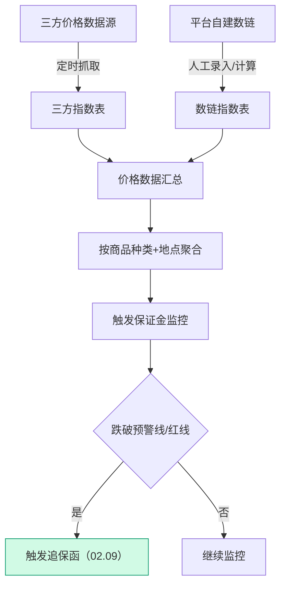

# 02.08 盯市价格管理 v1.0 终版

> **状态**：v1.0 终版（**新模块，基于原型 56-57 截图**）
> **生成时间**：2026-07-24 14:55
> **配套文档**：[00-项目总览与对接.md](../00-项目总览与对接.md) / [01-模块拆解大框架.md](../01-模块拆解大框架.md) / [02.09-追保函管理.md](./02.09-追保函管理.md)
> **复用度**：🟢 **90%（几乎零改造）**——主产品 `t_xxx（业务实体）` + `t_xxx（业务实体）` + `t_xxx（业务实体）` 高度匹配

---

> **当前页**：`market-price-detail.html`
> **文档状态**：基于源模块文档的占位版，精确字段待 review 后按原型图精修

## 0. 章节导航

1. 业务定位
2. 业务流程全景
3. 核心实体（3 张表）
4. 状态机
5. 字段规则
6. 按钮交互
7. 异常处理
8. 跨模块流转

10. v1.7.99.136 改造记录（**指标详情 2 tap**）

---

## 1. 业务定位

**盯市价格管理**是港通供应链的**价格监控中心**（**v1.0 新顶级模块**）——监控煤炭/木薯淀粉/糖粉等大宗商品的市场价格，触发追保函 + 保证金预警。

**港通特色**——对接"我的钢铁网/煤炭网"等三方价格指数 + 平台自建数链指数。

### 1.1 关键规则

1. **2 大数据源**（基于 56 截图）：
   - **三方指数**（公开）：BSP 环渤海 / CCI 沿海动力煤 / CCI 动力煤现货 / CCI 焦炭价格 / CCI 冶金煤 / CCTD 环渤海
   - **数链指数**（平台自建）：秦皇岛煤炭网 / 中国煤炭网 / 中国煤炭市场网 / 中国电力... / 我的钢铁网 / 全国煤炭交...
2. **3 视图模式**（基于 56 截图）：
   - **看板模式**（默认）
   - **列表模式**
   - **趋势对比模式**
3. **3 商品种类**：动力煤 / 炼焦煤 / 水泥煤 / 铁矿石 / 焦炭 / 兰炭（v1.0 待确认 6 种）
4. **6 对应地点**：全部 / 北方港 / 华东 / 华南 / 巴彦淖尔 / 其他
5. **价格走势**：每个指数卡片显示最新价 + 日更新 + 变化值 + 趋势图

### 1.2 2 个页面（sitemap）

| # | 页面 | 说明 |
|---|------|------|
| 1 | **盯市价格管理**（列表 + 3 视图）| 看板/列表/趋势对比 + 6 品类 + 6 地点筛选 |
| 2 | **指标详情** | 单个指数的历史价格走势 + 详情 |

---

## 2. 业务流程全景

### 2.1 价格数据采集流程



---

## 4. 状态机

盯市价格管理**无业务状态机**——是数据展示模块，不涉及审批/状态流转。

---

## 5. 字段规则

### 5.1 指数来源 `index_source`（基于 56 截图）

- 2 种：`third_party`（三方指数）/ `data_chain`（数链指数）

### 5.2 商品种类 `product_xxx`（基于 56 截图）

- 6 种：**动力煤** / **炼焦煤** / **水泥煤** / **铁矿石** / **焦炭** / **兰炭**
- **v1.0 标 [P0 待确认-业务]**：6 种是否完整？

### 5.3 对应地点 `region`（基于 56 截图）

- 6 种：**全部** / **北方港** / **华东** / **华南** / **巴彦淖尔** / **其他**

### 5.4 价格变化

- **变化值** `change_value`：最新价 - 昨日价
- **变化百分比** `change_pct`：变化值 / 昨日价 × 100%
- 颜色：红涨/绿跌

---

## 6. 按钮交互

### 6.1 列表页（基于 56 截图）

| 按钮 | 位置 | 可见条件 | 点击行为 |
|------|------|---------|---------|
| **看板模式** | 顶部 | 所有 | 切换到看板视图（默认）|
| **列表模式** | 顶部 | 所有 | 切换到列表视图 |
| **趋势对比模式** | 顶部 | 所有 | 切换到趋势对比视图 |
| 数据源筛选 | 左侧 | 所有 | 按 三方指数/数链指数 筛选 |
| 指数名称搜索 | 左侧 | 所有 | 模糊搜索 |
| 品类筛选 | 左侧 | 所有 | 按 6 品类 筛选 |
| 地点筛选 | 左侧 | 所有 | 按 6 地点 筛选 |
| **指标详情** | 卡片 | 所有 | 跳指标详情页 |

### 6.2 看板模式（默认，基于 56 截图）

- 3 列卡片布局
- 每个卡片显示：
  - 指数名称（例：CCI 北海动力煤价格）
  - 价格（元/吨 日更新）
  - 变化值（例：+8.00）
  - 变化百分比（例：+1.31%）
  - 趋势图（红/绿）
- 鼠标悬停显示详细数据

### 6.3 列表模式

- 表格布局
- 列：指数名称 / 最新价 / 变化值 / 变化百分比 / 更新时间 / 操作

### 6.4 趋势对比模式

- 多指数对比
- 选 2-4 个指数叠加显示

---

## 7. 异常处理

| 异常场景 | 提示文案 | 处理动作 |
|---------|---------|---------|
| 三方指数抓取失败 | "三方指数抓取失败，请联系管理员" | 重试 + 邮件通知 |
| 数据源价格缺失 | "指数 XXX 在 YYYY-MM-DD 无数据" | 标记为"暂无数据" |
| 指数变化异常（>20%）| "指数 XXX 变化异常（+25%），请人工确认" | 黄灯提醒 |
| 多个数据源价格不一致 | "三方指数与数链指数价格差异 >5%" | 黄灯提醒 |

---

## 8. 跨模块流转

### 8.1 上游触发

| 触发模块 | 触发条件 | 触发动作 |
|---------|---------|---------|
| 三方价格 API | 定时抓取 | 写入三方指数表 |
| 数链价格管理 | 人工录入/计算 | 写入数链指数表 |

### 8.2 下游触发

| 触发模块 | 触发条件 | 触发动作 |
|---------|---------|---------|
| **追保函管理（02.09）**| 指数跌破预警线/红线 | 触发追保函 |
| **保证金管理（02.10）**| 保证金率变化 | 更新保证金监控 |
| **预警中心（02.11）**| 价格波动 | 触发价格波动预警 |

---

## 10. v1.7.99.136 改造记录（**指标详情 2 tap**）

**改造时间**：2026-08-05
**触发**：user 2026-08-05 反馈"盯市价格详情页原型完全不对，要按 user 图 2 + 图 3 1:1 重制"——基于 user 提供的 2 张图（图2 tap1 指数趋势 / 图3 tap2 指数数据）
**部署**：`pages/market-price-detail.html`（19944 bytes 完全重写，2 次部署 `c902a5e8` → `1502829a`）

### 10.1 改造范围

| 页面 | 改造前 | 改造后 |
|------|--------|--------|
| `market-price-detail.html` | v1.7.7 占位版（标题 + 简单信息）| **完全重制**——指标详情 + 2 tap（指数趋势 / 指数数据）|

### 10.2 页面整体结构

```
┌─ 面包屑：数字供应链 / 盯市价格管理 / 指标详情
├─ 标题区：h1 "指标详情"
├─ tap bar：指标趋势（默认）| 指标数据
└─ 单一 tap panel
   ├─ Tap 1 指数趋势（默认）
   │  ├─ 指数名 + (日更新) (单位: 元/吨)
   │  ├─ 3 meta chip（数据来源/品种/区域）
   │  ├─ 6 对比卡片（最新价格 + 5 对比维度）
   │  ├─ 大趋势图（双 Y 轴 + 26 数据点 + 缩略图）
   │  └─ 返回按钮
   └─ Tap 2 指数数据
      ├─ 表格：指标日期 / 指标价格 / 单位
      ├─ 10 行 mock
      └─ 分页（共有 63 条信息 + 1/7 页 + 10 条/页 + 跳至 N 页）
```

**v1.7.99.136 重要修复**：`c902a5e8` 第一次部署时 tap 2 内部多了一个重复的 tap bar，**`1502829a` 第二次部署删除重复 tap bar，只保留顶部 1 个 tap bar**

### 10.3 Tap 1 指数趋势（基于 user 图 2）

**指数名 + 元信息**：
- `CCTD 环渤海动力煤现货参考价: 4500K`（大粗体）
- `(日更新) (单位: 元/吨)`（灰色副标题）

**3 meta chip**：
- 数据来源：中国煤炭市场网
- 品种：动力煤
- 区域：北方港

**6 对比卡片**：

| 卡片 | 值 | 增减 |
|------|----|----|
| 最新价格 | 788.00 | ¥ 图标 |
| 对比上期 | +1.41% | +11.00（红）|
| 对比月初 | +4.37% | +33.00（红）|
| 对比上月同期 | +19.39% | +128.00（红）|
| 对比上月同期 | 0.00 | —（灰）|
| 对比年初 | 0.00 | —（灰）|

**大趋势图 SVG**（**v1.7.99.136 核心创新**）：
- **双 Y 轴**：左侧价格（538.80 / 588.90 / 639.00 / 689.10 / 739.20 / 789.29 / 839.39）+ 右侧涨跌幅（-15.68% / -7.84% / 0 / 7.84% / 15.68% / 23.52% / 31.36%）
- **26 个数据点**（639 ~ 788）覆盖 2023-05-30 ~ 2023-10-08
- **红色折线 + 渐变填充**（linearGradient 红色从 #FEE2E2 → 透明）
- **X 轴日期**：2023-05-30, 2023-06-05, 2023-06-09, ... 2023-10-08
- **inline SVG path + linearGradient**（不依赖 ECharts / Chart.js）

**缩略图**：底部 32px 高的缩略图，显示完整数据趋势（蓝色单色）

**返回按钮**：居中底部 → 跳回 `market-price.html`

### 10.4 Tap 2 指数数据（基于 user 图 3）

**3 列表格**：
- 指标日期（width 60%）
- 指标价格（width 30%）
- 单位

**10 行 mock**：

| 指标日期 | 指标价格 | 单位 |
|----------|---------|------|
| 2023-10-09 | 788 | 元/吨 |
| 2023-10-08 | 777（高亮蓝）| 元/吨 |
| 2023-10-07 | 755 | 元/吨 |
| 2023-09-28 | 747 | 元/吨 |
| 2023-09-27 | 747 | 元/吨 |
| 2023-09-26 | 750 | 元/吨 |
| 2023-09-25 | 755 | 元/吨 |
| 2023-09-22 | 759 | 元/吨 |
| 2023-09-21 | 769 | 元/吨 |
| 2023-09-20 | 760 | 元/吨 |

**分页**：
- 共有 63 条信息
- 1 / 2 / 3 / 4 / 5 / 6 / 7 页（当前 1 页 active 蓝）
- 10 条/页
- 跳至 N 页

### 10.5 与 v1.7.99.7 占位版的差异

| 项 | v1.7.99.7 占位版 | v1.7.99.136 |
|----|------------------|-------------|
| 页面 | 简单详情页 | **完全重制** = 2 tap（指数趋势 + 指数数据）|
| 趋势图 | 无 | **双 Y 轴大趋势图 + 缩略图**（inline SVG）|
| 对比卡片 | 无 | **6 对比卡片**（最新价 + 5 对比维度）|
| 数据表 | 无 | **10 行 + 分页** |

### 10.6 后续待办

- 列表模式实施（v1.7.99.136 占位）
- 趋势对比模式实施（v1.7.99.136 占位）
- 详情页 URL 参数驱动实际数据（v1.7.99.136 占位）
- 详情页 6 对比卡片按 URL 参数动态化（v1.7.99.136 占位）
- 详情页 10 行数据按 URL 参数动态化（v1.7.99.136 占位）

---

## 11. 文档版本

- **v1.0（2026-07-24 14:55）**：基于 56 截图 + sitemap 首次终版，作为范本用于后端开发
- **v1.7.99.136（2026-08-05）**：盯市价格详情页完全重制（2 tap：指数趋势 + 指数数据）
- **v1.7.99.x（2026-07-28）**：基于 30+ 版本迭代同步
  - 🟡 列表页占位 = "全部"（全站统一）
  - 🟡 状态 tag 颜色编码
  - 🟡 流程图统一用 Mermaid
  - 详见：[v1.7.99-changelog.md](./v1.7.99-changelog.md)
修改记录：见 `06-修改记录.md`