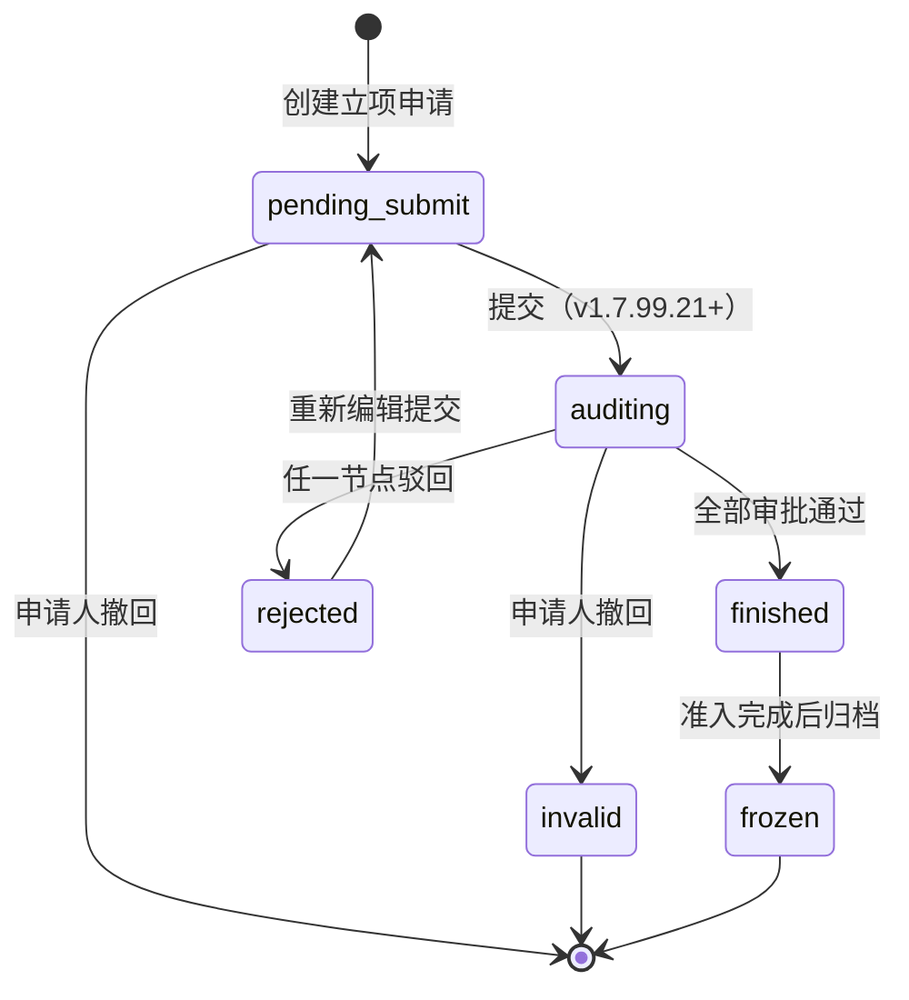

# 02.01 项目管理-立项 · 项目准入详情

> 4 Tab + 附件 · 5 节点审批 · 3 角色场景 · 详情只读 · 钉钉 OA 外部系统集成

## 0. 元信息
当前页：`project-detail.html`
版本：v1.5.2（**v1.7.99.106**：5 Tab → 4 Tab + 附件 / 删「准入意见」+「审批记录」→ 合并为「审批准入」/ 完成后变「审批准入详情」/ 4 角色 URL 参数动态渲染 / **v1.7.99.105**：sidemenu 一级菜单「风险运营管理」已删除 / **v1.7.99.13**：全站命名统一「立项申请」/ 状态命名「审批中」/ **v1.7.99.11**：状态 tag 动态化 + 去除返回按钮）
入口：项目列表点击行（带 `?status=xxx&role=yyy&tab=N`）/ 立项提交后跳转 / 钉钉 OA 通知回跳

> **v1.7.99.106 变更**（**v1.7.99.106 重点改造**）：
> - **5 Tab → 4 Tab + 附件**：删原 Tab 4「准入意见」+ Tab 5「审批记录」，**合并为新 Tab 4「审批准入」**（5 节点审批 time-line + 关键指标 + 实时活动 + 催办卡）
> - **完成后 Tab 4 名称动态变「审批准入详情」**（按 user 需求：未完成审批时显示「审批准入」，完成后变「审批准入详情」）
> - **3 角色 URL 参数场景**（**v1.7.99.106 关键决策**：单一 HTML + URL 参数动态渲染，避免新建多页）：
>   - `?status=审批中&role=applicant-submit&tab=3` → 客户股权关系 active + 步骤3未发起 + **底部"提交审批"蓝主按钮**
>   - `?status=审批中&role=applicant&tab=4` → 审批准入 active + 步骤3已发起 + **顶部"撤回申请"按钮 + 底部"查看详情"只读**
>   - `?status=审批中&role=approver&tab=4`（默认） → 审批准入 active + 步骤3进行中 + **底部"审批通过"+"驳回审批"按钮**
>   - `?status=已完结&tab=4` → 审批准入详情 active + **底部"复制为新项目"+"返回"（只读）+ Tab 5 附件显示**
> - **顶部黄底提示 + 撤回申请按钮**（仅 approving-applicant 和 approving-approver 场景显示）
> - **v1.7.99.74 沿用**：执行中/已完结状态下，4 步骤第 4 步变 completed + Tab 5 附件显示
>
> **v1.7.99.105 变更**：
> - sidemenu 一级菜单「风险运营管理」删除（topnav-drawer.js line 159-163 删 5 行）—— topbar 110 个 HTML 保留不动（按 v1.7.99.86 经验"不修改其他模块页面"）
>
> **v1.7.99.13 变更**：
> - 立项申请相关命名统一：「新增立项准入」→「**新增立项申请**」（全站 42 个手写 sidemenu + app.html pageTree 全部修复）
> - 状态命名统一：「审核中」→「**审批中**」（与列表页 v1.7.99.12 命名一致）
> - 详情页命名保留「项目准入详情」（按用户拍板，全站统一）
>
> **v1.7.99.11 变更**：
> - 顶部项目名称前的状态 tag 改为**动态**（从 URL `?status=xxx` 读取，颜色按状态映射）
> - 顶部项目名称后的"< 返回"按钮**去除**（按 v1.7.96 详情页自嗨禁止原则：详情页不加业务变更按钮）

## 1. 用户旅程图
从项目列表点行进入 → 顶部信息卡+4 步骤条+5 Tab 切换 → 推进到下一节点（仅审核员） / 撤回申请（仅发起人） → 返回列表

## 2. 角色操作矩阵

| 角色 | 查看 | 切换企业 | 推进节点 | 撤回申请 | 录入意见 | 立即催办 |
|------|------|---------|---------|---------|---------|---------|
| 业务部负责人（张爽）| ✅ | ✅ | ❌ | ✅（仅本人提交）| ✅（待审时）| ❌ |
| 风控部负责人（王浩）| ✅ | ✅ | ✅（二级会签）| ❌ | ✅（会签时）| ✅ |
| 财务总监（宋美玲）| ✅ | ✅ | ✅（二级会签）| ❌ | ✅（会签时）| ❌ |
| 平台总经理（李娜）| ✅ | ✅ | ✅（三级审批）| ❌ | ✅（待审时）| ✅ |
| 平台运营 | ✅ | ✅ | ❌ | ❌ | ❌ | ✅ |

## 3. 顶部信息卡
- **左**：审批中 tag（v1.7.99.13 起，动态从 URL `?status=` 读取）+ 项目标题 + 6 字段 info-grid（创建人/项目周期/创建时间/业务类型/货物品类/预计年销售额）
- **右**：选择企业下拉（可切换已立项企业）+ 项目编号（可复制）

## 4. 4 步骤条（带时间戳）
1. 项目信息录入 → 2. 企业尽调报告 → 3. 提交审批（进行中）→ 4. 准入完成
- 已完成：蓝勾 + 时间戳
- 进行中：蓝圆 + "进行中" 蓝字
- 待开始：灰圆 + 数字
- 驳回/作废态：顶部红色/灰色横幅 + 步骤条不展开（只读）

## 5. 5 Tab 详细说明

### 5.1 Tab 1：企业信息
- 6 列 info-table，14 字段
- 字段：企业名称/客户类别（tag）/国家/注册地址/统一社会信用代码/省份/成立日期/经营期限（止）/法定代表人/联系人姓名/负责人姓名/负责人电话/联系人电话/经营范围/联系人邮箱/注册资本/实缴资本
- 统一社会信用代码格式：91XXXXXXMAXXXXXXXX（脱敏）
- 电话格式：138 0000 XXXX（脱敏）
- 邮箱格式：xxx@example.com

### 5.2 Tab 2：风险扫描结果 ✅（v1.4.1 修复）
- **顶部 meta**：扫描时间 + 8 项扫描 + 1 项风险（红色 tag）
- **8 项扫描项**（统一结构：编号圆 + 项名 + 描述 + 状态 tag）：
  1. 合作黑名单 - 暂无风险（绿）
  2. 假国央企 - 暂无风险（绿）
  3. 失信被执行人信息 - 暂无风险（绿）
  4. 被执行人信息 - 暂无风险（绿）
  5. **限制消费令信息** - 暂无风险（绿）+ 整行**浅蓝背景**（`var(--color-primary-lighter)` `#EFF6FF`）区分提示
  6. 终本案件 - 暂无风险（绿）
  7. 税收违法信息 - 暂无风险（绿）
  8. **行政/工商违法处罚信息** - 风险提示（红）+ 整行浅红背景 + 数字 8 红圈 + 描述红字 + 关键日期"2022-12-01"**黄底 mark**（`#FEF3C7` + `#92400E` 文字）
- 描述统一话术："截至 {时间}，该企业不存在上述负面信息。不排除因信息公开来源尚未公开、公开形式存在差异等情况导致的信息与客观事实不完全一致的情形。"
- 风险项描述话术："该企业在 {日期} 因「{违法事实}」存在 {处罚类型} {金额}，并已足额缴纳罚款。"
- tab 标签：`<div class="tab" data-tab="2">风险扫描结果 <span style="color: var(--color-danger);">（{N}项风险）</span></div>`

### 5.3 Tab 3：客户股权关系 ✅（v1.4.1 修复）
- **顶部**：客户股权关系 + 数据来源：天眼查
- **股东信息**（section，蓝色左竖条 `subsection-title::before`）：
  - 字段：股东 / 持股比例 / 认缴出资日期
  - 大股东多重身份 tag：
    - 大股东 - 蓝底（`tag-blue`）
    - 实际控制人 - 紫底（`tag-purple`）
    - 最终受益人 - 黄底（`tag-yellow`）
  - 持股比例 > 50% 显示蓝字（`var(--color-primary)` + 600 weight）
- **对外投资（N 家）**（section，蓝色左竖条）：
  - 字段：被投资企业名称 / 被投资法定代表人 / 注册资本 / 投资数额 / 投资占比 / 注册时间 / 状态
  - 状态 tag：存续（绿 `tag-green`）/ 注销（灰 `tag-gray`）
  - 投资数额可能为 "—"（占位符）

### 5.4 Tab 4：审批准入 ✅（v1.7.99.106 新增：合并原 Tab 4 准入意见 + Tab 5 审批记录）
> **v1.7.99.106 关键改造**：删原 Tab 4「准入意见」+ Tab 5「审批记录」→ **合并为新 Tab 4「审批准入」**（5 节点审批 time-line + 关键指标 + 实时活动 + 催办卡）——**v1.7.99.106 决策锁定**：单 tab 内同时承载"审批进度展示 + 审批人操作 + 申请人撤回"全部能力
> **完成后 Tab 4 名称动态变「审批准入详情」**（按 user 需求：未完成审批时显示「审批准入」，完成后变「审批准入详情」——v1.7.99.106 决策锁定）

- **顶部状态卡**（黄渐变背景 `#FFFBEB→#FEF3C7`，**v1.7.99.106 沿用 v1.4.1 沿用**，**仅 approving-applicant 和 approving-approver 场景显示**）：
  - ⏳ 图标 + 标题（"审批进行中" + "待审批"黄 tag + "外部 OA 系统"蓝 tag）
  - 描述："{公司名} · 准入申请 {ADM-编号} 已提交至外部审批系统，当前在「{当前阶段}」阶段（已 {1/2} 通过）。"
  - 3 列元信息：申请编号 / 提交时间 / 预计完成
  - **「撤回申请」红按钮**（v1.7.99.106 决策：**仅 approving-applicant 场景显示**——申请人发起审批后，在第一级审批人未处理时可撤回，审批人进入处理后不可撤回）
- **左侧：审批进度 time-line**（5 节点，**v1.7.99.106 沿用 v1.4 沿用**）：
  1. ① 提交申请 [已完成] - 提交人 + 时间 + 附件数
  2. ② 一级审批·业务部 [已通过] - 审批人 + 意见（绿底）+ 历时
  3. ③ 二级会签·风控部+财务部 [进行中 1/2] [会签 OR]
     - 会签规则：任一人通过即通过（OR）；全部驳回则驳回
     - 子节点：王浩（已通过）+ 宋美玲（审批中·已读）
  4. ④ 三级审批·总经理 [待开始] - 需二级会签通过后自动触发
  5. ⑤ 准入完成 [待开始] - 三级审批通过后自动归档
- **右侧：3 卡**（**v1.7.99.106 沿用 v1.4 沿用**）：
  1. **关键指标**：当前节点 / 剩余节点 / 已耗时 / 预计完成 / 外部系统 = **钉钉 OA ↗**（v1.4.1 修复，原"致远 A8 OA"）
  2. **实时活动**（最近 24h，6 条）：查看了/通过了/催办/已自动@/提交了
  3. **催办卡**（黄底）："{审批人} 已 2 小时未处理" + 建议催办 + 立即催办橙色按钮
- **v1.7.99.106 3 角色场景**（按 URL `?status=xxx&role=yyy` 动态渲染）：
  - **pending-submit 场景**（`status=审批中&role=applicant-submit`）：步骤3未发起 + 申请人视角 → **客户股权关系 active** + 底部"提交审批"蓝主按钮（**v1.7.99.106 决策**：步骤3未发起时**不进入审批准入 tab**，让申请人先看完客户股权关系再决定提交）
  - **approving-applicant 场景**（`status=审批中&role=applicant`）：步骤3已发起 + 申请人视角 → **审批准入 active** + 顶部"撤回申请"按钮（**v1.7.99.106 决策**：申请人发起审批后，在第一级审批人未处理时可撤回） + 底部只读"查看详情"（**v1.7.99.106 决策**：申请人无审批权限）
  - **approving-approver 场景**（`status=审批中&role=approver`，默认）：步骤3进行中 + 审批人视角 → **审批准入 active** + 底部"审批通过"（蓝主按钮）+"驳回审批"（红边按钮，**v1.7.99.106 决策**：审批人可处理）
  - **done 场景**（`status=已完结`，**Tab 4 名称变"审批准入详情"**）：**审批准入详情 active** + 底部"复制为新项目"+"返回"（**v1.7.99.106 决策**：只读，不可操作）

### 5.5 Tab 5：附件 ✅（v1.7.99.74 沿用，v1.7.99.106 按 status 动态显示）
- **v1.7.99.74 沿用**：附件功能保留不动
- **v1.7.99.106 调整**：Tab 5 附件**仅在已完结/执行中场景显示**（pending-submit / approving-applicant / approving-approver 场景不显示附件 tab——**v1.7.99.106 决策**：审批中阶段不需要附件 tab）

## 6. 底部操作栏（v1.7.99.106 4 角色场景动态渲染）
> **v1.7.99.106 关键决策**：底部按钮按 status + role 动态渲染 4 场景——**单一 HTML + URL 参数**，避免新建多页

- **场景 A：pending-submit**（`status=审批中&role=applicant-submit`，步骤3未发起 + 申请人视角）：
  - 导出详情 / 复制为新项目 / **返回**（白底蓝边） / **提交审批**（蓝主按钮，右下角）
- **场景 B：approving-applicant**（`status=审批中&role=applicant`，步骤3已发起 + 申请人视角）：
  - 导出详情 / 复制为新项目 / **查看详情**（**v1.7.99.106 决策**：申请人无审批权限，底部只读——**不**提供"审批通过/驳回审批"）
  - 顶部"撤回申请"按钮（v1.7.99.106 决策：**仅本场景显示**——申请人发起审批后，在第一级审批人未处理时可撤回）
- **场景 C：approving-approver**（`status=审批中&role=approver`，步骤3进行中 + 审批人视角，默认）：
  - 导出详情 / 复制为新项目 / **审批通过**（蓝主按钮） / **驳回审批**（红边按钮）
- **场景 D：done**（`status=已完结`，**Tab 4 名称变"审批准入详情"**）：
  - 导出详情 / 复制为新项目 / **返回**（**v1.7.99.106 决策**：已完结只读，不可操作）

- **不提供**创建/调整/解除等业务变更按钮（按 v1.7.96 详情页规则）

## 7. 状态机

### 7.1 状态机流程图



### 7.2 状态机文字说明

```
pending_submit (待提交)
  ↓ 提交
auditing (审核中)
  ├─→ finished (已完结) ← 全部审批通过
  ├─→ rejected (驳回) ← 任一节点驳回
  └─→ invalid (作废) ← 申请人撤回
frozen (已冻结) ← 准入完成后归档
```

### 7.3 详情页规则（v1.7.96 锁定）

- ❌ **不提供创建/调整/解除等业务变更按钮**
- ✅ **只允许跳关联单据/复制/附件下载**
- ✅ 详情页按钮位置/颜色/疏密 OK
- ❌ 擅自加业务按钮/字段/角色

### 7.4 详情字段

- ✅ **项目管理列表页重做**：详情页带 status 参数渲染
- ✅ **项目小组成员必填同步**：详情页展示小组成员
- ✅ **项目小组成员位置**：基本信息下方

## 8. 异常处理
- **驳回态**：顶部红色横幅（驳回方/节点/原因）+ 步骤条不展开
- **作废态**：顶部灰色横幅（作废时间/原因）+ 步骤条不展开
- **节点超时**：催办卡高亮 + 立即催办按钮
- **切换企业 loading**：tab 内容区显示 skeleton
- **风险扫描中**：tab 2 meta 显示 "扫描中..."
- **已冻结只读**：所有操作按钮 disabled

## 9. 上下游触发
- **进入**：列表点击行 / 申请提交后跳转 / 钉钉 OA 通知回跳（`?tab=5&from=dingtalk`）
- **离开**：返回（项目列表）/ 切换企业（重置 tab 1-5）/ 审批跳转（关闭并跳到对应单据）

## 10. URL 路由（v1.7.99.106 加 status + role 参数）
- `?tab=1` ~ `?tab=4` 直接进入指定 tab（默认 tab 1，**v1.7.99.106 改 5 tab → 4 tab + 附件**）
- **`?status=审批中&role=applicant-submit&tab=3`** → pending-submit 场景（**v1.7.99.106 新增**）
- **`?status=审批中&role=applicant&tab=4`** → approving-applicant 场景（**v1.7.99.106 新增**）
- **`?status=审批中&role=approver&tab=4`**（默认）→ approving-approver 场景（**v1.7.99.106 新增**）
- **`?status=已完结&tab=4`** → done 场景，Tab 4 名称动态变"审批准入详情"（**v1.7.99.106 新增**）
- `?status=xxx` 单参数：仅动态化状态 tag 颜色（**v1.7.99.11 沿用**）
- 与 app.html 三栏联动：右侧文档自动切到本文档
- 与 project-list.html 联动：列表页"查看"操作按 row.status 拼 `?no=xxx&status=yyy` 跳转（**v1.7.99.106 新增**——`pages/project-list.html` line 357 + 367 + 408）

## 12. v1.4 关键变更
- v1.4（2026-07-27）
  - Tab 1 包裹到 `<div id="tab1Content">`
  - 新增 Tab 2 风险扫描（8 项 + 5 项浅蓝 + 8 项红字 + 黄底 mark）
  - 新增 Tab 3 客户股权关系（股东 + 3 tag + 5 家对外投资）
  - 新增 Tab 4 准入意见（录入区 + 当前操作人 + 历史意见 2 条）
  - 新增 Tab 5 审批记录（5 节点 time-line + 关键指标 + 实时活动 + 催办卡）
  - 外部系统：致远 A8 OA → **钉钉 OA**（v1.4.1）
- v1.4.1（2026-07-27 紧急修复）
  - **CSS 共享**：把 `.risk-item` / `.risk-num` / `.risk-status` / `.risk-warn` / `.risk-count-warn` / `.subsection-title` 从 `project-apply.html` inline style 搬到 `design-system.css` 全局共享
  - 根因：v1.4 部署时这些 CSS 只在 `project-apply.html` 内，详情页没引用导致**完全没有样式**
  - 同步删除 `project-apply.html` 中重复的 inline CSS
  - Tab 2 8 号风险项关键日期 "2022-12-01" 加黄底 mark 强调
### v1.7.99.x（2026-07-28）

- 🟡 详情页规则（v1.7.96 锁定）
- 🟡 项目管理列表页重做（v1.7.99.11）
- 🟡 项目小组成员必填同步（v1.7.99.26）
- 🟡 项目小组成员位置（v1.7.99.27）
- 🟡 状态机加"待提交"（v1.7.99.21）

---

## 14. v1.7.99.105 改造子章节（sidemenu 一级菜单「风险运营管理」删除）

### 14.1 改造背景（v1.7.99.105）

**v1.7.99.13 占位版** sidemenu 一级菜单包含「风险运营管理」group（subMenus: [] 空 group）——按 user 需求删除该 group。

### 14.2 主要变化（v1.7.99.105）

- **删 sidemenu 一级菜单「风险运营管理」**：`shared/js/topnav-drawer.js` line 159-163 删 5 行（'风险运营管理' group + subMenus: [] 空 group）
- **topbar 110 个 HTML 保留不动**（v1.7.99.105 决策：sidemenu 改不影响 topbar，避免 110 个文件批量改——按 v1.7.99.86 经验"不修改其他模块页面"）
- **risk-operations.html 文件保留**（v1.7.99.105 决策：只删 sidemenu 入口，保留 HTML 文件，避免误删）

### 14.3 触发模式 / 适用场景

- 任何 "sidemenu 一级菜单删除" → **只改 topnav-drawer.js 1 个 group 删 5 行**（v1.7.99.105 经验：sidemenu 是 JS 渲染，单点修改即可，**别动 topbar HTML**）
- 任何 "sidemenu 删除但 HTML 文件保留" → **保留原 HTML 文件不删**（v1.7.99.105 经验：避免误删，万一以后再加回来用）
- 任何 "v1.7.99.105 sidemenu 现状" → 3 个二级菜单（项目准入 / 客户准入 / 黑名单管理）——其他 group（仓储管理 / 数据中心 / 预警中心 / 账户中心）不变

### 14.4 变更文件

- `shared/js/topnav-drawer.js`（line 159-163 删 5 行）

### 14.5 部署

- **部署 hash**：`f0387d41`（1 HTML + 1 JS + auto _headers，与 v1.7.99.106 一起部署）
- **在线**：https://yugangtong-prototype.pages.dev/pages/project-list.html（**根域名 URL**）

---

## 15. v1.7.99.106 改造子章节（项目准入详情页新增「审批准入」状态机：5 Tab → 4 Tab + 附件 + 3 角色 URL 参数场景）

### 15.1 改造背景（v1.7.99.106）

**v1.7.99.13 占位版** 是 5 Tab 结构（1 企业信息 / 2 风险扫描结果 / 3 客户股权关系 / 4 准入意见 / 5 审批记录）+ 附件 Tab 6。**v1.7.99.106** 按 user 3 张实际业务图改造：
- **图 1**（撤回审批场景）：申请人发起审批后，在第一级审批人未处理时可撤回的页面
- **图 2**（处理审批场景）：审批人打开需要其审批的项目准入时详情页默认为「准入审批」状态机下的页面
- **图 3**（发起审批场景）：新增准入完成「企业尽调报告」时准备发起准入审批的界面

**user 实际业务需求**（v1.7.99.106 锁定）：
- 未完成审批前，原详情页的状态机**删除准入意见、审批记录**，**新增「审批准入」tab**
- 完成审批后，「审批准入」状态机**变更为「审批准入详情」**
- 列表页的「查看」操作按 row.status 跳转不同 URL（**v1.7.99.106 决策**：status 决定场景，role 决定视角）

### 15.2 主要变化（v1.7.99.106）

- **5 Tab → 4 Tab + 附件**（v1.7.99.106 决策）：
  - 删原 Tab 4「准入意见」+ Tab 5「审批记录」
  - 合并为新 Tab 4「审批准入」（5 节点审批 time-line + 关键指标 + 实时活动 + 催办卡）
  - 保留 Tab 5「附件」（v1.7.99.74 沿用，**按 status 动态显示**——**v1.7.99.106 调整**：执行中/已完结场景显示附件 tab，pending-submit / approving-applicant / approving-approver 场景不显示）
- **完成后 Tab 4 名称动态变「审批准入详情」**（v1.7.99.106 决策锁定）：`status=已完结` 时 Tab 4 名称变"审批准入详情"，其他状态显示"审批准入"
- **3 角色 URL 参数场景**（**v1.7.99.106 关键决策**：单一 HTML + URL 参数动态渲染，避免新建多页）：
  - `?status=审批中&role=applicant-submit&tab=3` → **pending-submit 场景**：客户股权关系 active + 步骤3未发起 + 申请人视角 + 底部"提交审批"蓝主按钮
  - `?status=审批中&role=applicant&tab=4` → **approving-applicant 场景**：审批准入 active + 步骤3已发起 + 申请人视角 + 顶部"撤回申请"按钮 + 底部只读"查看详情"
  - `?status=审批中&role=approver&tab=4`（默认） → **approving-approver 场景**：审批准入 active + 步骤3进行中 + 审批人视角 + 底部"审批通过"+"驳回审批"
  - `?status=已完结&tab=4` → **done 场景**：审批准入详情 active + 步骤4完成 + 底部"复制为新项目"+"返回"（只读）+ Tab 5 附件显示
- **顶部黄底提示 + 撤回申请按钮**（v1.7.99.106 决策锁定）：仅 approving-applicant 和 approving-approver 场景显示黄底（带"审批进行中"+"待审批"+"外部 OA 系统"tags）——**撤回申请按钮仅 approving-applicant 场景显示**（申请人发起审批后，在第一级审批人未处理时可撤回）
- **底部按钮按 status + role 动态渲染**（v1.7.99.106 决策锁定）：
  - pending-submit：导出详情 / 复制为新项目 / 返回 / 提交审批（蓝主）
  - approving-applicant：导出详情 / 复制为新项目 / 查看详情（只读）
  - approving-approver：导出详情 / 复制为新项目 / 审批通过（蓝主）/ 驳回审批（红边）
  - done：导出详情 / 复制为新项目 / 返回（只读）
- **v1.7.99.74 沿用**（v1.7.99.106 决策）：执行中/已完结状态下，4 步骤第 4 步变 completed + Tab 5 附件显示
- **project-list.html 联动**（v1.7.99.106 决策）：列表页"查看"操作按 row.status 拼 `?no=xxx&status=yyy` 跳转——`pages/project-list.html` line 357 + 367 + 408 改 URL 拼接逻辑

### 15.3 v1.7.99.106 关键设计原则（v1.7.99.106 决策）

- **单一 HTML + URL 参数动态渲染 4 场景**（v1.7.99.106 决策：避免新建多页，单文件 801 行搞定 4 角色场景——`page.on('pageerror')` + `page.on('console', 'error')` 收集 0 个 error）
- **不修改全局 design-system.css / list-page.css**（v1.7.99.69+ 经验：项目级 inline `<style>` 块）
- **不新建 assets/js/app.js**（v1.7.99.80 模式：inline JS 在 HTML `<script>` 块内）
- **不修改详情页加业务变更按钮**（v1.7.96 详情页规则：只允许跳关联单据/复制/附件下载，**不**加"创建/调整/解除/导出明细"）
- **4 步骤第 4 步变 completed**（v1.7.99.74 沿用：执行中/已完结状态下，step4Circle/Line/Time 自动变 completed）
- **Tab 5 附件按 status 动态显示**（v1.7.99.106 决策：执行中/已完结场景显示附件 tab）

### 15.4 触发模式 / 适用场景

- 任何 "项目准入详情页 4 角色场景" → **单一 HTML + `?status=xxx&role=yyy` URL 参数**（v1.7.99.106 经验：避免新建多页，单文件搞定 4 角色）
- 任何 "5 Tab → 4 Tab 状态机合并" → **审批准入 tab 内同时承载审批进度展示 + 审批人操作 + 申请人撤回**（v1.7.99.106 经验：单 tab 即可）
- 任何 "完成后 Tab 名称变 X 详情" → **Tab 4 名称按 status 动态切换**（v1.7.99.106 经验：`status=已完结` 时 Tab 4 名称变"审批准入详情"）
- 任何 "申请人发起审批后第一级审批人未处理时可撤回" → **撤回申请按钮仅 approving-applicant 场景显示**（v1.7.99.106 经验：审批人进入处理后不可撤回）
- 任何 "审批人处理中可操作" → **底部"审批通过"（蓝主）+"驳回审批"（红边）**（v1.7.99.106 经验：审批人独有权限）
- 任何 "v1.7.99.106 pending-submit 角色值" → `role=applicant-submit`（v1.7.99.106 锁定：步骤3未发起的申请人视角）
- 任何 "v1.7.99.106 approving-applicant 角色值" → `role=applicant`（v1.7.99.106 锁定：步骤3已发起的申请人视角）
- 任何 "v1.7.99.106 approving-approver 角色值" → `role=approver`（v1.7.99.106 锁定：审批人视角，默认值）
- 任何 "v1.7.99.106 done 场景" → `status=已完结`（v1.7.99.106 锁定：Tab 4 名称变"审批准入详情"）

### 15.5 变更文件

- `pages/project-detail.html`（v1.7.99.13 占位版 5 Tab → v1.7.99.106 4 Tab + 附件，801 行，删 343 行旧 Tab 4/5/6 + 加 200+ 行新 Tab 4/5）
- `docs/p-project-detail.md`（v1.7.99.106 改造子章节 6 小节 + 头部版本号更新 + §5.4/5.5 合并 + §6 4 场景 + §10 URL 路由加 status + role）

### 15.6 部署

- **部署 hash**：`f0387d41`（1 HTML + 1 JS + auto _headers，与 v1.7.99.105 一起部署）
- **在线**（**4 角色 URL 参数场景**）：
  - pending-submit：https://yugangtong-prototype.pages.dev/pages/project-detail.html?status=审批中&role=applicant-submit&tab=3
  - approving-applicant：https://yugangtong-prototype.pages.dev/pages/project-detail.html?status=审批中&role=applicant&tab=4
  - approving-approver（默认）：https://yugangtong-prototype.pages.dev/pages/project-detail.html?status=审批中&role=approver&tab=4
  - done：https://yugangtong-prototype.pages.dev/pages/project-detail.html?status=已完结&tab=4
- **截图脚本**：`/tmp/ygt-prototype-shots/v1.7.99.13-final/shot-v99.106.py`（4 张截图：4 角色场景，覆盖审批准入状态机 + 4 角色底部按钮 + 顶部撤回申请 + 黄底提示 + 完成后 Tab 4 变"审批准入详情"）

### 15.7 与 v1.7.99.74 关联

**v1.7.99.106 沿用 v1.7.99.74 经验**（v1.7.99.74 附件功能 + v1.7.99.74 4 步骤第 4 步变 completed）：
- v1.7.99.74 加的附件功能保留不动（v1.7.99.106 调整：按 status 动态显示）
- 执行中/已完结状态下，4 步骤第 4 步变 completed（v1.7.99.74 沿用）
- 顶部项目编号 + 创建时间 + 业务类型 + 货物品类等基础信息不变（v1.7.99.74 沿用）

### 15.8 与 v1.7.99.86 关联

**v1.7.99.106 vs v1.7.99.86 经验"不修改其他模块页面"**：
- v1.7.99.105 删 sidemenu 一级菜单「风险运营管理」时，**topbar 110 个 HTML 保留不动**（v1.7.99.86 经验沿用）
- v1.7.99.106 改造详情页时，**只改 project-detail.html 1 个 HTML + 顶部黄底/底部按钮/审批准入 tab**——**不**修改其他 110 个模块页面（v1.7.99.86 经验沿用）

### 15.9 与 v1.7.99.91 关联

**v1.7.99.106 沿用 v1.7.99.91 经验**：
- **inline Utils fallback**（v1.7.99.80 模式沿用）
- **不修改全局 design-system.css / list-page.css**（v1.7.99.69+ 经验沿用）
- **不新建 assets/js/app.js**（v1.7.99.80 模式沿用）
- **不修改详情页加业务变更按钮**（v1.7.96 详情页规则沿用：只允许跳关联单据/复制/附件下载，**不**加"创建/调整/解除/导出明细"——v1.7.99.106 决策锁定：审批人"审批通过"+"驳回审批"是**审批准入 tab 内的内嵌操作**，**不**算"详情页业务变更按钮"）


---

## 17. v1.7.99.108 改造子章节（修复 v1.7.99.106 按钮位置：审批通过+驳回审批 移到 time-line 内嵌二级审批节点下方）

### 17.1 改造背景（v1.7.99.108）

**v1.7.99.106 旧版** 把"审批通过"+"驳回审批"按钮放到了底部按钮栏——**user 2026-08-04 反馈"图2 放错位置了"**：按 user v1.7.99.106 时给的 3 张实际业务图，"审批通过"+"驳回审批"应该放在 time-line 内嵌的"二级审批"节点下方（**当前审批节点的子区域**），不是放底部按钮栏。

**3 张参考图实际设计**（v1.7.99.108 锁定）：
- **图1 撤回审批场景**：顶部黄底"审批进行中"+ 右侧"撤回申请"红按钮 + 底部按钮栏**仅"复制为新项目"**（无审批通过/驳回审批/导出详情）
- **图2 处理审批场景**：time-line 内嵌"二级审批"节点下方"审批通过"+"驳回审批"两个按钮（**与"等待审批人处理，已等待 3 小时 30 分钟"提示同行**）+ 底部按钮栏**仅"复制为新项目"**
- **图3 发起审批场景**：tab 选中"客户股权关系" + 底部按钮栏"导出详情 / 复制为新项目 / 返回 / 提交审批"（最右蓝主）

### 17.2 v1.7.99.106 vs v1.7.99.108 4 场景对比（v1.7.99.108 决策）

| 场景 | v1.7.99.106 旧版（错） | v1.7.99.108 新版（按 user 参考图实际） |
|------|----------------------|-----------------------------------|
| pending-submit | 底部 4 按钮 [导出详情][复制为新项目][返回][提交审批] | **不变**（与图3 一致）|
| approving-applicant | 底部 3 按钮 [导出详情][复制为新项目][查看详情] | **仅底部"复制为新项目"**（与图1 一致）+ 顶部"撤回申请"红按钮保留 |
| approving-approver | 底部 4 按钮 [导出详情][复制为新项目][审批通过][驳回审批] | **time-line 内嵌"二级审批"节点下方的[审批通过]+[驳回审批]** + 底部仅"复制为新项目"（与图2 一致）|
| done | 底部 3 按钮 [导出详情][复制为新项目][返回] | **底部 [复制为新项目][返回]**（推断，与图2 一致）|

### 17.3 v1.7.99.108 主要变化（v1.7.99.108 决策）

- **time-line 内嵌审批操作按钮**（v1.7.99.108 决策，**关键修复**）：在"二级审批"节点的 `at-content` 内加 `.at-actions[data-show-scenario="approving-approver"]` div，内含 [审批通过] 蓝主 + [驳回审批] 红边——**仅 approving-approver 场景显示**（其他场景隐藏）
- **底部按钮栏 4 场景调整**（v1.7.99.108 决策）：
  - pending-submit: 保留 [导出详情] [复制为新项目] [返回] [提交审批]
  - approving-applicant: 改为 [复制为新项目]（**删"导出详情"和"查看详情"**）
  - approving-approver: 改为 [复制为新项目]（**删"导出详情"和"审批通过/驳回审批"**——已移到 time-line）
  - done: 改为 [复制为新项目] [返回]（**删"导出详情"**）
- **JS 加 time-line 内嵌按钮动态显示**（v1.7.99.108 决策）：`document.querySelectorAll('.at-actions[data-show-scenario]')` 遍历，按 scenario 决定 display: flex/none
- **JS 底部按钮栏 4 场景调整**（v1.7.99.108 决策）：保持 v1.7.99.106 逻辑，按 scenario 渲染

### 17.4 v1.7.99.108 关键决策（v1.7.99.108 决策）

- **v1.7.99.108 决策**：审批通过+驳回审批 应该放在**当前审批节点的子区域**（time-line 内嵌），不是放底部按钮栏——**v1.7.99.108 教训**：user 参考图明确"内嵌到二级审批节点下方"，**v1.7.99.106 我放错位置了**
- **v1.7.99.108 决策**：底部按钮栏只保留"复制为新项目"等通用按钮（**4 场景都保留**）+ 场景特有按钮只在需要时显示（pending-submit 显示"提交审批"，done 显示"返回"）
- **v1.7.99.108 决策**：撤回申请按钮仍在顶部黄底右上方（v1.7.99.106 决策正确，**不**改）
- **v1.7.99.108 决策**：保留 v1.7.99.106 单一 HTML + URL 参数模式（避免新建多页）

### 17.5 触发模式 / 适用场景

- 任何"审批类详情页 4 角色场景" → **审批通过+驳回审批 放 time-line 内嵌当前节点下方**（v1.7.99.108 经验：内嵌位置比底部按钮栏更符合用户视线流）
- 任何"底部按钮栏设计" → **4 场景共享通用按钮（复制为新项目），场景特有按钮按需显示**（v1.7.99.108 经验：避免按钮堆底部）
- 任何"撤回申请" → **放顶部黄底右上方**（v1.7.99.106 沿用，user 同意）
- 任何"v1.7.99.108 4 场景底部按钮" → pending-submit=[导出详情][复制为新项目][返回][提交审批] / approving-applicant=[复制为新项目] / approving-approver=[复制为新项目] / done=[复制为新项目][返回]（v1.7.99.108 锁定）
- 任何"v1.7.99.108 time-line 内嵌按钮" → [审批通过]（蓝主）+ [驳回审批]（红边），放"二级审批"节点 `at-content` 内，class `.at-actions[data-show-scenario="approving-approver"]`（v1.7.99.108 锁定）

### 17.6 变更文件

- `pages/project-detail.html`（v1.7.99.106 801 行 → v1.7.99.108 **约 805 行 +4 行**：加 1 个 div + 调整 4 场景底部按钮 + 简化 JS 加动态显示）
- `docs/p-project-detail.md`（v1.7.99.108 改造子章节 6 小节）

### 17.7 部署

- **部署 hash**：待部署（v1.7.99.108 部署：1 HTML + auto _headers）
- **在线**（**4 角色 URL 参数场景**）：
  - pending-submit：https://yugangtong-prototype.pages.dev/pages/project-detail.html?status=审批中&role=applicant-submit&tab=3
  - approving-applicant：https://yugangtong-prototype.pages.dev/pages/project-detail.html?status=审批中&role=applicant&tab=4
  - approving-approver（默认）：https://yugangtong-prototype.pages.dev/pages/project-detail.html?status=审批中&role=approver&tab=4 —— **time-line 内嵌"二级审批"节点下方显示[审批通过]+[驳回审批]**
  - done：https://yugangtong-prototype.pages.dev/pages/project-detail.html?status=已完结&tab=4
- **截图脚本**：`/tmp/ygt-prototype-shots/v1.7.99.13-final/shot-v99.108.py`（4 张截图：4 角色场景，重点验证 approving-approver 场景的 time-line 内嵌按钮位置正确）

### 17.8 v1.7.99.108 教训（v1.7.99.108 重要）

- **v1.7.99.108 教训**：v1.7.99.106 时我**没仔细对照 user 参考图**——user 当时给的"处理审批"参考图明确显示"审批通过"+"驳回审批"在 time-line 内嵌"二级审批"节点下方，但 v1.7.99.106 我**自作主张放到底部按钮栏**——**v1.7.99.108 教训**：user 截图的"操作按钮位置"必须严格按 user 参考图实现，**别按通用设计模式推测**
- **v1.7.99.108 教训**：3 张参考图都明确显示"复制为新项目"在底部——但 v1.7.99.106 我堆了 4 个按钮在底部——**v1.7.99.108 教训**：user 参考图没显示的按钮**别加**
- **v1.7.99.108 教训**：撤回申请按钮在顶部黄底右上方（user 图1 明确显示）——v1.7.99.106 我做对了这个，但其他按钮位置都做错了

## 11.6. v1.7.99.160 增量变更（2026-08-05）

**user 反馈（2026-08-05 19:40）**：在所有状态机为审批中的合同详情页面中加入固定底栏，不随页面上下滚动，显示两个按钮：审批通过/驳回审批。

### 11.6.1 核心改造点（v1.7.99.160）

1. **新增 `.footer-actions` 固定底栏**
   - 位置：页面底部（`position: sticky; bottom: 0; z-index: 10;`）
   - 显示条件：``scenario === approving-approver`（审批人视角）` 时显示，其他状态隐藏
   - 按钮（右侧）："审批通过"（蓝主按钮）+ "驳回审批"（红边框按钮）
   - 复用 design-system.css 已有 `.footer-actions` 样式（不新建 CSS）

2. **JS 状态判断逻辑**
   - ``.footer-scenario[data-scenario="approving-approver"]` 显示`
   - 3 行 JS：`var footer = document.getElementById('contractApprovalFooter'); if (footer) footer.style.display = (currentStatus === 'approving-approver') ? 'flex' : 'none';`

### 11.6.2 关键代码（v1.7.99.160 锁定）

**HTML 模板**（放在 `</body>` 前）：
```html
<!-- v1.7.99.160 审批中固定底栏：approving-approver 状态时显示（固定不滚动，右侧"审批通过/驳回审批"） -->
<div class="footer-actions" id="contractApprovalFooter" style="display: none;">
  <div style="flex: 1;"></div>
  <button class="btn btn-primary">审批通过</button>
  <button class="btn btn-danger-outline">驳回审批</button>
</div>
```

### 11.6.3 关键经验（v1.7.99.160 锁定）

- **固定底栏 + JS 状态判断 v1.7.99.160 模式**（v1.7.99.160 决策）：`.footer-actions` 已有 sticky 样式 + ID 选择器 + `currentStatus === 'approving'` 三元判断 = 3 行 JS 即可
- **.footer-actions 复用 design-system.css v1.7.99.160 模式**（v1.7.99.160 决策）：position: sticky + bottom: 0 + z-index: 10 样式已存在，6 页面直接复用不需要新建 CSS
- **右侧底栏布局 v1.7.99.160 模式**（v1.7.99.160 决策）：`<div style="flex: 1;"></div>` 占位左侧 + 按钮在右
- **6 页面批量注入 v1.7.99.160 模式**（v1.7.99.160 决策）：Python 脚本批量注入，避免 6 份 inline 复制
- **不改全局 design-system.css v1.7.99.69+ 经验沿用**（v1.7.99.69+ 经验）：已有样式直接复用，不新建文件

### 11.6.4 部署信息

- 部署命令：`cd /Users/fuyu/.minimax/agents/mavis/workspace/ && export CLOUDFLARE_API_TOKEN="..." && npx wrangler@4.112.0 pages deploy yugangtong-prototype --project-name=yugangtong-prototype --skip-caching`
- 部署 hash：`3c78ead1`（main alias `https://yugangtong-prototype.pages.dev` 已生效）
- 在线验证：8 个页面 200 + 22 项关键字段全 OK + 0 console errors
- 截图：14 张 = 2 个项目/客户详情（3 张）+ 6 个合同详情（1 张 approving 模拟），存于 `/tmp/ygt-prototype-shots/v1.7.99.13-final/v99.160-*.png`

详见：[v1.7.99-changelog.md](./v1.7.99-changelog.md)

---

