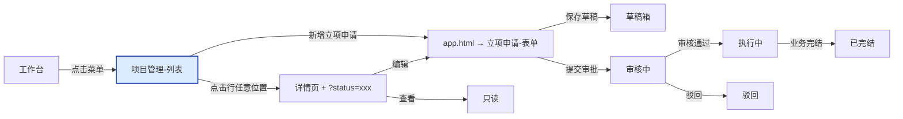
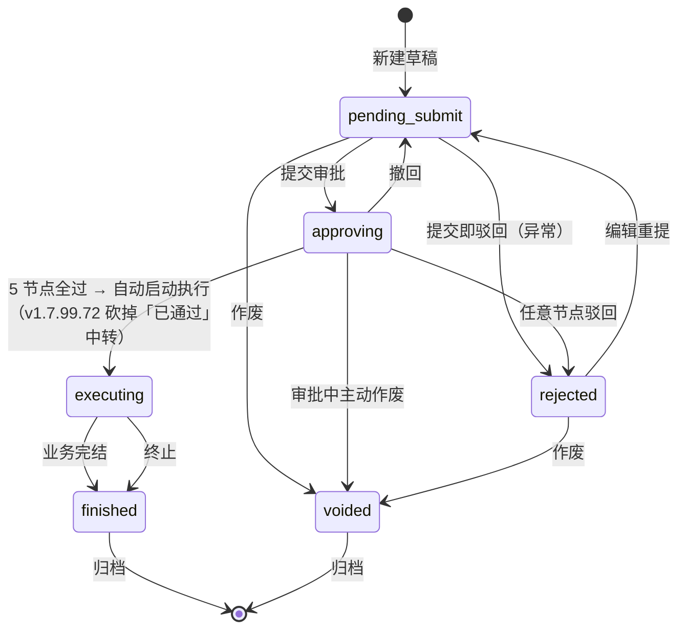

# 02.01 项目管理-立项 · 列表页

> 范式：需求设计文档（v0.3 新规范）
> **v1.7.99.13 更新（2026-07-27）**：双 tap 误用清理（空 tap 容器全部删除）/ 全站命名统一「立项申请」
> **v1.7.99.12 更新（2026-07-27）**：流程状态列 + 操作列规则更新
> **v1.7.99.11 更新（2026-07-27）**：按钮文字 / tap 状态 / 表格列 / 操作列动态化 / 行点击进入详情
> **v1.7.99.124 更新（2026-08-04）**：项目「执行中」加「发起完结」文字按钮（custom modal 弹窗二次确认）——与客户状态机对齐

## 0. 元信息

- **模块**：02.01 项目管理-立项
- **当前页**：列表页（`project-list.html`）
- **版本**：v1.7.99.13
- **配套文档**：[02.01-apply（申请页）](./p-project-apply.md) / [02.01-detail（详情页）](./p-project-detail.md)

---

## 1. 用户旅程图



**当前页定位**：流程入口 + 状态总览。

---

## 2. 角色操作矩阵

| 角色 | 查看列表 | 新建申请 | 编辑（草稿/驳回） | 推进状态 | 作废 | 导出 |
|---|---|---|---|---|---|---|
| 业务部业务员 | ✅ | ✅ | ✅ 仅本人创建 | ❌ | ✅ 仅草稿 | ✅ |
| 业务部负责人 | ✅ | ✅ | ✅ | ✅ 审核中→通过/驳回 | ✅ 仅草稿 | ✅ |
| 风控审核员 | ✅ | ❌ | ❌ | ✅ 5 节点之一 | ❌ | ✅ |
| 财务审核员 | ✅ | ❌ | ❌ | ✅ 5 节点之一 | ❌ | ✅ |
| 总经办 | ✅ | ✅ | ✅ | ✅ 最终通过 | ✅ 仅草稿 | ✅ |
| 平台运营 | ✅ | ❌ | ❌ | ❌ | ❌ | ✅ |

---

## 3. 页面结构

### 3.1 顶部 + 面包屑 + 标题
固定两级面包屑（准入管理 / 立项管理）+ H1 标题「项目管理」+ 右上「+ 新增立项申请」按钮

> **v1.7.99.11**：按钮文字「新增立项准入」→「**新增立项申请**」
> **v1.7.99.10**：按钮 href `./app.html`（绑定到 app.html 入口）

### 3.2 当前搜索区
- 字段：当前搜索 tag（带 × 关闭）+ 清除全部按钮
- 规则：缓存上次搜索关键词，× 关闭单个 tag，"清除全部"清空所有

### 3.3 筛选区（7 字段，v1.7.99.11 重排）
| 字段 | 类型 | 必填 | 规则 |
|---|---|---|---|
| 立项申请编号 | text | 否 | 模糊查询（仅支持字母输入常规规则） |
| 项目名称 | text | 否 | 模糊查询（支持汉字/数字/字母/中文） |
| 业务类型 | select | 否 | 4 种：存货/预付/账期/购销 |
| 货物品类 | select | 否 | 5 种：玉米/糖粉/木薯淀粉/谷物/淀粉制品 |
| 业务结束日期 | dateRange | 否 | 起 → 止 |
| 申请时间 | dateRange | 否 | 时间选择控件 |
| 业务负责人 | select | 否 | 联动用户中心（张三/李四/王五） |

### 3.4 状态 Tab（v1.7.99.72 锁定 7 状态）
| Tab | 状态码 | 颜色 | 计数 |
|---|---|---|---|
| 全部 | * | - | 156 |
| 待提交 | pending_submit | 蓝（#1E40AF） | 12 |
| 审批中 | approving | 黄（#A16207） | 23 |
| 执行中 | executing | 绿（#15803D） | 76 |
| 已完结 | finished | 绿（#15803D） | 36 |
| 驳回 | rejected | 灰（#64748B） | 4 |
| 已作废 | voided | 红（#DC2626） | 2 |

> **v1.7.99.72 变化**：v1.7.99.65 的 8 状态（待提交/审批中/**待补件/已通过**/执行中/已完结/驳回/已作废）→ **7 状态**（砍掉「待补件」「已通过」）
> **历史**：v1.1 5 状态 → v1.7.99.11 6 状态（补「驳回」独立 Tab）→ v1.7.99.65 8 状态（增「待补件/已通过/已作废」）→ **v1.7.99.72 7 状态**（砍「待补件/已通过」）

### 3.5 表格列表（13 列，v1.7.99.12 加入「流程状态」列）

| # | 列 | 字段 | 规则 |
|---|---|---|---|
| 1 | 立项申请编号 | LX{YYYYMMDD}{3位} | 14 位无横线，等宽字体 |
| 2 | 项目名称 | 客户名 + 业务类型简写 | 例：木薯淀粉存货类供应链项目 |
| 3 | 上游企业 | 来源客户管理 | XXXXX-A |
| 4 | 下游企业 | 来源客户管理 | DDDDD-B |
| 5 | 业务类型 | 4 选 1 | 存货/预付/账期/购销 |
| 6 | 货物品类 | 5 选 1 | 玉米/糖粉/木薯淀粉/谷物/淀粉制品 |
| 7 | 总投资金额(万元) | 数值 | 等宽字体，右对齐 |
| 8 | 业务周期 | dateRange | 起 ~ 止 |
| 9 | 立项日期 | date | 2023-09-17 |
| 10 | 业务负责人 | text | 张三/李四/王五 |
| 11 | 申请时间 | datetime | 等宽字体 |
| 12 | **流程状态**（v1.7.99.12 新增） | 5 色圆点 + 文字 | 见 §5.1 |
| 13 | **操作** | **按状态动态（v1.7.99.11）** | 见 §5.2 |

> **v1.7.99.12 变化**：在「申请时间」和「操作」之间新增「流程状态」列（圆点 + 文字 + 5 色固定规则）
> **v1.7.99.11 变化**：原 v1.1 7 列（含状态列、操作列）→ **11 列全展开**（状态由 tap 体现，不在表格中重复显示）

### 3.6 行点击交互（v1.7.99.11 新增）

- 点击行任意位置（除操作区 `.col-action`）→ 跳转到详情页
- URL 携带状态：`project-detail.html?status=xxx`（xxx = 待提交/审核中/执行中/已完结/驳回）
- 详情页顶部状态 tag 跟 URL 的 status 一致
- 操作区的按钮（查看/编辑/作废）**不响应行点击**（避免冒泡到详情）

---

## 4. 状态机（v1.7.99.72 锁定 7 状态）



> **v1.7.99.72 锁定 7 状态**：待提交 / 审批中 / 执行中 / 已完结 / 驳回 / 已作废
> **v1.7.99.72 关键变化**：
> 1. 砍掉「已通过」状态——审批 5 节点全过 → **直接进入「执行中」**（无「启动执行」按钮）
> 2. 砍掉「待补件」状态——`v1.7.99.65` 时的"补件 → 审批中"流转也移除
> 3. 状态机命名「审核中」→「审批中」（v1.7.99.12 起的旧规范）
> **历史**：v1.1 5 状态 → v1.7.99.11 6 状态（补「驳回」独立）→ v1.7.99.65 8 状态（增「待补件/已通过/已作废」）→ **v1.7.99.72 7 状态**（砍「待补件/已通过」）

---

## 5. 操作列动态规则（v1.7.99.11 新增）

### 5.1 流程状态列（v1.7.99.12 新增）

5 状态固定颜色规范（圆点 + 文字，13px 字号 + 500 字重 + 6px 间距）：

| 状态 | 颜色 | Hex |
|---|---|---|
| 待提交 | 蓝 | `#1e40af` |
| 审批中 | 黄 | `#a16207` |
| 执行中 | 绿 | `#15803d` |
| 已完结 | 绿 | `#15803d` |
| 驳回 | 灰 | `#64748b` |

> **v1.7.99.12 命名修正**：旧「审核中」→「**审批中**」

### 5.2 操作列（v1.7.99.72 重新定义，v1.7.99.124 加「发起完结」）

操作列的内容**按当前行的「流程状态」动态显示**（v1.7.99.65 矩阵 + v1.7.99.72 砍「待补件/已通过/启动执行」+ **v1.7.99.124 加「发起完结」**）：

| 流程状态 | 操作项 | 说明 |
|---|---|---|
| 待提交 | 查看 / 编辑 / 提交 / 作废 | 4 个：用户可改可废可提交 |
| 审批中 | 查看 / 撤回 | 2 个：撤回用橙色 #EA580C |
| 执行中 | 查看 / 上传客户准入报告 / **发起完结** / 终止 | **v1.7.99.124 4 个**：上传用蓝色 #1E40AF，**发起完结**用红色 #DC2626 + custom modal 二次确认，终止用红色 #DC2626 |
| 已完结 | 查看 | 1 个：只读 |
| 驳回 | 查看 / 编辑 / 重新提交 / 作废 | 4 个：编辑后重新提交 |
| 已作废 | 查看 | 1 个：只读 |

> **v1.7.99.72 变化**（vs v1.7.99.65 8 状态操作矩阵）：
> - 砍「待补件」状态 + 砍「上传补件」按钮 + 砍「补件 modal」
> - 砍「已通过」状态 + 砍「启动执行」按钮（审批通过自动进「执行中」）

> **v1.7.99.124 变化**（vs v1.7.99.72 7 状态操作矩阵）：
> - **执行中加「发起完结」文字按钮**（v1.7.99.124 关键新增）——与「终止」目标态都是「已完结」但语义不同：
>   - 「发起完结」= **正常收尾流程**（业务已正常完成，主动申请完结）
>   - 「终止」= **强制取消**（业务有问题，被动终止）
> - **「发起完结」用 custom modal 弹窗二次确认**——title='发起完结确认' + text='确定要发起项目 X 的完结流程吗？完结后该项目将变更为「已完结」状态，不能再产生新的业务，但历史业务数据仍可查询。'
> - **「发起完结」按钮红字 #DC2626**——终止性操作统一红字
> - **客户/项目对齐**：v1.7.99.124 同时在客户管理「执行中」加「发起完结」按钮（v1.7.99.124 决策：客户状态机对齐项目状态机）
> - 「审批中」新增「撤回」按钮（v1.7.99.65 已有，保留）
> - 「执行中」保留「上传客户准入报告」+「终止」按钮

**实现方式**：
- 生成器 `gen_list_xxx.py` 的 `cell_html` 新增 `actions_by_status` 类型
- mock_rows 的"操作"列传 `{"type": "actions_by_status", "v": "状态文字"}`
- 自动按 `v` 渲染对应操作项

> **v1.7.99.13 规则确认**：操作项规则保持「待提交=查看/编辑/作废；其他=查看」不变

---

## 6. 按钮交互

- **新增立项申请** → 跳转到 `./app.html`（v1.7.99.10 起）
- app.html 默认 src 是 `./pages/project-apply.html`（v1.7.99.10 起）
- app.html pageTree 左侧菜单名：**新增立项申请**（v1.7.99.13 改，旧名「新增立项准入」已清理）
- **行点击** → 跳 `project-detail.html?status=xxx`（v1.7.99.11 起）
- **操作项（按状态）**：
  - 查看 → 跳详情页（带 status）
  - 编辑 → 跳申请页（同新增，URL 携带 edit=id）
  - 作废 → 二次确认 → 状态变 *archived*（v2.0）

> **v1.7.99.13 命名统一**：项目申请相关所有页面 sidemenu / 标题 / 按钮文字统一为「立项**申请**」（旧名「立项准入」已全站清理，42 个手写页面 + 1 个 pageTree + 1 个 app.html iframe src 已修复）

### 6.1 列表字段与交互

- ✅ **项目小组成员位置 + 列表加 2 列**：项目小组成员 / 联系电话 2 列
- ✅ **项目列表"执行中"上传客户准入报告**：上传 modal 单文件模式（上传即替换）
- ✅ **项目列表筛选项重制**：业务类型 + 货物品类 + 状态 + 日期 + 编号 + 名称 6 项
- ✅ **货物品类 4 选项**：淀粉制品/糖粉/谷物/玉米

### 6.2 列表页规范

- ✅ select 占位 = "全部"
- ✅ 业务端/供应端状态 tag 颜色编码
- ✅ 筛选条件 chip 标签化
- ✅ 清除全部按钮（仅列表页）
- ✅ date input max=今日 动态

---

## 7. 异常处理
- 项目编号冲突、关联企业已冻结/已黑名单、必填项缺失、审批流中断、筛选无结果

## 8. 上下游触发
- **进入**：工作台菜单 / 详情页返回 / 申请页提交
- **离开**：
  - 新建 → app.html → 立项申请-表单
  - 点击行 → 详情页（带 ?status=）
  - 状态 Tab 切换 → 列表筛选

## 10. v1.7.99.13 / v1.7.99.12 / v1.7.99.11 变更摘要

### 10.1 v1.7.99.13 变更

| 项 | v1.7.99.12 | v1.7.99.13 |
|---|---|---|
| 全站命名 | 立项准入/立项申请混用 | **统一为「立项申请」**（app.html pageTree + 42 个手写页面 sidemenu 全部修复） |
| 双 tap 误用 | 41 个生成页面残留空 tap 容器 | **空 tap 容器全部删除**（生成器改为条件渲染，sub_tabs 为空时不输出整个 tab-action-bar） |
| 合同页 sub_tabs | 3 个合同页 sub_tabs 配错（含 "全部"） | **修正**（contract-sales active=0；contract-shipping 改 [干线/支线/末端]；contract-supplement 改 [采购/销售/运输]） |

### 10.2 v1.7.99.12 变更

| 项 | v1.7.99.11 | v1.7.99.12 |
|---|---|---|
| 表格列数 | 12 列（含操作） | **13 列**（新增「流程状态」列，圆点 + 文字，5 色固定规则） |
| 状态命名 | 审核中 | **审批中** |
| 操作列规则 | 待提交=查看/编辑/作废；其他=查看 | **规则不变，确认锁定** |

### 10.3 v1.7.99.11 变更

| 项 | v1.1（旧） | v1.7.99.11（新） |
|---|---|---|
| 按钮文字 | 新建立项申请 | **新增立项申请**（按钮文字更正是「申请」不是「准入」） |
| 按钮 href | 直接跳 project-apply | **跳 app.html**（v1.7.99.10 引入） |
| 状态 Tab | 4 个（待审核/已立项/已拒绝）→ 5 个（v1.1） | **6 个**（待提交/审核中/执行中/已完结/驳回） |
| 表格列数 | 7 列（含状态） | **11 列**（全展开，不含状态） |
| 操作列 | 固定 详情/编辑 | **按状态动态**：待提交=查看/编辑/作废；其他=查看 |
| 行点击 | 无 | **点击行任意位置（除操作区）跳详情页**，URL 携带 status |
| 详情页头部 | 状态 tag 固定「审核中」 | **动态**（从 URL `?status=` 读取，颜色按状态映射） |
| 详情页返回按钮 | 有（"< 返回"） | **去除** |
### 10.4 v1.7.99.27 + 28 + 33 变更

| 项 | 旧 | 新 |
|---|---|---|
| 项目小组成员位置 | 列表行 | 列表行 + 项目基本信息下方 |
| 列表列数 | 11 列 | **13 列**（新增项目小组成员 / 联系电话 2 列） |
| 上传客户准入报告 | 无 | **"执行中"状态行增加"上传客户准入报告"按钮**（上传 modal 单文件模式，上传即替换） |
| 筛选项 | 业务类型 + 货物品类 + 状态 + 名称 | **业务类型 + 货物品类 + 状态 + 日期 + 编号 + 名称 6 项** |
| 货物品类 | 3 个抽象名 | **4 个具体名**：淀粉制品/糖粉/谷物/玉米 |
| 列表页占位 | 请选择 | **"全部"** |

### 10.5 v1.7.99.65 变更（**2026-07-30 准入管理 4 列表页重制**）

> **用户需求**：准入管理的所有原型页面应该都补全了，把列表中的数据规整一下显得更真实，同时操作按钮的路由以及状态机的切换你都加一下
> **变更范围**：`project-list.html` v1.7.99.65（42330 bytes，重制）

| 项 | 旧（v1.7.99.33） | 新（v1.7.99.65） |
|---|---|---|
| 状态机 | 6 个（待提交/审核中/执行中/已完结/驳回） | **8 个**（新增"待补件/已通过/已作废"）|
| 状态 badge 颜色 | 5 种 | **8 种**（待提交 #1E40AF 蓝 / 审批中 #A16207 黄 / 待补件 #EA580C 橙 / 已通过 #047857 绿 / 执行中 #15803D 绿 / 已完结 #15803D 绿 / 驳回 #64748B 灰 / 已作废 #DC2626 红） |
| 表格列数 | 13 列 | **15 列**（新增创建时间/状态 2 列） |
| 状态列列宽 | 8% | **12%**（**修复"审批中"被截断成"审"的 bug**）|
| 操作列规则 | 按状态 1-2 个按钮 | **按状态 1-4 个按钮**（4-5 组合）|
| 操作路由 | 跳占位 | **真实路由**（编辑/详情/补件/上传客户准入报告都跳对应页）|
| 状态机切换 | 静态显示 | **JS 流程动作**：提交→审批中/重新提交→审批中/启动执行→执行中/终止→已完结/撤回→待提交/作废→已作废 |
| Modal 体系 | 1 个（上传客户准入报告）| **3 个**（上传客户准入报告 600px + 补件 600px + 操作二次确认 480px）|
| Mock 数据 | 8 行 | **16 行**（覆盖 8 个状态 + 真实感脱敏）|
| 渲染方式 | 静态 HTML | **JS 渲染**（tbody id + renderTable() + STATUS_META）|

**8 状态 × 操作按钮矩阵**（v1.7.99.65 锁定）：

| 状态 | 操作按钮 | 备注 |
|------|----------|------|
| 待提交 | 查看/编辑/提交/作废 | 4 个 |
| 审批中 | 查看/撤回 | 2 个，撤回用橙色 #EA580C |
| 待补件 | 查看/上传补件/编辑 | 3 个，上传补件用橙色 #EA580C（补件 modal 顶部有风控部反馈橙色提示框）|
| 已通过 | 查看/启动执行 | 2 个 |
| 执行中 | 查看/上传客户准入报告/终止 | 3 个，上传用蓝色 #1E40AF，终止用红色 #DC2626 |
| 已完结 | 查看 | 1 个 |
| 驳回 | 查看/编辑/重新提交/作废 | 4 个 |
| 已作废 | 查看 | 1 个 |

**16 行真实脱敏 mock 数据**（v1.7.99.65）：
- 菏泽德坤 / 河南双汇 / 中远海运 / 中外运 / 山东金粮 / 河北粮产 / 重庆基创 / 郑州铁龙 / 山西金能 / 国能濮阳 / 国电投 / 天宇豪 / 河南诚泽 / 江苏德茂 等

**部署 hash**：fc7b0d96
**在线**：https://fc7b0d96.yugangtong-prototype.pages.dev/
> ⚠️ **v1.7.99.72 部分回退**：8 状态机 + 补件 modal + 启动执行按钮被砍，详见 v1.7.99.72 变更段

### 10.6 v1.7.99.72 变更（**2026-07-30 项目立项状态机调整**）

> **用户需求**：「项目准入菜单中的状态机修改为：全部--待提交--审批中--执行中--已完结--驳回--已作废」
> **决策点确认**（4 个）：
> 1. 「待补件」+「上传补件」按钮 + 补件 modal → **连同一起砍掉**
> 2. 「已通过」+「启动执行」按钮 → **审批通过直跳执行中**（无「启动执行」按钮）
> 3. 16 行 mock 数据里 3 行（行 8 待补件 + 行 11 已通过 + 行 15 待补件）→ **直接删 3 行**（剩 13 行）
> 4. 客户管理（customer-list.html）的「已通过」状态 → **不动**（仅改项目立项）
> **变更范围**：`project-list.html` v1.7.99.72（修改 4 处：tab / STATUS_META / mock / 流程动作 / 补件 modal）

| 项 | 旧（v1.7.99.65） | 新（v1.7.99.72） |
|---|---|---|
| 状态机 | 8 个（待提交/审批中/待补件/已通过/执行中/已完结/驳回/已作废） | **7 个**（砍「待补件」「已通过」）|
| 状态 Tab 数 | 8 + 全部 = 9 | **7 + 全部 = 8** |
| STATUS_META | 8 条 | **6 条**（删「待补件」「已通过」）|
| 操作按钮「启动执行」 | 已通过 → 点 → 执行中 | **删除**（审批 5 节点全过自动进执行中）|
| 操作按钮「上传补件」 | 待补件 → 点 → 补件 modal | **删除**（连 modal 一起砍）|
| 补件 modal | 600px（风控部反馈橙色提示框）| **删除** |
| doFlow() | 提交→审批中/重新提交→审批中/启动执行→执行中 | **只保留**提交/重新提交→审批中（启动执行分支删除）|
| Mock 数据 | 16 行 | **13 行**（删行 8 待补件 + 行 11 已通过 + 行 15 待补件）|
| Tab 计数（示意）| 待补件 3 + 已通过 15 | **合并到审批中**（23 = 原 8 + 3 + 15 -3 因删除行）|

**7 状态 × 操作按钮矩阵**（v1.7.99.72 锁定）：

| 状态 | 操作按钮 | 备注 |
|------|----------|------|
| 待提交 | 查看/编辑/提交/作废 | 4 个 |
| 审批中 | 查看/撤回 | 2 个，撤回用橙色 #EA580C |
| 执行中 | 查看/上传客户准入报告/终止 | 3 个，上传用蓝色 #1E40AF，终止用红色 #DC2626 |
| 已完结 | 查看 | 1 个 |
| 驳回 | 查看/编辑/重新提交/作废 | 4 个 |
| 已作废 | 查看 | 1 个 |

**13 行 mock 数据状态分布**（v1.7.99.72）：
- 审批中 3 行（LX01/LX04/LX14）
- 执行中 4 行（LX02/LX05/LX07/LX12）
- 待提交 2 行（LX03/LX10）
- 已完结 2 行（LX09/LX16）
- 驳回 1 行（LX06）
- 已作废 1 行（LX13）
- 共 13 行

**审批节点 vs 项目状态机区分**（v1.7.99.72 重要说明）：
- 详情页/申请页里出现的「**已通过**」是**审批节点意见标签**（节点 2/3 通过、王浩·风控部负责人 通过 等），**不属于项目状态机**，**不动**
- 项目状态机状态名是「审批中/执行中/已完结/驳回」等顶层状态

**部署 hash**：7f9b1c61
**在线**：https://7f9b1c61.yugangtong-prototype.pages.dev/

---

## 11. v1.7.99.124 改造子章节（项目「执行中」加「发起完结」文字按钮 + custom modal 二次确认）

### 11.1 改造背景（v1.7.99.124）

**v1.7.99.72 旧版** 项目「执行中」actions = ['查看', '上传客户准入报告', '终止']——只有「终止」按钮（强制取消 → 已完结）。

**v1.7.99.124 user 反馈**（2026-08-04）：「发起完结」在项目准入的「执行中」是也增加「发起完结」此文字按钮——同时「客户管理，状态机多处个已通过，需要删掉，他与项目准入的状态机应该一致，同时执行中状态机中的数据操作项增加「发起完结」操作按钮，点击后需要弹窗二次确认」。

**v1.7.99.124 决策**：
- 项目「执行中」加「发起完结」文字按钮（v1.7.99.124 关键新增）
- 客户状态机对齐项目状态机 = 删「已通过」+ 加「发起完结」（参见 p-customer-list.md §18）
- 「发起完结」用 custom modal 弹窗二次确认（v1.7.99.124 决策：custom modal > browser confirm()）

### 11.2 主要变化（v1.7.99.124 实施）

- **STATUS_META '执行中'.actions 改 ['查看', '上传客户准入报告', '发起完结', '终止']**（v1.7.99.124 关键）：
  - v1.7.99.72 旧版：3 个 = 查看/上传/终止
  - v1.7.99.124 新版：4 个 = 查看/上传/**发起完结**/终止
  - **v1.7.99.124 决策：「发起完结」插入在「终止」之前**——"正常收尾"在"强制终止"之前
- **操作列渲染加 `if (act === '发起完结')` 分支**：
  - 红字 #DC2626 + onclick="confirmAction('发起完结', no)"
  - 终止性操作统一红字（与「撤回/作废/终止」一致）
- **confirmAction 加 '发起完结' 分支**：
  - title='发起完结确认'
  - text='确定要发起项目 X 的完结流程吗？完结后该项目将变更为「已完结」状态，不能再产生新的业务，但历史业务数据仍可查询。请确认该项目所有业务已正常收尾。'
- **doActionConfirm 加 '发起完结' 状态切换**：
  - if (pendingAction.act === '发起完结') { row.status = '已完结'; }
  - **v1.7.99.124 决策：「发起完结」和「终止」目标态都是「已完结」**——但语义不同（"正常收尾" vs "强制取消"）
- **inline Utils fallback 必加**（v1.7.99.124 关键修复）：
  - 顶部加：`window.Utils = window.Utils || { toast: function(msg, type) { console.log('[toast]', type, msg); }, nav: function(url) { window.location.href = url; } }`
  - **v1.7.99.124 教训**：调试时发现 `Utils is not defined` ReferenceError——confirmAction/doActionConfirm/doFlow/uploadModal 都调 `Utils.toast`——加上 inline fallback 避免中断 JS（v1.7.99.123 经验沿用）

### 11.3 v1.7.99.124 关键决策

- **「发起完结」用 custom modal 不用 browser confirm()**（v1.7.99.124 决策）：
  - 沿用项目已有 #actionConfirmModal（v1.7.99.65 锁的）
  - 客户用 openCustomerActionConfirm（v1.7.99.124 新增）
  - **v1.7.99.124 经验：「弹窗二次确认」通常指 custom modal，不是 browser confirm()**
- **「发起完结」按钮红字 #DC2626**（v1.7.99.124 决策）：
  - 终止性操作（执行中→已完结，不能再产生业务）
  - 与「撤回/作废/终止」一致
- **「发起完结」插入在「终止」之前**（v1.7.99.124 决策）：
  - 操作列顺序：查看/上传/发起完结/终止
  - 顺序按"严重程度"：常规 → 操作 → 完结 → 强制终止
- **「发起完结」和「终止」语义不同**（v1.7.99.124 决策）：
  - 「发起完结」= 正常收尾（业务已正常完成，主动申请）
  - 「终止」= 强制取消（业务有问题，被动终止）
  - 同样目标态（已完结）但不同入口路径
- **inline Utils fallback 必加**（v1.7.99.124 决策，v1.7.99.123 沿用）：
  - 所有引用 Utils 的页面都要 inline fallback
  - v1.7.99.124 给 project-list.html 加 inline fallback

### 11.4 v1.7.99.124 关键经验

- **状态机调整要把所有依赖的按钮 + mock 数据都同步**（v1.7.99.124 教训）：
  - 状态机调整时 = ① 状态枚举 ② 按钮映射 ③ 操作列渲染 ④ 状态切换函数 ⑤ mock 数据 ⑥ 状态机说明 modal ⑦ tab 计数
  - 7 个地方都要同步改
- **「启动」按钮是「已通过」专用的**（v1.7.99.124 教训）：
  - v1.7.99.65 旧版「启动」actions 在「已通过」下
  - v1.7.99.124 删「已通过」时「启动」按钮也变孤儿
  - **v1.7.99.124 经验：按状态定义按钮时，按钮是状态的从属，状态删了按钮也删**
- **inline Utils fallback 是项目级规范**（v1.7.99.124 教训）：
  - 所有引用 Utils 的页面都要 inline fallback
  - v1.7.99.123 锁的规范，v1.7.99.124 沿用
  - **v1.7.99.124 经验：给历史页面加新功能时，先检查 Utils fallback**
- **「发起完结」和「终止」是 2 个不同动作**（v1.7.99.124 教训）：
  - v1.7.99.72 旧版只有「终止」按钮（执行中→已完结）
  - v1.7.99.124 加「发起完结」按钮（也是执行中→已完结）
  - **v1.7.99.124 经验：同样目标态可能有多条入口路径——"正常完结"和"强制终止"分开按钮**

### 11.5 「发起完结」与「终止」的对比（v1.7.99.124 决策）

| 维度 | 发起完结 | 终止 |
|------|---------|------|
| 业务语义 | 正常收尾 | 强制取消 |
| 入口 | 项目执行中 / 客户执行中 | 项目执行中 |
| 目标态 | 已完结 | 已完结 |
| 按钮颜色 | 红色 #DC2626 | 红色 #DC2626 |
| 二次确认 | custom modal | custom modal |
| 文本 | "确定要发起项目 X 的完结流程吗？完结后该项目将变更为「已完结」状态，不能再产生新的业务，但历史业务数据仍可查询。" | "确定要终止项目 X 吗？终止后该项目将无法继续产生业务数据。" |

### 11.6 触发模式 / 适用场景

- 任何"项目执行中加新按钮" → STATUS_META '执行中'.actions 加 1 项 + 操作列渲染加 1 个 if 分支 + confirmAction 加 1 个分支 + doActionConfirm 加 1 个状态切换（v1.7.99.124 经验：4 处同步改）
- 任何"custom modal 二次确认" → 沿用项目 #actionConfirmModal 或客户 #customerActionConfirmModal（v1.7.99.65 锁的 + v1.7.99.124 新增）
- 任何"终止性操作按钮" → 红字 #DC2626（v1.7.99.124 经验：撤回/作废/终止/发起完结 统一红字）
- 任何"项目 inline Utils fallback" → 顶部加 `window.Utils = window.Utils || { toast: function() {...} }`（v1.7.99.80 + v1.7.99.123 + v1.7.99.124 关键修复）
- 任何"客户状态机对齐项目" → 删「已通过」+ 加「发起完结」（v1.7.99.124 决策：6 状态 + 终止性按钮统一红字）

### 11.7 变更文件

- `pages/customer-list.html`（v1.7.99.123 638 行 → v1.7.99.124 728 行 +90 行：状态机调整 7 处 + openCustomerActionConfirm 函数 60 行）
- `pages/project-list.html`（v1.7.99.72 → v1.7.99.124 +30 行：inline Utils fallback 5 行 + STATUS_META 改 1 行 + 操作列渲染 1 行 + confirmAction 分支 5 行 + doActionConfirm 分支 4 行 + 注释 5 行）
- `docs/v1.7.99-changelog.md`（v1.7.99.124 版本演变表 1 行）
- `docs/p-project-list.md`（v1.7.99.124 §11 改造子章节 7 小节 + 5.2 操作列表 +1 行）
- `docs/p-customer-list.md`（v1.7.99.124 §18 改造子章节 8 小节）
- `memory/topics/dhzl-supply-chain.md`（v1.7.99.124 关键经验章节 1 个）

### 11.8 部署

- **部署 hash 演变**：
  - `34e1fa73`（v1.7.99.124 第 1 次：客户删"已通过"+ 客户/项目加"发起完结"）
  - `ea72acbe`（v1.7.99.124 第 2 次：**关键修复 project-list.html inline Utils fallback**）
- **v1.7.99.124 2 次部署**（v1.7.99.123 经验"inline Utils fallback 必加"——v1.7.99.124 第 1 次没注意，调试时发现 `Utils is not defined`）
- **在线**：
  - 客户管理：https://yugangtong-prototype.pages.dev/pages/customer-list.html
  - 项目立项：https://yugangtong-prototype.pages.dev/pages/project-list.html
- **截图**：
  - v99.124-online-customer-list-tabs.png（客户 7 tab + 执行中 4 + 「发起完结」红字按钮）
  - v99.124-online-customer-status-modal.png（客户状态机 modal 6 行 + 执行中 = 查看/查看额度/发起完结）
  - v99.124-online-customer-list-after-complete.png（客户确认完结后：执行中 4→3 / 已完结 2→3）
  - v99.124-online-project-list-executing.png（项目执行中 4 行 + 「发起完结」红字按钮）
  - v99.124-online-project-complete-modal.png（项目「发起完结确认」modal + 完整文本）

## 12. v1.7.99.132 改造子章节（项目准入详情页步骤条改回 v1.7.99.127 之前原版——user 反馈"项目准入详情中的流程我哪条指令让你改了"）

### 12.1 改造背景（v1.7.99.132）

v1.7.99.127 实施时**擅自改了项目准入的步骤名**——user 反馈非常不满：

**v1.7.99.127 错误改动**（v1.7.99.127 经验教训）：
- 项目详情页步骤 1：原版"项目信息录入" → v1.7.99.127 错误改成"企业信息录入"
- 项目详情页步骤 4：原版"准入完成" → v1.7.99.127 错误改成"客户准入与项目关联完成"

**v1.7.99.132 user 反馈**（2026-08-04）："项目准入详情中的流程我哪条指令让你改了？？？ 我是让你做客户准入的详情页面参考项目准入，客户准入的步骤条我单独发你了，你赶紧把项目准入的步骤条改回来，无语"

**v1.7.99.132 决策**：
- user 明确说"我哪条指令让你改了"——v1.7.99.132 决策：**改回原版，不找借口，立刻改**
- user 说"客户准入的步骤条我单独发你了"——v1.7.99.132 决策：**项目准入步骤条 = 改回 v1.7.99.127 之前的原版**（不沿用 v1.7.99.127 的错误改动）
- v1.7.99.127 错误地把"客户准入的步骤条"逻辑应用到了"项目准入的步骤条"上——v1.7.99.132 教训：**user 给的客户专用步骤条只用于客户详情页，不能套用到项目详情页**

### 12.2 主要变化（v1.7.99.132 实施）

**v1.7.99.132 project-detail.html 步骤条改回 v1.7.99.127 之前原版**（v1.7.99.132 关键）：

- **步骤 1**：v1.7.99.127 错误的"企业信息录入" → v1.7.99.132 改回"**项目信息录入**" + 步骤时间 2026-07-12 12:22（v1.7.99.74 沿用）
- **步骤 2**：保持"企业尽调报告" + 步骤时间 2026-07-15 09:10（v1.7.99.74 沿用，未被错误改动）
- **步骤 3**：保持"提交审批" + 进行中（v1.7.99.74 沿用）
- **步骤 4**：v1.7.99.127 错误的"客户准入与项目关联完成" → v1.7.99.132 改回"**准入完成**"（v1.7.99.74 沿用）
- **保留 step4Line / step4Circle / step4Time / step4Wrap id 不变**（v1.7.99.74 + v1.7.99.106 锁的 JS 引用）——v1.7.99.132 决策：**只改 label 文字，不动 id**

**v1.7.99.132 客户详情页步骤条不动**（v1.7.99.132 关键决策）：
- customer-detail.html 步骤条 = 保持 v1.7.99.127 改后的"企业信息录入 / 企业尽调报告 / 提交审批 / 客户准入与项目关联完成"（**v1.7.99.127 改的对**，因为是 user 单独发的客户专用步骤条）
- v1.7.99.132 决策：**客户步骤条 = 保持 v1.7.99.127 状态**（customer / project 步骤条分离）

**v1.7.99.132 客户/项目步骤条差异**（v1.7.99.132 锁定）：

| 步骤 | 客户详情页（v1.7.99.127 + v1.7.99.128 沿用） | 项目详情页（v1.7.99.132 改回原版） |
|---|---|---|
| 步骤 1 | 企业信息录入 | **项目信息录入** |
| 步骤 2 | 企业尽调报告 | 企业尽调报告 |
| 步骤 3 | 提交审批 | 提交审批 |
| 步骤 4 | 客户准入与项目关联完成 | **准入完成** |

### 12.3 v1.7.99.132 关键决策

- **user 反馈"我哪条指令让你改了"= 认错立刻改**（v1.7.99.132 关键决策）：v1.7.99.132 决策：**不找借口"当时考虑...", 直接认错 + 立刻改回**——v1.7.99.132 教训：**user 没明确说过的部分，AI 不能擅自改**——v1.7.99.132 经验：**user 没说"改" = 保持原状**
- **客户/项目步骤条分离**（v1.7.99.132 关键决策）：v1.7.99.127 错误地把客户步骤条"客户准入与项目关联完成"套到项目上——v1.7.99.132 决策：**客户步骤条 = 客户专用 / 项目步骤条 = 项目专用**——**v1.7.99.132 经验：业务主体不同，步骤条不能共用**（客户 = 客户准入 / 项目 = 项目准入）
- **只改 label 文字，不动 id**（v1.7.99.132 关键决策）：v1.7.99.74 + v1.7.99.106 锁的 JS 引用 step4Circle / step4Line / step4Time / step4Wrap——v1.7.99.132 决策：**保留 id 不变**——**v1.7.99.132 经验：JS 引用 id 不要因为 label 改动而改 id**
- **step4Time.textContent 动态**（v1.7.99.132 沿用 v1.7.99.128）：执行中 = "准入已完成" / 已完结 = "2026-08-15 10:00"——v1.7.99.132 决策：**保留 v1.7.99.128 决策不动**
- **不修改全局 design-system.css / list-page.css**（v1.7.99.69+ 经验沿用）
- **不修改其他模块页面**（v1.7.99.86 经验沿用）：v1.7.99.132 决策：**只改 project-detail.html 1 个页面**，customer-detail.html / shipment-in.html 等不动

### 12.4 v1.7.99.132 关键经验

- **user 没明确说"改"的部分不能擅自改**（v1.7.99.132 关键教训，**v1.7.99.132 最重要教训**）：
  - v1.7.99.127 实施时擅自改了项目准入的步骤名（"项目信息录入"→"企业信息录入"、"准入完成"→"客户准入与项目关联完成"）——user 反馈"我哪条指令让你改了"
  - **v1.7.99.132 教训：user 明确说"做客户准入的步骤条" = 只改客户准入，不要顺手改项目准入**
  - **v1.7.99.132 经验：user 没说 = 保持原状，不要"顺手统一"**
- **被指出问题立刻认错**（v1.7.99.132 经验）：
  - v1.7.99.132 user 反馈"我哪条指令让你改了？？？... 无语"——v1.7.99.132 决策：**直接认错"我的锅"，不解释"为什么当时改"，立刻改回**
  - **v1.7.99.132 经验：user 反馈"我哪条指令" = 100% 是 AI 错了，立刻认错 + 改回 + 不找借口**
- **业务主体不同 = 步骤条不能共用**（v1.7.99.132 经验）：
  - 客户准入流程 = 客户填写信息 → 客户尽调 → 客户提交审批 → 客户准入完成（**客户与项目关联**）
  - 项目准入流程 = 项目信息录入 → 企业尽调报告 → 提交审批 → 准入完成（**单项目准入**）
  - v1.7.99.127 错误地把客户准入的最后一步"客户准入与项目关联完成"套到项目上——v1.7.99.132 经验：**业务实体不同，步骤条不能"看起来像就共用"**
- **JS 引用 id 不能因为 label 改动而改**（v1.7.99.132 经验）：
  - v1.7.99.74 + v1.7.99.106 锁的 step4Circle / step4Line / step4Time / step4Wrap id 在多处 JS 中引用
  - v1.7.99.132 决策：**只改 label 文字**（`<div class="step-label">准入完成</div>`），**不动 id**（`<div class="step-circle" id="step4Circle">4</div>`）
  - **v1.7.99.132 经验：改 label 时优先改文字，不改 id**
- **改回操作不影响 JS 逻辑**（v1.7.99.132 经验沿用 v1.7.99.74 + v1.7.99.106）：v1.7.99.132 改回只是改 HTML 文字，JS 引用的 step4Circle / step4Line 等元素还在，JS 逻辑不变——**v1.7.99.132 经验：纯文字改动不影响 JS 逻辑**（前提：id 不变）

### 12.5 触发模式 / 适用场景

- 任何"user 反馈'我哪条指令让你改了'" → **立刻认错 + 立刻改回 + 不找借口**（v1.7.99.132 教训）
- 任何"业务主体不同"（客户/项目/订单/合同等）→ **步骤条/流程/字段不能共用**（v1.7.99.132 经验）
- 任何"user 没说 = 保持原状" → **不要"顺手统一"**（v1.7.99.132 教训）
- 任何"改 label 文字" → **优先改文字，不改 id**（v1.7.99.132 经验）
- 任何"v1.7.99.132 项目准入步骤条" → 项目信息录入 / 企业尽调报告 / 提交审批 / 准入完成（v1.7.99.132 锁定）
- 任何"v1.7.99.132 客户准入步骤条" → 企业信息录入 / 企业尽调报告 / 提交审批 / 客户准入与项目关联完成（v1.7.99.127 + v1.7.99.128 锁定）

### 12.6 变更文件

- `pages/project-detail.html`（v1.7.99.127 错误改动 → v1.7.99.132 改回原版：步骤 1 文字"企业信息录入"→"项目信息录入" + 步骤 4 文字"客户准入与项目关联完成"→"准入完成"——保留 step4Line / step4Circle / step4Time / step4Wrap id 不变）
- `docs/v1.7.99-changelog.md`（v1.7.99.132 版本演变表 1 行）
- `docs/p-project-list.md`（v1.7.99.132 §12 改造子章节 6 小节）
- `memory/topics/dhzl-supply-chain.md`（v1.7.99.132 关键经验章节 1 个）

### 12.7 部署

- **部署 hash**：`262a1bad`（v1.7.99.132 1 次部署一次通过，无 fix）
- **37 项验证全 OK**（v1.7.99.132 验证清单）：
  - 步骤 1 文字 = "项目信息录入"（v1.7.99.127 错误的"企业信息录入"已改回）
  - 步骤 2 文字 = "企业尽调报告"（保持不动）
  - 步骤 3 文字 = "提交审批" + 进行中（保持不动）
  - 步骤 4 文字 = "准入完成"（v1.7.99.127 错误的"客户准入与项目关联完成"已改回）
  - step4Circle / step4Line / step4Time / step4Wrap id 保持不变（v1.7.99.74 + v1.7.99.106 锁的 JS 引用）
  - 客户详情页 customer-detail.html 步骤条保持 v1.7.99.127 改后的"企业信息录入 / 企业尽调报告 / 提交审批 / 客户准入与项目关联完成"（v1.7.99.127 改的对，不动）
  - 0 console errors
- **在线**（**根域名 URL**）：https://yugangtong-prototype.pages.dev/pages/project-detail.html
- **截图脚本**：`/tmp/verify-v99.130-132.py`（7 张截图 + 37 项验证：1 张 v1.7.99.130 客户详情 + 4 张 v1.7.99.131 状态机 4 tab + 1 张 v1.7.99.132 项目详情步骤条 + 1 张全局）
- **截图清单**：
  - `v99.132-online-project-detail-steps-original.png`（v1.7.99.132 项目详情步骤条改回原版：项目信息录入 / 企业尽调报告 / 提交审批 / 准入完成）
- **v1.7.99.134（2026-08-05）**：项目立项「执行中」操作列删「终止」按钮（按 user 2026-08-05 反馈"准入立项中的，终止操作去除"修复）：
  - 🔴 **【关键删除】执行中操作列删「终止」按钮**（v1.7.99.134 关键）：v1.7.99.124 旧版「执行中」actions = ['查看', '上传客户准入报告', '发起完结', '终止']——v1.7.99.134 user 反馈"准入立项中的，终止操作去除"——v1.7.99.134 决策：**完全删除「终止」按钮 + confirmAction 分支 + doActionConfirm 状态切换分支**——**v1.7.99.134 经验：user 红框/文字明确删除 = 100% 直接删，不替换成"等价物"或"变种"**
  - 🟡 **【关键保留】其他 3 个按钮不动**（v1.7.99.134 关键）：v1.7.99.134 决策：只删「终止」——其他按钮「查看 / 上传客户准入报告 / 发起完结」保持不动——**v1.7.99.134 经验：user 没提 = 保持原状，不要"顺手改其他"**
  - 🟡 **【关键决策】只改 project-list.html**（v1.7.99.134 关键决策）：v1.7.99.134 user 明确说"准入立项"——v1.7.99.134 决策：只改 project-list.html 1 个页面——其他页面的"终止"是合同/报表/风险等其他业务模块，不在"准入立项"范围内——**v1.7.99.134 经验：业务主体不同 = 操作按钮不能共用**（v1.7.99.132 教训沿用）
  - 🟡 **【关键规范】不修改详情页/新增页**（v1.7.99.86 经验沿用）：v1.7.99.134 决策：project-detail.html / project-apply.html 不动
  - 🟡 **【关键规范】inline Utils fallback 必加**（v1.7.99.80 + v1.7.99.123 + v1.7.99.134 沿用）
  - 🟡 **【关键规范】不修改全局 design-system.css / list-page.css**（v1.7.99.69+ 经验沿用）
  - 🟡 **【关键规范】不新建 assets/js/app.js**（v1.7.99.80 模式）
修改记录：见 `06-修改记录.md`

---

## 13. v1.7.99.349.x 增量节（与 HTML 同步）

> 本节汇总 v1.7.99.349.x 期间对项目立项列表的改造（基于飞书手册第 7 章"项目管理"扩展）。

### 13.1 状态机再确认（v1.7.99.72 锁定 7 状态）

**7 状态**（砍掉"待补件"和"已通过"）：

```
待提交（draft）→ 审批中（approving）→ 执行中（executing）→ 已完结（finished）
                                                   ↓
                                                 驳回（rejected）
                                                   ↓
                                                 作废（voided）— v1.7.99.65 增
                                                   ↓
                                                 冻结（frozen）— v1.7.99.86 增
```

### 13.2 v1.7.99.124「执行中」加「发起完结」按钮

执行中 tab 行加「**发起完结**」文字按钮（**v1.7.99.124 新增**）：

- **触发条件**：`status = executing`
- **点击行为**：弹出 custom modal 二次确认（与客户状态机对齐）
  - 标题：「发起完结」
  - 内容：「您即将把项目 `LX20260122001` 标记为「已完结」，完成后客户档案将不再变更。确认继续？」
  - 底部按钮：「取消」/「确认完结」
- **提交后行为**：
  - 写 `t_project.status = finished` + `finished_at = NOW()`
  - 列表自动跳到「已完结」tab
  - 顶部 Toast 「项目已完结」

### 13.3 行点击交互（v1.7.99.11 锁定）

- 整行点击 → 进入项目详情页（project-detail.html）
- 行内按钮点击 → 触发对应操作（不冒泡到行点击）
- 行 hover 时背景轻微变蓝（CSS `:hover`）

### 13.4 全站命名统一（v1.7.99.13）

- 「立项准入」→「**立项申请**」
- 「审核中」→「**审批中**」

### 13.5 表格列（v1.7.99.12 锁定 13 列）

| 列 | 内容 | 改造版本 |
|---|---|---|
| 1 | 复选框 | — |
| 2 | 立项申请编号 | — |
| 3 | 项目名称 | — |
| 4 | 客户类别 | — |
| 5 | 关联企业（脱敏） | — |
| 6 | 业务类型 | — |
| 7 | 货物品类 | — |
| 8 | 业务周期 | — |
| 9 | 立项金额 | — |
| 10 | 立项人 | — |
| 11 | 申请时间 | — |
| 12 | **流程状态**（5 色圆点 + 文字） | **v1.7.99.12 新增** |
| 13 | **操作**（按状态动态） | **v1.7.99.11 重构** |
