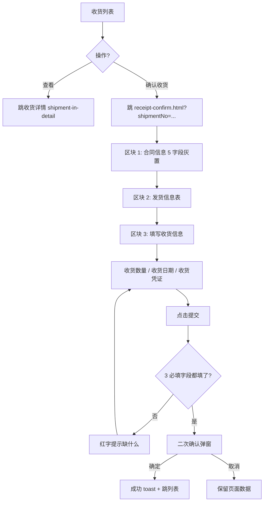

# 02.05.99.99 收货确认（填写收货信息）v1.7.99.129 终版

> **状态**：v1.7.99.129 终版（**v1.0 基础上 + v1.7.99.129 1:1 重制 user 截图**）
> **生成时间**：2026-09-24 16:15
> **配套文档**：[00-项目总览与对接.md](../00-项目总览与对接.md) / [01-模块拆解大框架.md](../01-模块拆解大框架.md) / [p-shipment-in.md](./p-shipment-in.md) / [p-shipment-in-detail.md](./p-shipment-in-detail.md) / [02.05-收发货管理.md](./02.05-收发货管理.md)
> **需求来源**：本仓库 v1.7.99.129 重制 + 飞书《豫港通用户使用手册（内部版）》第 5.3 节"收货管理"
> **复用度**：🟡 60%（部分复用 + 新建 v1.7.99.129 重制页面）

---

> **当前页**：`receipt-confirm.html`（收货确认页 — **填写收货信息**）
> **关联页**：`shipment-in.html`（收货管理列表）/ `shipment-in-detail.html`（收货详情）/ `shipment-in-new.html`（新增收货）

## 0. 章节导航

1. 业务定位
2. 业务流程全景
3. 字段规则
4. 按钮交互
5. 异常处理
6. 跨模块流转
7. 文档版本

---

## 1. 业务定位

**收货确认**（页面标题"填写收货信息"）是收货管理的**关键操作页**——业务人员（下游收货方）确认发货单到达 + 填写实际收货数量 + 上传收货凭证。

> **页面命名说明**：此页面 file 是 `receipt-confirm.html` 但**不是"回款确认"**（回款模块没有此页面），而是"收货管理 / 收货确认"的子操作页。sidemenu 路径是"收发货管理 / 收货管理 / 收货确认"。

### 1.1 入口

| 入口 | URL | 说明 |
|------|------|------|
| 收货列表"确认收货"按钮 | `./receipt-confirm.html?shipmentNo={发货编号}` | 主入口 |
| 收货详情"确认收货"按钮 | 同上 | 同上 |

### 1.2 v1.7.99.129 关键改动

- 从 v1.0 单字段表单重构为 **v1.7.99.129 1:1 重制**：
  - 区块 1：合同信息（5 字段 3 列）
  - 区块 2：发货信息表（发货清单）
  - 区块 3：填写收货信息表单（2 行 × 2 列）
- 简化校验：3 必填字段（数量、日期、附件）
- 与 shipment-in.html "确认收货"按钮跳转路径打通

---

## 2. 业务流程全景

**关键决策**（来自手册 5.3 + v1.7.99.129）：
- **第三步 → 第四步**：如果点击查看 → 显示发货详情页；如果点击确认收货 → 进入确认收货节目
- **第六步**：选择收货方式（全部收货 / 部分收货）+ 填写收货数量 + 收货日期 + 上传收货单据

---

## 3. 字段规则

### 3.1 区块 1：合同信息（v1.7.99.129 5 字段 3 列灰置）

| 字段 | 类型 | 来源 |
|------|------|------|
| 销售订单/单批次合同编号 | display | URL 参数 `shipmentNo` 关联 |
| 合同编号（批次）| display | 同上 |
| 买方企业 | display | 同上 |
| 卖方企业 | display | 同上 |
| 品名 | display | 同上 |

### 3.2 区块 2：发货信息表（v1.7.99.129 子表）

| 列 | 字段 | 说明 |
|----|------|------|
| 1 | 发货编号 | 蓝字链接 → 跳发货详情 |
| 2 | 发货日期 | yyyy-MM-dd |
| 3 | 发货数量（吨）| - |
| 4 | 已收货数量（吨）| 累计收货 |
| 5 | 收货完成时间 | 灰置（未收货时为空）|

**展开行**（v1.7.99.129）：
- 5 字段 metadata + 附件信息子表（发货清单）
- 弹窗内通过 querySelector 找到对应字段更新（v1.7.99.129 JS 注释）

### 3.3 区块 3：填写收货信息（v1.7.99.129 2 行 × 2 列布局）

| 字段 | 类型 | 必填 | 校验 |
|------|------|------|------|
| **收货数量（吨）** | number input | 是 | 必填，min=0, step=0.01；不能超过发货数量-已收货数量 |
| **收货日期** | date picker | 是 | 必填；不能早于发货日期 |
| 收货方式 | select | 是 | 全部收货 / 部分收货 |
| 备注 | textarea | 否 | 选填，最多 500 字符 |
| 收货单据 | upload | 是 | 凭证 jpg/jpeg/png/pdf；单文件 ≤ 100MB；至少 1 个 |

**v1.7.99.129 简化校验**：3 必填字段都不能空（数量、日期、单据）。

---

## 4. 按钮交互

### 4.1 主操作按钮

| 按钮 | 位置 | 行为 |
|------|------|------|
| **提交** | 底部 | 二次确认 → 写入收货记录 |
| **取消** | 底部 | 返回收货列表 |
| **附件下载** | 区块 2 内 | 批量下载发货清单 |

### 4.2 辅助按钮

| 按钮 | 位置 | 行为 |
|------|------|------|
| + 上传 | 区块 3 凭证区域 | 弹文件选择 |
| 删除附件 | 单附件右侧 | 二次确认 → 删除 |

### 4.3 二次确认弹窗

- **提交确认弹窗**：
  - 标题：提交确认
  - 内容：确认提交本次收货登记？提交后系统将更新发货清单的已收货数量
  - 按钮：取消 / 确定
  - 成功后 toast："收货登记成功"

---

## 5. 异常处理

| 场景 | 处理 |
|------|------|
| URL 参数 `shipmentNo` 缺失 | 顶部红色 bar + 返回收货列表 |
| 发货单已作废 | 顶部红色 bar 提示"该发货单已作废，无法确认收货" |
| 收货数量 > 未收货数量 | 红字提示"收货数量不能大于发货数量 - 已收货数量" |
| 收货日期 < 发货日期 | 红字提示"收货日期不能早于发货日期" |
| 未上传凭证附件 | 禁用提交按钮 + 红字提示 |
| 同一发货单并发收货 | 二次校验已收货数量，被覆盖则提示"已被其他收货覆盖，请刷新" |

---

## 6. 跨模块流转

### 6.1 与发货管理（shipment-out）

- 本页"发货信息"区块展示的清单 → 来自 `shipment-out.html` 的发货记录
- 收货登记成功 → 同步更新发货记录的"已收货数量"

### 6.2 与业务线（business-line）

- 收货登记成功 → 该业务线的"累计入库数量" += 收货数量
- 触发业务线台账的"账面库存"重算

### 6.3 与结算单（settlement）

- 收货登记完成 → 后续可发起结算（详见 02.13）

### 6.4 与货转管理（goods-transfer）

- 收货登记完成 → 货转流程可继续推进

---

## 7. 文档版本

- **v1.0（2026-07-24）**：收货确认 v1.0 终版
- **v1.7.99.129（2026-07-31）**：**1:1 重制 user 截图** —— 3 区块（合同信息 / 发货清单 / 填写收货信息）+ 2 行 × 2 列布局 + 3 必填字段校验
- **2026-09-24**：首次写 PRD（基于手册 5.3 + v1.7.99.129 沉淀）

修改记录：见 `v1.7.99-changelog.md`