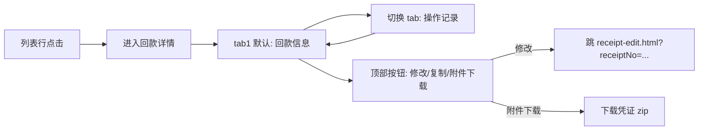

# 02.14.99.2 回款详情 v1.7.99.66 终版

> **状态**：v1.7.99.66 终版（**v1.0 基础上 + v1.7.99.66 重构需求描述** + v1.7.99.347/348 沉淀）
> **生成时间**：2026-09-24 14:30
> **配套文档**：[00-项目总览与对接.md](../00-项目总览与对接.md) / [01-模块拆解大框架.md](../01-模块拆解大框架.md) / [p-receipt-list.md](./p-receipt-list.md) / [p-receipt-edit.md](./p-receipt-edit.md) / [02.14-资金管理.md](./02.14-资金管理.md)
> **需求来源**：本仓库 v1.7.99.66 重构 + 飞书《豫港通用户使用手册（内部版）》第 6.3 节"回款管理"
> **复用度**：🟢 80%（复用 v1.7.99.66 2 tab 结构 + 手册 6.3 业务规则）

---

> **当前页**：`receipt-detail.html`（回款详情页）
> **关联页**：`receipt-list.html`（回款列表）/ `receipt-edit.html`（回款编辑）

## 0. 章节导航

1. 业务定位
2. 业务流程全景
3. 字段规则（2 tab）
4. 按钮交互
5. 异常处理
6. 跨模块流转
7. 文档版本

---

## 1. 业务定位

**回款详情**是回款管理的**追溯页**——业务人员查看某笔回款的全部信息（含基本信息 + 操作记录 + 附件凭证），同时**支持回款修改/删除前的二次确认入口**。

| 维度 | 回款详情（本页） | 回款编辑（receipt-edit）|
|------|------------------|-------------------------|
| 业务语义 | 追溯 + 查看 | 新增/修改 |
| 顶部按钮 | 修改 / 复制（v1.7.99.x 待定）/ 附件下载 | 提交 / 取消 |
| 字段可编辑 | ❌（除"修改"按钮触发跳转外）| ✅ |
| 顶部 Tab | 2 个（回款信息 / 操作记录） | 无 Tab（一次性展示 3 区块）|

### 1.1 入口

| 入口 | URL | 说明 |
|------|------|------|
| 列表行点击回款编号 | `./receipt-detail.html?receiptNo={回款编号}` | 主入口 |
| 编辑页提交成功后 | 自动跳转到本详情页 | toast 路径 |

### 1.2 v1.7.99.66 / 347 / 348 关键改动

- **v1.7.99.66**：从 v1.0 列表+详情双层改为**单详情页 + 2 tab**——回款信息（基本信息）+ 操作记录（含 NC/系统日志）
- **v1.7.99.347 沉淀**：认领明细表的"应付总额 / 现金实付 / 保证金冲抵"三行展示与 receipt-edit 保持一致
- **v1.7.99.348 沉淀**：保证金字段已从本详情页移除（v1.7.99.348 后保证金业务统一走保证金模块）

---

## 2. 业务流程全景



**关键决策**：
- **详情页不加业务变更按钮**（v1.7.99.x 通用规则：详情页只允许跳关联 / 复制 / 附件下载，不直接做创建/调整/解除）
- **修改入口**通过顶部"修改"按钮跳 receipt-edit，**不在本页直接做**

---

## 3. 字段规则

### 3.1 顶部 metadata（v1.7.99.66）

| 字段 | 来源 |
|------|------|
| 回款编号 | URL 参数 `receiptNo` |
| 状态徽标 | 已认领（绿）/ 未认领（橙）/ 部分认领（黄）|

### 3.2 区块 1：回款信息（v1.7.99.66 6 字段 3 列 × 2 行 + 凭证附件）

| 字段 | 类型 | 必填 | 校验 |
|------|------|------|------|
| 回款账号名称 | display | - | 灰置 |
| 回款账号开户行 | display | - | 灰置 |
| 回款账号 | display | - | 灰置 |
| 回款方式 | display | - | 灰置 |
| 回款日期 | display | - | 灰置 |
| 回款金额（元）| display | - | 灰置 |
| 回款凭证（附件）| list | - | 列表展示文件名 + 大小 + 时间 + 下载按钮 |

### 3.3 区块 2：回款认领（v1.7.99.66 3 统计卡 + 5 列认领明细表）

**3 统计卡**：
| 指标 | 计算 |
|------|------|
| 回款金额（元）| = 区块 1 回款金额 |
| 已认领金额（元）| SUM(所有认领行的"本次认领金额") |
| 可认领金额（元）| 回款金额 - 已认领金额 |

**5 列认领明细表**（v1.7.99.347 字段拆分后）：

| 列 | 字段 | 说明 |
|----|------|------|
| 1 | 认领类型 | 业务线回款 / 非业务线回款（**v1.7.99.348 后无"保证金"选项**）|
| 2 | 认领信息 | 业务线或非业务线对应的销售合同 |
| 3 | 应付总额（元）| disabled / 系统回显 |
| 4 | 已认领金额（元）| 现金实付 + 保证金冲抵的合计 |
| 5 | 操作（详情页）| 仅展示，不允许编辑 |

### 3.4 Tab 2：操作记录（v1.7.99.66 新增）

| 列 | 字段 | 说明 |
|----|------|------|
| 1 | 操作类型 | 创建 / 修改 / 删除 / OA 审核 / NC 回传 |
| 2 | 操作人员 | 系统账号 |
| 3 | 所属公司 | 港通供应链 / 下游客户 |
| 4 | 操作内容 | 描述变更前后的值（如"回款金额：100,000 → 120,000"）|
| 5 | 操作时间 | yyyy-MM-dd HH:mm:ss |

**关键决策**：
- **修改/删除通过"修改"按钮跳编辑页**，本页只展示
- **删除采用逻辑删除**：状态标记为"已删除"，保留操作记录 + 凭证附件（合规要求）

---

## 4. 按钮交互

### 4.1 顶部按钮

| 按钮 | 行为 |
|------|------|
| **修改** | 跳 `receipt-edit.html?receiptNo={编号}`（v1.7.99.x 通用规则：详情页不加业务变更按钮，仅做跳转）|
| **复制** | 复制当前回款基本信息（不含认领明细）→ 跳 `receipt-edit.html?mode=add&copyFrom={编号}` |
| **附件下载** | 批量下载凭证附件为 zip |

### 4.2 Tab 切换

```javascript
function switchDetailTab(el, key) {
  document.querySelectorAll('.detail-tab').forEach(t => t.classList.remove('active'));
  el.classList.add('active');
  document.querySelectorAll('.tab-content').forEach(panel => { panel.style.display = 'none'; });
  var target = document.getElementById('tab-' + key);
  if (target) target.style.display = '';
}
```

### 4.3 附件列表操作

| 操作 | 行为 |
|------|------|
| 单附件下载 | 下载该附件原文件 |
| 批量下载 | 顶部"附件下载"按钮 → zip 包 |

---

## 5. 异常处理

| 场景 | 处理 |
|------|------|
| URL 参数 `receiptNo` 缺失 | 顶部红色 bar 提示"该回款不存在" + 返回列表按钮 |
| URL 参数 `receiptNo` 对应已删除回款 | 顶部红色 bar 提示"该回款已删除" + 返回列表按钮 |
| 当前用户无查看权限 | 跳登录页 |
| 附件下载失败 | toast 提示"附件下载失败，请稍后重试" |

---

## 6. 跨模块流转

### 6.1 与回款编辑（receipt-edit）

- "修改"按钮 → 跳编辑页（带 `receiptNo`）
- 编辑页提交成功后回写操作记录（tab2 自动追加一条"修改"记录）

### 6.2 与下游结算单（settlement）

- 详情页"认领明细"中的销售合同编号 → 可点击跳销售合同详情或结算单详情（取决于合同状态）

### 6.3 与保证金池（margin-pool）

- 认领明细表的"保证金冲抵" → 如关联合同有保证金池，可点击跳该合同保证金池行（v1.7.99.x 未来扩展）

### 6.4 操作记录来源

| 操作类型 | 触发场景 |
|----------|----------|
| 创建 | receipt-edit.html 提交成功 |
| 修改 | receipt-edit.html 修改提交成功 |
| 删除 | receipt-list.html "删除"按钮触发（v1.7.99.x 通用规则：删除走列表而非详情）|
| OA 审核 | 关联的下游结算单 OA 审核反馈（如有）|
| NC 回传 | 关联的下游结算单 NC 实际打款回传（如有）|

---

## 7. 文档版本

- **v1.0（2026-07-24）**：回款详情 v1.0 终版
- **v1.7.99.66（2026-07-30）**：从 v1.0 单详情页重构为 2 tab（回款信息 / 操作记录）
- **v1.7.99.347（2026-09-23）**：认领明细表字段拆分（应付总额 / 现金实付 / 保证金冲抵）
- **v1.7.99.348（2026-09-23）**：保证金字段移除（保证金业务统一走保证金模块）
- **2026-09-24**：首次写 PRD（基于手册 6.3 节 + v1.7.99.x 沉淀）

修改记录：见 `v1.7.99-changelog.md`