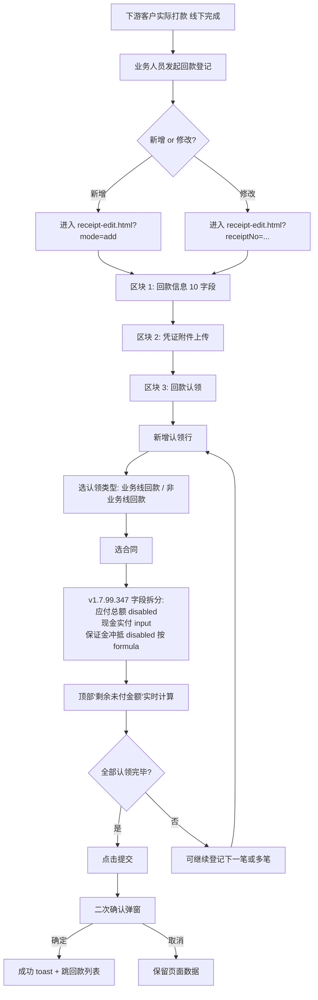

# 02.14.99 回款编辑（新增/编辑）v1.7.99.348 终版

> **状态**：v1.7.99.348 终版（**v1.7.99.66 基础上 + v1.7.99.347 字段拆分 + v1.7.99.348 移除保证金收款类型** + v1.7.99.349 沉淀）
> **生成时间**：2026-09-24 14:00
> **配套文档**：[00-项目总览与对接.md](../00-项目总览与对接.md) / [01-模块拆解大框架.md](../01-模块拆解大框架.md) / [p-receipt-list.md](./p-receipt-list.md) / [p-receipt-detail.md](./p-receipt-detail.md) / [p-margin-pool.md](./p-margin-pool.md) / [02.14-资金管理.md](./02.14-资金管理.md)
> **需求来源**：本仓库 v1.7.99.66 / 347 / 348 / 349 改造沉淀 + 飞书《豫港通用户使用手册（内部版）》第 6.3 节"回款管理"
> **复用度**：🟢 80%（复用 v1.7.99.66 三区块结构 + 手册 6.3 业务规则补充）

---

> **当前页**：`receipt-edit.html`（回款新增/编辑页）
> **关联页**：`receipt-list.html`（回款列表）/ `receipt-detail.html`（回款详情）/ `margin-pool.html`（保证金池）

## 0. 章节导航

1. 业务定位（含 v1.7.99.347 / 348 关键改动）
2. 业务流程全景
3. 字段规则（3 区块）
4. 按钮交互
5. 异常处理
6. 跨模块流转
7. 文档版本

---

## 1. 业务定位

**回款编辑**是回款管理的**新增/编辑入口**——业务人员录入下游客户的实际回款（含回款信息 + 凭证附件 + 回款认领到具体业务线），是资金闭环的关键节点。

**港通特色——资金线下流转 + 系统流程化登记**（来自 02.14 v1.0 + 手册 6.3）：
- 实际回款**线下完成**（电汇/票据/其他方式）
- 发起方**回款信息 + 凭证附件**
- 收款方**系统内确认**（即下游客户已打款，业务人员上传凭证）

### 1.1 入口

| 入口 | URL | 说明 |
|------|------|------|
| 回款列表 + 新增按钮 | `./receipt-edit.html?mode=add` | 主入口 |
| 回款详情"修改"按钮 | `./receipt-edit.html?receiptNo={回款编号}` | 编辑现有回款 |

### 1.2 v1.7.99.347 / 348 关键改动

**v1.7.99.347 字段拆分**（**核心改动**）：

- ❌ 旧版（v1.7.99.66）：认领明细表只有 1 个"本次认领金额"input
- ✅ v1.7.99.347：拆为 **3 行**：
  - 应付总额（disabled / 系统回显）
  - 现金实付（input / 用户填写）
  - 保证金冲抵（disabled / 系统按 depositRatio 自动计算）
- 顶部加"剩余未付金额 = 应付总额 - 现金实付 - 保证金冲抵"实时计算条
- 加 2 快捷按钮：**补足剩余保证金金额** / **本次付清**

**v1.7.99.348 移除保证金收款类型**：

- ❌ 旧版（v1.7.99.66）：回款认领的"收款类型"提供 radio（保证金 / 货款 2 选 1）
- ✅ v1.7.99.348：**移除保证金 radio**，仅保留"货款"
- 保证金登记/调整**统一走保证金模块**（margin-register / margin-adjust），回款认领只负责"货款"认领
- 同步移除 receipt-edit.html 里的"保证金冲抵配置"checkbox（v1.7.99.349 后保证金池统一入口）

**v1.7.99.349 沉淀**：
- 等比例冲抵配置**统一在保证金池**（详见 `p-margin-pool.md` v1.7.99.349）；receipt-edit.html 的 deposit-offset-config 块改为**只读回显**
- 保证金冲抵 = `应付总额 × depositRatio / 100`，按保证金池当前配置自动计算

---

## 2. 业务流程全景



**v1.7.99.347 关键 UX 模式**（详见 `p-receipt-list.md` / `p-margin-pool.md` 沉淀）：
- 顶部"剩余未付"提示条实时更新（每输入一次现金实付就重算）
- 快捷按钮"补足剩余"自动计算 = 应付总额 - 已认领现金实付 - 已认领保证金冲抵
- 快捷按钮"本次付清"= 补足剩余

---

## 3. 字段规则

### 3.1 区块 1：回款信息（v1.7.99.66 11 字段 3 列 × 4 行）

| 字段 | 必填 | 默认值 | 校验 | 备注 |
|------|------|--------|------|------|
| 回款编号 | 是 | 新增时为空 / 修改时回显 | 按实际回款单号；不可重复 |
| 回款方式 | 是 | 空 | 商业承兑汇票 / 电子银行承兑汇票 / 电汇 / 保证金冲抵 |
| 回款方 | 是 | 默认"下游客户" | 单选；下拉选下游客户 |
| 回款方账号名称 | 是 | 随客户自动带出 | 可修改 |
| 回款方开户行 | 否 | 随客户自动带出 | 可修改 |
| 回款方银行账号 | 否 | 随客户自动带出 | 可修改 |
| 收款账号名称 | 是 | 默认核心企业所登记信息 | 单选；下拉选收款账号 |
| 收款账号开户行 | - | 随收款账号自动带出 | 灰置 |
| 收款账号 | - | 随收款账号自动带出 | 灰置 |
| 回款日期 | 是 | 当前日期 | 日期选择器 |
| 回款金额 | 是 | 空 | 文本框；输入数值 |

### 3.2 区块 2：凭证附件

| 字段 | 类型 | 必填 | 校验 |
|------|------|------|------|
| 凭证附件列表 | upload | 是 | jpg/jpeg/png/pdf；单文件 ≤ 100MB；支持多张 |

### 3.3 区块 3：回款认领（v1.7.99.66 3 统计卡 + 6 列认领明细表）

**3 统计卡**：
| 指标 | 计算 |
|------|------|
| 回款金额（元）| = 区块 1 回款金额 |
| 已认领金额（元）| SUM(所有认领行的"本次认领金额") |
| 可认领金额（元）| 回款金额 - 已认领金额 |

**6 列认领明细表**：

| 列 | 字段 | 说明 |
|----|------|------|
| 1 | 认领类型 | 业务线回款 / 非业务线回款（**v1.7.99.348 后无"保证金"选项**）|
| 2 | 认领信息 | 业务线或非业务线对应的销售合同（可点击编辑重新选）|
| 3 | **应付总额（元）** | v1.7.99.347：disabled / 系统回显 |
| 4 | **现金实付（元）** | v1.7.99.347：input / 用户填写 |
| 5 | **保证金冲抵（元）** | v1.7.99.347：disabled / 系统按 `应付总额 × depositRatio / 100` 计算 |
| 6 | 操作 | 删除 / 重新选合同 |

**v1.7.99.347 字段拆分后的核心公式**：

```
应付总额 = SUM(本认领行关联合同的下游结算金额)
现金实付 = 用户填写（默认 = 应付总额）
保证金冲抵 = 应付总额 × depositRatio / 100  (来自保证金池配置)
```

> ⚠️ **公式锁定**：v1.7.99.347 起"现金实付 + 保证金冲抵 = 应付总额"是产品硬约束；现金实付 > 应付总额 → 报错；现金实付 + 保证金冲抵 ≠ 应付总额 → 报错

**顶部"剩余未付"实时计算条**（v1.7.99.347）：
```
剩余未付 = 下游结算合计 - 当前所有认领行已认领总额 - 当前所有认领行保证金冲抵合计
（下游结算合计 - 当前所有认领行已认领总额；可继续登记下一笔或多笔）
```

**2 快捷按钮**（v1.7.99.347）：
| 按钮 | 行为 |
|------|------|
| **补足剩余** | 自动填充"现金实付 = 应付总额 - 保证金冲抵" |
| **本次付清** | 同上 |

### 3.4 v1.7.99.348 移除的字段

- ❌ 旧版"收款类型" radio（保证金 / 货款）—— 保证金业务**统一走保证金模块**
- ❌ 旧版 deposit-offset-config checkbox 块 —— v1.7.99.349 后保证金池统一入口
- ❌ 旧版"保证金冲抵配置"提示 —— 改为保证金池页的只读回显

---

## 4. 按钮交互

### 4.1 主操作按钮

| 按钮 | 位置 | 行为 |
|------|------|------|
| **提交** | 底部固定 | 点击二次确认；确认后写入回款列表 + 跳详情页 toast |
| **取消** | 底部固定 | 二次确认（"取消后已填数据不会被保存"）|

### 4.2 辅助按钮

| 按钮 | 位置 | 行为 |
|------|------|------|
| + 新增认领行 | 区块 3 表格下方 | 新增一行认领明细 |
| 编辑 | 认领行的"认领信息"列 | 重新选合同 |
| 删除 | 认领行的操作列 | 删除该认领行（最后一次确认）|
| 上传 / 移除 | 区块 2 凭证区域 | 上传/删除附件 |

### 4.3 快捷按钮（v1.7.99.347）

| 按钮 | 位置 | 行为 |
|------|------|------|
| 补足剩余 | 顶部"剩余未付"条 | 自动填充"现金实付 = 应付总额 - 保证金冲抵" |
| 本次付清 | 同上 | 同上 |

### 4.4 二次确认弹窗

- **取消确认弹窗**：
  - 标题：取消确认
  - 内容：取消后，已填写的回款信息、凭证附件、认领明细将不会被保存
  - 按钮：取消 / 确定

- **提交确认弹窗**：
  - 标题：提交确认
  - 内容：确认提交本次回款登记？提交后系统将按本次认领明细更新下游结算金额
  - 按钮：取消 / 确定
  - 成功后 toast："回款登记成功"

---

## 5. 异常处理

| 场景 | 处理 |
|------|------|
| 回款金额 ≤ 0 或非数字 | 禁用提交按钮 + 红字提示"回款金额必须大于 0" |
| 未上传凭证附件 | 禁用提交按钮 + 红字提示"请上传本次回款凭证" |
| 已认领金额 > 回款金额 | 顶部红字提示"已认领金额超过回款金额" |
| 现金实付 + 保证金冲抵 ≠ 应付总额（v1.7.99.347 强校验）| 单行红字提示"现金实付 + 保证金冲抵 必须等于应付总额" |
| 现金实付 > 应付总额 | 红字提示"现金实付不能大于应付总额" |
| 保证金冲抵因未足额不可用 | 详情页只读回显保证金池"未足额"徽标，提示"该合同保证金未足额，不参与等比例冲抵" |
| 选择已作废合同 | 红字提示"该合同已作废，无法认领" |
| 选择非"执行中/待上传双签合同"状态 | 红字提示"请选择执行中或待上传双签合同" |

---

## 6. 跨模块流转

### 6.1 与保证金池（margin-pool）

- 认领明细的"保证金冲抵"按保证金池当前 `depositRatio` 计算
- **保证金冲抵的"账款"未足额**（v1.7.99.345 硬卡）：保证金冲抵列 disabled + 0 元 + 顶栏红字提示
- 保证金池改 depositRatio（v1.7.99.346 策略 B）→ **未来笔**按新比例；已登记的不改

### 6.2 与下游结算金额（settlement）

- 认领完成后 → 该合同下游结算金额 -= 本次认领金额
- 当下游结算金额 = 0 → 触发该合同"已结清"状态

### 6.3 与客户额度（02.02）

- 回款完成 → 客户已回款金额 += 本次回款 → 触发敞口金额 / 保证金覆盖率重算

### 6.4 与 OA / NC 系统

- 本页面**不直接走 OA 审批**——回款是实际资金流入凭证，不需要业务审批
- 关联的下游结算单若有"结算审核"流程，独立走 OA（详见 02.13 结算单管理）

---

## 7. 文档版本

- **v1.0（2026-07-24）**：回款登记 v1.0 终版
- **v1.7.99.66（2026-07-30）**：回款认领 3 区块重构 + 6 列认领明细表 + 3 统计卡
- **v1.7.99.347（2026-09-23）**：**字段拆分**——应付总额 / 现金实付 / 保证金冲抵 三行 + 顶部"剩余未付"实时计算 + 2 快捷按钮
- **v1.7.99.348（2026-09-23）**：**移除"保证金"收款类型 radio** + 移除 deposit-offset-config checkbox 块（保证金业务统一走保证金模块）
- **v1.7.99.349**：保证金池的等比例冲抵配置**统一在保证金池页**（receipt-edit.html 只读回显）
- **2026-09-24**：首次写 PRD（基于手册 6.3 节 + v1.7.99.x 沉淀）

修改记录：见 `v1.7.99-changelog.md`