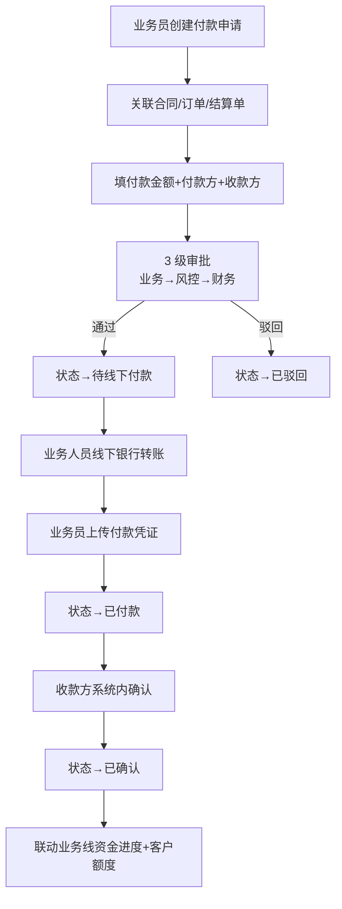
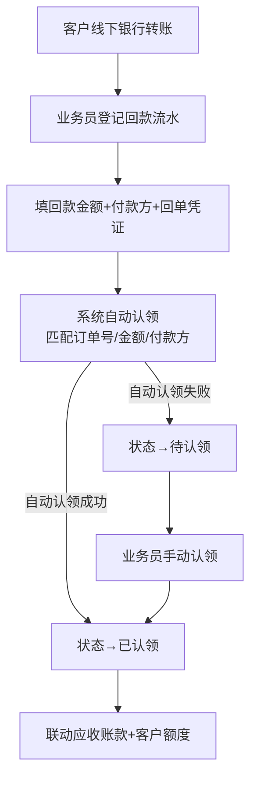
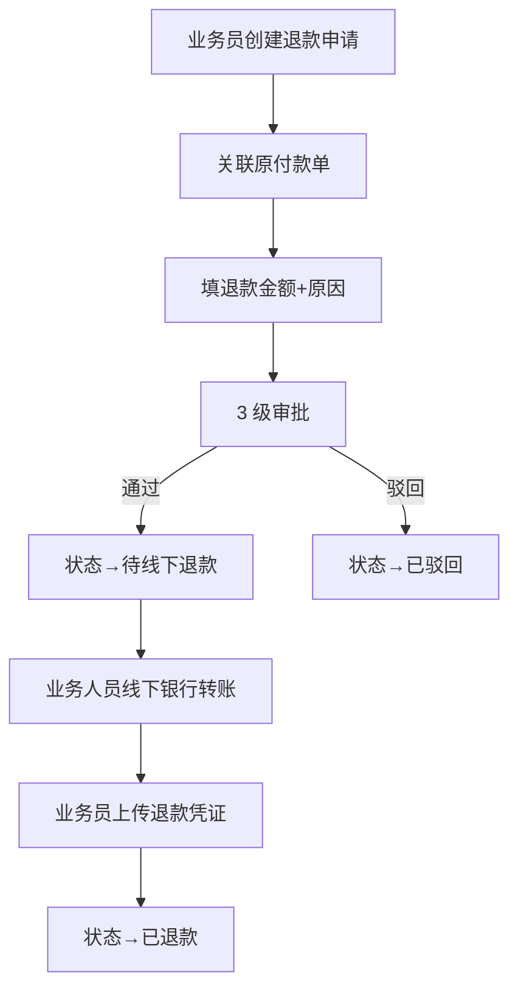

# 02.14 资金管理 v1.0 终版

> **状态**：v1.0 终版（**新模块，基于原型 37-48 截图**）
> **生成时间**：2026-07-24 14:55
> **配套文档**：[00-项目总览与对接.md](../00-项目总览与对接.md) / [01-模块拆解大框架.md](../01-模块拆解大框架.md) / [02.03-合同管理.md](./02.03-合同管理.md) / [02.04-订单管理.md](./02.04-订单管理.md) / [02.10-保证金管理.md](./02.10-保证金管理.md)
> **复用度**：🟢 **85%（大幅复用）**——主产品 `bo_payment` + `bo_receipt` + `bo_collection_claim_record` 12+ 张表

---

> **当前页**：`refund-detail.html`
> **文档状态**：基于源模块文档的占位版，精确字段待 review 后按原型图精修

## 0. 章节导航

1. 业务定位
2. 业务流程全景（**5 子模块**）
3. 核心实体（10 张表）
4. 角色操作矩阵
5. 字段规则
6. 按钮交互
7. 异常处理
8. 跨模块流转

---

## 1. 业务定位

**资金管理**是港通供应链的**资金流核心**——5 大子模块：付款/退款/回款/保证金管理/费用管理。

**关键特点**：
- **资金线下流转**（**港通特色**）：实际资金操作**线下完成**（银行转账/票据），系统流程化登记
- **凭证上传**：发起方上传凭证 + 收款方系统内确认
- **不假设线上扣款**：不存在"银行扣款失败/补足余额/账户异常"等线上假设分支

### 1.1 5 大子模块（基于原型 37-48 截图）

| # | 子模块 | 页面 | 说明 |
|---|--------|------|------|
| 1 | **付款管理** | 付款列表 / 新增付款 / 付款详情 | 采购付款（货主方→上游供应商）|
| 2 | **退款管理** | 退款列表（逻辑不变）/ 退款申请（逻辑不变）/ 退款详情 | 退款流程（逻辑不变）|
| 3 | **回款管理** | 回款列表（不做改动）/ 回款认领操作 / 回款认领详情 | 回款流水登记 + 自动认领 |
| 4 | **保证金管理（新增）** | 保证金管理 / 保证金调整 / 调整记录 | **v1.0 新顶级（独立到 02.10）** |
| 5 | **费用管理** | 隐含在付款/回款中 | 服务费/手续费 |

**注**：保证金管理在原型 46-48 是独立顶级，v1.0 拆出来到 02.10 独立范本。本范本（02.14）只覆盖付款/退款/回款/费用。

### 1.2 12 个页面（sitemap）

| # | 子模块 | 页面 |
|---|--------|------|
| 1-3 | 付款 | 付款列表 / 新增付款 / 付款详情 |
| 4-6 | 退款 | 退款列表（逻辑不变）/ 退款申请（逻辑不变）/ 退款详情 |
| 7-9 | 回款 | 回款列表（不做改动）/ 回款认领操作 / 回款认领详情 |
| 10-12 | 保证金 | 保证金管理 / 保证金调整 / 调整记录（**v1.0 独立到 02.10**）|

---

## 2. 业务流程全景

### 2.1 付款管理流程（**港通特色：线下付款**）

**v1.0 关键流程变化**：
- ❌ 旧版：业务部→风控校验→财务审批→**待线下付款**→已付款
- ✅ v1.1：业务部→风控校验→财务审批→**待线下付款**（保留）→已付款
- 关键：**不假设"银行扣款失败"等线上分支**

### 2.2 回款管理流程（**港通特色：线下回款+自动认领**）

### 2.3 退款管理流程

---

## 4. 角色操作矩阵

### 4.1 付款管理

| 操作 / 角色 | 业务员 | 业务部 | 风控部 | 财务部 | 总经办 |
|------------|------|------|------|------|------|
| 创建付款申请 | **✓** | - | - | - | - |
| 业务部审批 | - | **✓** | - | - | - |
| 风控校验 | - | - | **✓** | - | - |
| 财务审批 | - | - | - | **✓** | - |
| 线下付款+上传凭证 | **✓** | - | - | - | - |
| 收款方确认 | - | - | - | - | - |
| 查看 | ✓ | ✓ | ✓ | ✓ | ✓ |

### 4.2 回款管理

| 操作 / 角色 | 业务员 | 业务部 | 风控部 | 财务部 |
|------------|------|------|------|------|
| 登记回款流水 | **✓** | - | - | - |
| 自动认领 | 自动 | - | - | - |
| 手动认领 | **✓** | - | - | - |
| 查看 | ✓ | ✓ | ✓ | ✓ |

---

## 5. 字段规则

### 5.1 付款类型 `payment_xxx`

- 3 种：`purchase`（采购付款）/ `expense`（费用付款）/ `other`（其他）

### 5.2 付款方式 `payment_xxx`（**v1.0 港通特色**）

- 3 种：`bank_transfer`（银行转账）/ `bill`（票据）/ `other`
- **v1.0 关键**：实际资金操作**线下完成**，系统只登记

### 5.3 实际金额 `actual_amount`（**v1.0 关键**）

- 与 `apply_amount` 可能不一致（**v1.0 重要**）
- 实际金额 = 线下实际转账金额
- 实际金额 ≠ 申请金额 → 状态→`warning`

### 5.4 付款凭证 `voucher_url`（**v1.0 关键**）

- 必填（线下付款后）
- 格式：图片/PDF
- 包含：银行回单/票据照片

### 5.5 付款前置校验 4 类（**v1.0 关键**）

- `contract_xxx`（合同有效性）
- `quota_available`（额度可用）
- `receipt_xxx`（回款足额）
- `margin_enough`（保证金足额）
- 任一校验不通过 → 阻止付款

### 5.6 回款认领匹配规则（**v1.0 港通特色**）

- 匹配优先级：金额（精确）> 付款方（一致）> 订单号（备注）
- 匹配分数 = 0-100
- 分数 >= 80 → 自动认领
- 分数 < 80 → 待人工认领

### 5.7 应收账款逾期（**v1.0 新增**）

- 逾期天数 = 当前日期 - due_date
- 逾期 > 30 天 → 触发预警

---

## 6. 按钮交互

### 6.1 付款列表（37 截图）

| 按钮 | 位置 | 可见条件 | 点击行为 |
|------|------|---------|---------|
| **+ 新增付款** | 右上 | 业务员 | 跳新增页（38 截图）|
| 数据导出 | Tab 右侧 | 所有 | 导出 Excel |
| 详情 | 列表行 | 所有 | 跳详情页（39 截图）|

### 6.2 新增付款（38 截图）

- 关联合同/订单/结算单（必填）
- 填付款金额+付款方+收款方
- 4 类前置校验（自动）

### 6.3 付款详情（39 截图）

- 付款基本信息
- 4 类校验结果
- 审批记录
- 线下付款凭证

### 6.4 退款列表（40 截图，逻辑不变）

- **v1.0 注释**：退款逻辑不变，沿用主产品

### 6.5 退款申请（41 截图，逻辑不变）

- 关联原付款单
- 填退款金额+原因

### 6.6 退款详情（42 截图）

- 退款基本信息
- 关联原付款
- 凭证

### 6.7 回款列表（43 截图，不做改动）

- **v1.0 注释**：回款逻辑不变，沿用主产品

### 6.8 回款认领操作（44 截图）

- 系统自动匹配订单/合同
- 手动调整匹配
- 拆分认领（多订单）

### 6.9 回款认领详情（45 截图）

- 回款基本信息
- 认领记录
- 关联订单/合同

---

## 7. 异常处理

### 7.1 付款异常

| 异常场景 | 提示文案 | 处理动作 |
|---------|---------|---------|
| 合同无效 | "合同已过期/作废" | 阻止 |
| 额度不足 | "可用额度 X < 付款金额 Y" | 阻止 |
| 回款不足 | "客户已回款 X < 本次付款 Y" | 黄灯提醒 |
| 保证金不足 | "客户保证金 X < 应付 Y" | 黄灯提醒 |
| 实际金额 ≠ 申请金额 | "实际金额 X ≠ 申请金额 Y" | 黄灯提醒 |
| 凭证未上传 | "线下付款后必须上传凭证" | 阻止完成 |

### 7.2 回款异常

| 异常场景 | 提示文案 | 处理动作 |
|---------|---------|---------|
| 凭证未上传 | "登记回款必须上传回单凭证" | 阻止 |
| 自动认领失败 | "回款自动认领失败（匹配分数 X < 80），请手动认领" | 提示手动 |
| 认领金额 > 回款金额 | "认领金额 X 超过回款金额 Y" | 阻止 |
| 客户被冻结 | "客户 X 已被冻结，不能登记回款" | 阻止 |

### 7.3 退款异常

| 异常场景 | 提示文案 | 处理动作 |
|---------|---------|---------|
| 退款金额 > 原付款金额 | "退款金额 X 超过原付款金额 Y" | 阻止 |
| 原付款已退款 | "原付款 X 已退款，不能重复退款" | 阻止 |

---

## 8. 跨模块流转

### 8.1 上游触发

| 触发模块 | 触发条件 | 触发动作 |
|---------|---------|---------|
| 合同管理（02.03）| 合同 `executing` | 允许付款关联 |
| 订单管理（02.04）| 订单 `finished` | 触发付款申请 |
| 结算单（02.13）| 结算单 `active` | 触发付款申请 |
| 客户回款（线下）| 客户线下转账 | 业务员登记回款 |

### 8.2 下游触发

| 触发模块 | 触发条件 | 触发动作 |
|---------|---------|---------|
| 客户额度（02.02）| 付款/回款 | 更新客户已用/可用额度 |
| 业务线（02.06）| 付款/回款 | 更新业务线资金进度 |
| 发票（02.15）| 付款完成 | 触发开票申请 |
| 预警中心（02.11）| 应收账款逾期 | 触发预警 |

---

## 10. 文档版本

- **v1.0（2026-07-24 14:55）**：基于 37-48 截图 + sitemap 首次终版，作为范本用于后端开发
- - **v1.7.99.x（2026-07-28）**：基于 30+ 版本迭代同步
  - 🟡 列表页占位 = "全部"（全站统一）
  - 🟡 状态 tag 颜色编码
  - 🟡 流程图统一用 Mermaid
  - 详见：[v1.7.99-changelog.md](./v1.7.99-changelog.md)
- **v1.7.99.63（2026-07-30）**：退款详情页重制（按用户图 4）：
  - 🔴 顶部信息条：标题"退款详情" + 状态 badge + 资金流水号 + 复制按钮 + 4 字段（所属合同编号/卖方企业/买方企业/创建时间）（v1.7.99.192 删右上角"返回"按钮，按 v1.7.99.183 + v1.7.99.188 规范）
  - 🔴 步骤条：**3 步**（登记退款信息 → 审批中 → 流程结束，退款完成；v1.7.99.192 加第 2 步"审批中"；IIFE 按 status 切每步状态：已退款全 done / 审批中第 2 步 current（蓝圈 box-shadow 突出）/ 已驳回第 2 步 rejected（红字✕））
  - 🔴 tab 切换：退款信息 / 操作记录
  - 🔴 区块 1：退款信息（4 行 3 字段 = 11 字段，**退款金额 ¥123 橙色高亮**）
  - 🔴 区块 2：附件（表格 3 列：文件类型/文件编号/操作，含 1 行 退款附件/入库凭证.png/下载）
  - 🟡 **【关键规范】详情页不加业务变更按钮**：只保留返回/复制/下载
  - 🟡 **【关键规范】mock 数据**：资金流水号 SKTK2025092210000005 / 所属合同 TYYGJ-SM-202506-002 / 卖方企业 天宇豪国际贸易集团有限公司 / 买方企业 陕西魏煤供应链管理有限公司
  - 详见：[v1.7.99-changelog.md](./v1.7.99-changelog.md) 6.1 节
修改记录：见 `06-修改记录.md`