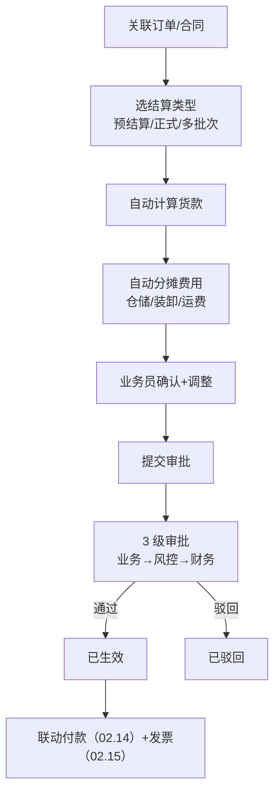
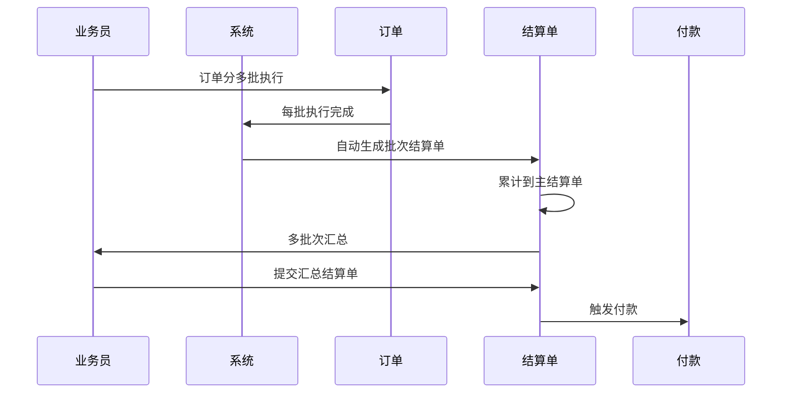
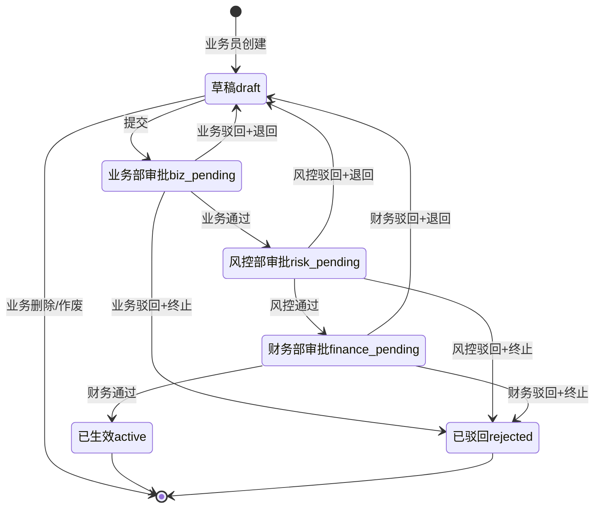

# 02.13 结算单管理 v1.0 终版

> **状态**：v1.0 终版（**新模块，基于原型 49-54 截图**）
> **生成时间**：2026-07-24 14:55
> **配套文档**：[00-项目总览与对接.md](../00-项目总览与对接.md) / [01-模块拆解大框架.md](../01-模块拆解大框架.md) / [02.03-合同管理.md](./02.03-合同管理.md) / [02.04-订单管理.md](./02.04-订单管理.md)
> **复用度**：🟢 **75%（大幅复用）**——主产品 `bo_statement` + `t_xxx（业务实体）` + `bo_terminal_statement` + `t_xxx（业务实体）` 4+ 张表

---

> **当前页**：`settlement-purchase-new.html`
> **文档状态**：基于源模块文档的占位版，精确字段待 review 后按原型图精修

## 0. 章节导航

1. 业务定位
2. 业务流程全景
3. 核心实体（3 张表）
4. 4 状态机
5. 角色操作矩阵
6. 字段规则
7. 按钮交互
8. 异常处理
9. 跨模块流转

---

## 1. 业务定位

**结算单管理**是港通供应链的**货款及费用结算中心**——采购/销售预结算+正式结算+多批次结算，自动核算货款及仓储/装卸/运费。

**关键特点**：
- **2 子模块**：采购结算 / 销售结算
- **3 结算类型**：预结算 / 正式结算 / 多批次结算
- **自动分摊**：仓储/装卸/运费按比例分摊

### 1.2 6 个页面（sitemap）

| # | 子模块 | 页面 |
|---|--------|------|
| 1 | **采购结算** | 采购结算列表 / 新增/编辑采购结算单 / 采购结算单详情 |
| 2 | **销售结算** | 销售结算列表 / 新增/编辑销售结算单 / 销售结算单详情 |

---

## 2. 业务流程全景

### 2.1 结算单创建流程

### 2.2 多批次结算流程

---

## 4. 4 状态机

### 4.1 4 状态说明

| # | 状态 | 中文 | 触发 | 出口 |
|---|------|------|------|------|
| 1 | `draft` | 草稿 | 业务员创建 | 提交/删除 |
| 2 | `biz_pending` | 业务部审批 | 业务部审批 | 业务部审批 |
| 3 | `risk_pending` | 风控部审批 | 风控部审批 | 风控部审批 |
| 4 | `finance_pending` | 财务部审批 | 财务部审批 | 财务部审批 |
| 5 | `active` | 已生效 | 财务部通过 | 终态 |
| 6 | `rejected` | 已驳回 | 任一审批驳回 | 终态 |

---

## 5. 角色操作矩阵

| 状态 / 角色 | 业务员 | 业务部 | 风控部 | 财务部 | 系统 |
|------------|------|------|------|------|------|
| `draft` 草稿 | 编辑/提交 | 查看 | 查看 | 查看 | - |
| `biz_pending` 业务部 | 查看 | **审批** | 查看 | 查看 | 推送 |
| `risk_pending` 风控部 | 查看 | 查看 | **审批** | 查看 | 推送 |
| `finance_pending` 财务部 | 查看 | 查看 | 查看 | **审批** | 推送 |
| `active` 已生效 | 查看 | 查看 | 查看 | 查看 | 联动付款/发票 |
| `rejected` 已驳回 | **编辑后重新提交** | 查看 | 查看 | 查看 | - |

---

## 6. 字段规则

### 6.1 结算类型 `settlement_xxx`

- 2 种：`purchase`（采购结算）/ `sales`（销售结算）

### 6.2 结算阶段 `settlement_xxx`（**v1.0 新增**）

- 3 种：
  - `pre`（预结算）—— 订单执行前预估
  - `final`（正式结算）—— 订单完成后
  - `multi_batch`（多批次结算）—— 长协订单分批结算

### 6.3 费用类型 `fee_type`

- 5 种：
  - `goods`（货款）
  - `storage`（仓储费）
  - `loading`（装卸费）
  - `transport`（运费）
  - `other`（其他）

### 6.4 自动分摊规则（**v1.0 港通特色**）

- 仓储/装卸/运费按订单数量/金额分摊
- 多批次结算：分摊费按批次数量占比

---

## 7. 按钮交互

### 7.1 列表页

| 按钮 | 位置 | 可见条件 | 点击行为 |
|------|------|---------|---------|
| **新增/编辑采购结算单** | 右上 | 业务部 | 跳新增页 |
| **新增/编辑销售结算单** | 右上 | 业务部 | 跳新增页 |
| 数据导出 | Tab 右侧 | 所有 | 导出 Excel |
| 详情 | 列表行 | 所有 | 跳详情页 |

### 7.2 新增/编辑结算单

- 选关联合同（必填）
- 选关联订单（必填，多批次时为空）
- 选结算阶段（预结算/正式结算/多批次结算）
- 系统自动计算货款 + 分摊费用
- 业务员可调整金额 + 备注

### 7.3 详情页

- 结算基本信息
- 费用明细（货款/仓储/装卸/运费/其他）
- 审批记录
- 关联付款/发票

---

## 8. 异常处理

| 异常场景 | 提示文案 | 处理动作 |
|---------|---------|---------|
| 结算金额 < 0 | "结算金额不能 < 0" | 阻止 |
| 结算金额 > 合同剩余金额 | "结算金额 X 超过合同剩余金额 Y" | 阻止 |
| 货款自动计算错误 | "货款计算异常，请联系管理员" | 阻止 |
| 关联订单未完结 | "关联订单还未完结，不能正式结算" | 阻止 |
| 多批次结算未到批次 | "批次 X 还未执行完成" | 阻止 |

---

## 9. 跨模块流转

### 9.1 上游触发

| 触发模块 | 触发条件 | 触发动作 |
|---------|---------|---------|
| 合同管理（02.03）| 合同 `executing` | 允许创建结算单 |
| 订单管理（02.04）| 订单 `finished` | 触发正式结算 |

### 9.2 下游触发

| 触发模块 | 触发条件 | 触发动作 |
|---------|---------|---------|
| 付款（02.14）| 结算单 `active` | 触发付款申请 |
| 发票（02.15）| 结算单 `active` | 触发开票申请 |
| 业务线（02.06）| 结算单 `active` | 更新业务线结算进度 |

---

## 11. 文档版本

- **v1.0（2026-07-24 14:55）**：基于 49-54 截图 + sitemap 首次终版，作为范本用于后端开发
- - **v1.7.99.x（2026-07-28）**：基于 30+ 版本迭代同步
  - 🟡 列表页占位 = "全部"（全站统一）
  - 🟡 状态 tag 颜色编码
  - 🟡 流程图统一用 Mermaid
  - 详见：[v1.7.99-changelog.md](./v1.7.99-changelog.md)
修改记录：见 `06-修改记录.md`