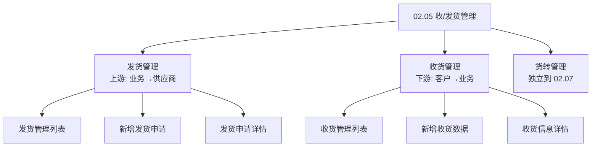
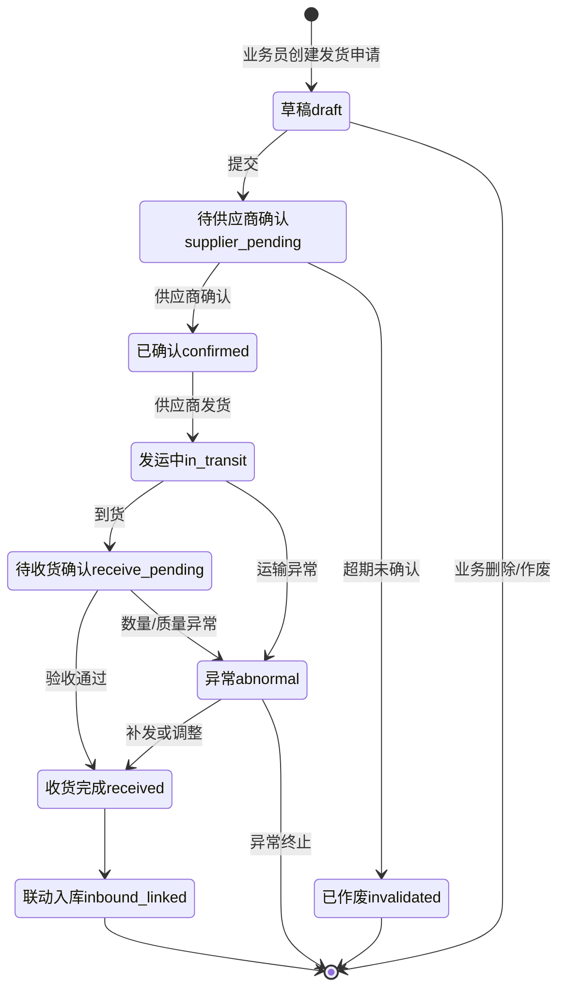
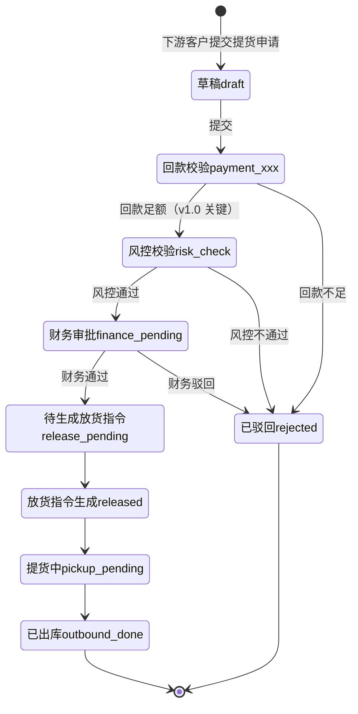
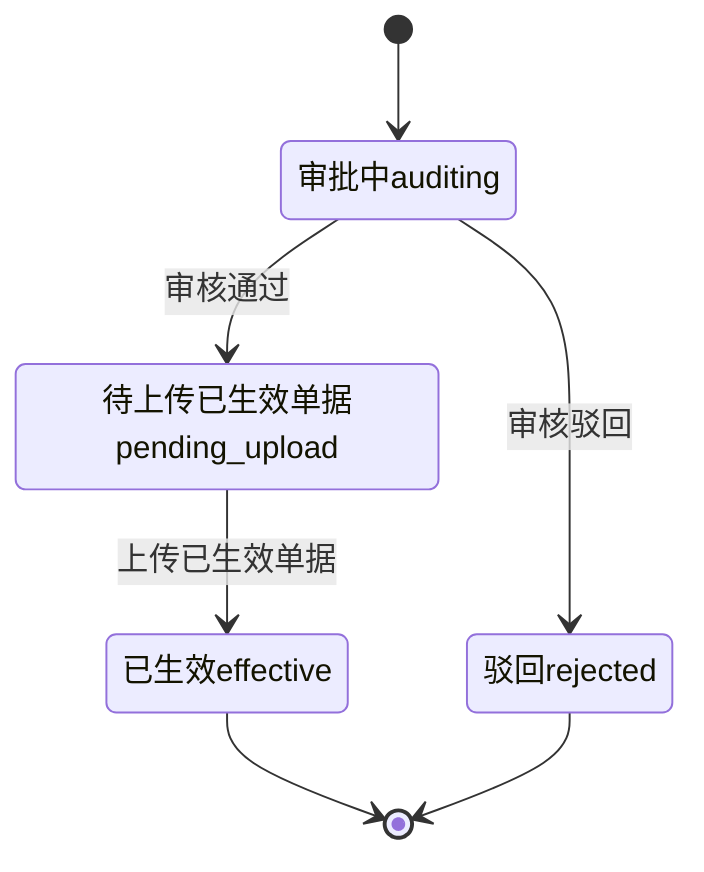

# 02.05 收/发货管理 v1.0 终版

> **状态**：v1.0 终版（**v0.1 重写版，基于原型 26-31 截图 + 新架构**）
> **生成时间**：2026-07-24 14:55
> **配套文档**：[00-项目总览与对接.md](../00-项目总览与对接.md) / [01-模块拆解大框架.md](../01-模块拆解大框架.md) / [02.03-合同管理.md](./02.03-合同管理.md) / [02.04-订单管理.md](./02.04-订单管理.md) / [02.07-货转管理.md](./02.07-货转管理.md)
> **复用度**：🟢 **80%（大幅复用）**——主产品 `t_xxx` 6 张 + `t_xxx` 5 张 + `t_xxx（业务实体）` = **11+ 张表**

---

> **当前页**：`shipment-in.html`
> **文档状态**：基于源模块文档的占位版，精确字段待 review 后按原型图精修

## 0. 章节导航

1. 业务定位
2. 业务流程全景（**3 子模块**）
3. 核心实体（8 张表）
4. 3 子状态机（**v1.0 重新结构化**）
5. 角色操作矩阵
6. 字段规则
7. 按钮交互
8. 异常处理
9. 跨模块流转

---

## 1. 业务定位

**收/发货管理**是港通供应链**物流执行的核心**——订单执行后，通过收/发货指令完成货物的实际物理流转。

**3 大子模块**（基于 sitemap）：
- **发货管理**（上游）：业务人员→上游供应商（发货指令→发运登记→收货确认→入库）
- **收货管理**（下游）：下游客户→业务人员（提货申请→风控校验→放货指令→出库）
- **货转管理**：货权转移登记+智能识别+撤销（**v1.0 拆出来到独立模块 02.07**）

**关键特点**：
- **多方协同**：业务人员 + 上游供应商 + 仓储管理员 + 下游客户
- **线下+线上结合**：发货指令系统下发→供应商确认→线下发货→线上登记
- **货权凭证**：铁路运单 + 商品所有权确认单（**港通特色**——木薯淀粉通过中欧班列运输）
- **车/船/火车**：根据建设方案 V2 §3.3.2.5，港通支持**船运/火车/汽车**多式联运
- **货转凭证智能识别**：OCR 识别关键字段（**港通特色**）

---

## 2. 业务流程全景

### 2.1 3 子模块架构（**v1.0 重新结构化**）

---

## 4. 3 子状态机（**v1.0 重新结构化**）

### 4.1 发货管理状态机（上游）

### 4.2 收货管理状态机（下游）

### 4.3 货转管理状态机（**v1.0 简版，详细见 02.07**）

---

## 5. 角色操作矩阵

| 状态 / 角色 | 业务员 | 业务部 | 供应商 | 客户 | 风控部 | 财务部 | 仓储方 |
|------------|------|------|------|------|------|------|------|
| 发货-待供应商确认 | 查看 | 查看 | **确认** | - | - | - | - |
| 发货-已确认 | 查看 | 查看 | **发运登记** | - | - | - | - |
| 发货-到货 | **登记收货** | 查看 | - | - | - | - | **入库** |
| 收货-回款校验 | 查看 | - | - | - | - | **校验** | - |
| 收货-风控校验 | 查看 | - | - | - | **校验** | - | - |
| 收货-财务审批 | 查看 | - | - | - | - | **审批** | - |
| 收货-放货指令 | 查看 | - | - | - | - | - | **执行放货** |
| 货转-审核 | 查看 | - | - | - | **审核** | - | - |

---

## 6. 字段规则

### 6.1 运输方式 `delivery_method`（**港通特色**）

- 3 种：`truck`（汽车）/ `train`（火车，铁路运单）/ `ship`（船）
- **多式联运**：发货单可拆分为多段运输

### 6.2 提货方式 `pickup_method`

- 2 种：`self`（自提）/ `delegate`（委托）

### 6.3 提货回款校验（**v1.0 关键**）

- 校验提货金额 ≤ 客户已回款金额
- 校验不通过 → 状态→`rejected`

### 6.4 风控校验（**v1.0 关键**）

- 校验客户黑名单 / 风险等级
- 客户已被冻结/黑名单 → 状态→`rejected`

---

## 7. 按钮交互

### 7.1 发货管理列表（26 截图）

| 按钮 | 位置 | 可见条件 | 点击行为 |
|------|------|---------|---------|
| **+ 新增发货申请** | 右上 | 业务员 | 跳新增页 |
| 详情 | 列表行 | 所有 | 跳详情页 |

### 7.2 新增发货申请（27 截图）

- 选上游供应商（必填）
- 选关联订单（必填）
- 填运输方式 + 数量 + 提货日期
- 上传附件（铁路运单/车辆照片/质检报告）

### 7.3 发货申请详情（28 截图）

- 状态时间线
- 运输信息
- 附件列表
- 异常处理记录

### 7.4 收货管理列表（29 截图）

- 提货申请列表（按订单/客户筛选）
- 状态：草稿/回款校验/风控校验/财务审批/放货指令/已出库

### 7.5 新增收货数据（30 截图）

- 选下游客户（必填）
- 选关联销售订单（必填）
- 填提货数量 + 提货日期 + 提货方式
- 自动校验回款 + 风控

### 7.6 收货信息详情（31 截图）

- 完整提货信息
- 校验记录（回款/风控/财务）
- 放货指令
- 提货凭证

---

## 8. 异常处理

### 8.1 发货异常

| 异常场景 | 提示文案 | 处理动作 |
|---------|---------|---------|
| 供应商未确认 | "供应商 X 未确认发货指令" | 黄灯提醒 |
| 发货数量 > 订单数量 | "发货数量 X 超过订单剩余数量 Y" | 阻止 |
| 铁路运单未上传 | "火车运输必须上传铁路运单" | 阻止 |
| 收货数量不一致 | "实际收货数量 X 与发货数量 Y 不一致" | 红色提示 + 启动异常流程 |
| 质检不合格 | "质检不合格数量 X" | 启动补发/调整流程 |

### 8.2 收货异常（**v1.0 关键**）

| 异常场景 | 提示文案 | 处理动作 |
|---------|---------|---------|
| **回款不足**（v1.0 关键）| "客户 X 已回款 Y 元，不足以提货 Z 元" | 状态→`rejected` |
| **客户被冻结**（v1.0 关键）| "客户 X 已被冻结，不能提货" | 状态→`rejected` |
| **客户命中黑名单**（v1.0 关键）| "客户 X 命中黑名单，禁止提货" | 状态→`rejected` |
| 风控不通过 | "风控校验不通过" | 状态→`rejected` |
| 财务驳回 | "财务驳回" | 状态→`rejected` |

### 8.3 货转异常（**v1.0 简版**）

| 异常场景 | 提示文案 | 处理动作 |
|---------|---------|---------|
| OCR 识别失败 | "OCR 识别失败，请手动填写" | 允许手动 |
| 货转数量 > 发货/收货数量 | "货转数量 X 超过剩余数量 Y" | 阻止 |

---

## 9. 跨模块流转

### 9.1 上游触发

| 触发模块 | 触发条件 | 触发动作 |
|---------|---------|---------|
| 订单管理（02.04）| 订单 `executing` | 允许发货/收货关联 |

### 9.2 下游触发

| 触发模块 | 触发条件 | 触发动作 |
|---------|---------|---------|
| 仓储-入库（02.12）| 发货收货完成 | 联动入库 |
| 仓储-出库（02.12）| 放货指令生成 | 联动出库 |
| 货转（02.07）| 发货/收货完成 | 货转关联 |
| 业务线（02.06）| 发货/收货完成 | 更新业务线货物进度 |
| 客户额度（02.02）| 提货申请 | 校验回款 |
| 预警中心（02.11）| 发货/收货异常 | 触发预警 |

---

## 11. 文档版本

- **v0.1（2026-07-24 11:01）**：基于 5 张截图 + 建设方案 V2 初稿（旧架构）
- **v1.0（2026-07-24 14:55）**：基于 26-31 截图 + sitemap **重写**（新架构）
  - 🔴 3 子模块结构（发货/收货/货转，货转拆出到 02.07）
  - 🟡 8 张表（vs v0.1 11+ 张）
  - 🟡 3 子状态机
  - 🟡 关键校验：回款/风控/财务
- - **v1.7.99.x（2026-07-28）**：基于 30+ 版本迭代同步
  - 🟡 列表页占位 = "全部"（全站统一）
  - 🟡 状态 tag 颜色编码
  - 🟡 流程图统一用 Mermaid
  - 详见：[v1.7.99-changelog.md](./v1.7.99-changelog.md)
- **v1.7.99.56（2026-07-29）**：收货管理重制（按用户 3 张图）
  - 🔴 **【关键重制】收货管理列表页**（`shipment-in.html`）：从 v1.7.99.7 5 状态 tab 重制为 **2 状态 tab**（待收货/已收货）
  - 🟡 **【关键新增】9 字段筛选**：编号/发货批次号/收货编号/买方企业/卖方企业/收货人/发货日期/收货日期/状态
  - 🟡 **【关键新增】已收货状态表格**（按图 1）：11 列表格（合同编号/收货编号/关联发货批次/买方企业/卖方企业/收货人/收货日期/发货数量(吨)/收货数量(吨)/运输方式/操作）+ 10 行 mock 数据
  - 🟡 **【关键新增】待收货状态表格**（按图 2）：13 列表格（合同编号/发货批次号/收货编号/买方企业/卖方企业/收货人/发货日期/最新收货日期/发货数量(吨)/累计收货(吨)/运输方式/状态/操作）+ 空数据
  - 🔴 **【关键新增】"+ 新增收货数据"按钮**（按图 3 + 与发货管理按钮位置一致）：点击打开"填写收货信息"模态弹窗（1080px × 92vh）
  - 🟡 **【关键新增】"填写收货信息"弹窗 4 区块**：
    - **合同信息**（5 字段 5 列 readonly 灰色表格）：合同编号/基准价格/数量/交货期限/运输方式
    - **发货信息**（表格 + 选中行展开 5 字段）：发货批次号/发货数量(吨)/已收货数量(吨)/发货日期/收货完成时间 + 选中后展开发货数量/发货日期/发货地址/收货地址/车数
    - **附件信息**（嵌入发货信息块）：5 行运输凭证 + 下载
    - **收货信息**：收货方式（部分收货/全部收货 单选）+ 收货数量(吨) + 收货日期
    - **附件信息**：化验凭证（必填）/ 磅单 / 磅单明细 / 其他凭证 + 4 个上传按钮 + 顶部上传提示框
  - 🟡 **【关键新增】CSS**：`.cp-modal` / `.cp-modal-overlay` / `.cp-modal-header` / `.cp-modal-body` / `.cp-modal-footer` / `.cp-modal-title` / `.cp-modal-close` + `.info-section` / `.info-section-title` / `.info-section-body` / `.info-grid-5` / `.dispatch-row-extra` / `.radio-group` / `.radio-item` / `.upload-tip` / `.attach-row-list` / `.attach-row` / `.attach-label` / `.attach-btn` / `.form-grid-receipt` / `.form-field` / `.form-input` / `.form-label` / `.required`
  - 🟡 **【关键新增】JS 函数**：`openReceiptModal()` / `closeReceiptModal()` / Esc 关闭 / `toggleAllDispatch(master)` 全选切换
  - 🟡 **【关键规范】表格列宽用 px 不用 %**：因为 11 列 / 13 列数量多 + 比例超过 100% 时浏览器压缩，px 固定列宽更可控（130px/110px/120px/180px/160px/180px/100px/100px/100px/110px/100px）
  - 🟡 **【关键规范】截图 viewport=1900**：因为 cp-table-wrap 有 overflow-x:auto + sidemenu 220px + page-body 24*2 padding，11/13 列总宽度 ~1500-1700px 需要 1900 viewport 才能完整显示
- **v1.7.99.126（2026-08-04）**：收货管理 3 处操作列改造
  - 🟡 **【关键变更】删"新增收货数据"按钮**：v1.7.99.56 旧版"收货"业务可独立新增——v1.7.99.126 决策：**收货是发货的下游，不能独立创建**——手动新增会造成数据不一致
  - 🟡 **【关键变更】待收货 tab 默认 active + 4 行 mock**：3 行"待收货"+ 1 行"部分收货"演示混合状态
  - 🟡 **【关键变更】操作列 3 按钮**：查看/确认收货/删除（待收货）——查看/作废（已收货，沿用 v1.7.99.56）
  - 🟡 **【关键沿用】#receiptModal（v1.7.99.56）**："确认收货"打开模态弹窗填写收货信息——**v1.7.99.129 决策：modal → 独立页面**
  - 🟡 **【关键新增】删除确认弹窗**（custom modal 二次确认）：openDeleteConfirmModal / closeDeleteConfirmModal / doDeleteReceipt
- **v1.7.99.129（2026-08-04）**：收货管理「确认收货」从 modal 改成独立页面（按 user 反馈"应该是个页面级别"）
  - 🔴 **【关键重制】新建 `pages/receipt-confirm.html` 独立页面**：1:1 重制 user 截图"填写收货信息"
    - 面包屑：收发货管理 / 收货管理 / 收货确认
    - 标题"填写收货信息" + 蓝线（border-image gradient）
    - **4 区块**（v1.7.99.129 锁定）：
      1. **合同信息**（5 字段 3 列 grid）：合同编号 HNCIEGNMYB26(购)HO2-01 [📋 copy] + 基准价格 204.04元/吨 + 数量 6000吨 / 交货期限 2026-01-31~2026-02-12 + 运输方式 汽运
      2. **发货信息**（5 列表格 + 选中行展开 + 附件子表）：☑ BN202603090001 / 5976.38 / 0 / 2026-02-03 / - + 展开行 5 字段（发货数量/发货日期/发货地址/收货地址/车数）+ 附件子表 5 行（运输凭证 × 5 PDF + 下载）
      3. **收货信息**（表单 2 行）：收货方式 *(部分收货/全部收货 radio + ? tooltip) + 收货数量(吨) *(input) + 收货日期 *(date input)
      4. **附件信息**（蓝底提示 + 4 行 upload）：【化验凭证】支持上传 jpg, jpeg, png, bmp, pdf 的附件，单个附件大小不超过 100M [展开 ∨] + 化验凭证/磅单/磅单明细/其他凭证 4 行 upload
    - **底部 2 按钮**（v1.7.99.129 锁定）：取消（跳回 shipment-in.html）+ 提交（3 必填字段校验后跳回列表页）
    - **URL 参数 ?bn=XXX**（v1.7.99.129 决策）：4 个 BN 号映射到不同 mock 数据（合同编号/价格/数量/运输方式/发货日期/发货地址/收货地址/车数等）
  - 🔴 **【关键修改】`pages/shipment-in.html` 操作列改为链接**：4 行 `<a href="javascript:void(0)" onclick="openReceiptModal('XXX')">确认收货</a>` → `<a href="./receipt-confirm.html?bn=XXX">确认收货</a>`
  - 🟡 **【关键删除】`pages/shipment-in.html` 模态弹窗**：
    - HTML：删除 `#receiptModal` 块（183 行）
    - CSS：删除 `.cp-modal` / `.cp-modal-overlay` / `.cp-modal-*` 7 类
    - JS：删除 `openReceiptModal(bnNo)` / `closeReceiptModal()` 函数 + 移除 keydown Escape 关闭
  - 🟡 **【关键沿用】删除确认弹窗**：custom modal 二次确认（v1.7.99.126 锁定）保持不动
  - 🟡 **【关键规范】inline Utils fallback**：v1.7.99.80 + v1.7.99.123 经验沿用——`window.Utils = window.Utils || { toast: function() {...}, nav: function() {...} }`
  - 🟡 **【关键规范】inline CSS 极简化**：所有 `info-section / dispatch-table / radio-group / upload-table` 都从 design-system.css 复用——inline 只放项目级差异（contract-grid / dispatch-table / expanded-row / receipt-form / attachment-info-tip / receipt-footer 等）
修改记录：见 `06-修改记录.md`- **v1.7.99.131（2026-08-04）**：发货管理状态机改造（按 user 反馈"修改发货管理中的状态机"——2 tab → 4 tab）
  - 🔴 **【关键变更】收货管理状态 tab 2 → 4**（v1.7.99.131 关键）：v1.7.99.126 沿用 v1.7.99.56 旧版 2 tab（待收货/已收货）——v1.7.99.131 user 反馈"修改发货管理中的状态机"——v1.7.99.131 决策：**4 tab = 全部 / 待收货 / 已收货 / 已作废**
    - **全部**（16 行）= 3 个 table 堆叠显示（receiptTableDone + receiptTablePending + receiptTableVoided）—— **避免 mock 数据重复**
    - **待收货**（4 行）= receiptTablePending 单独显示
    - **已收货**（10 行）= receiptTableDone 单独显示
    - **已作废**（2 行）= receiptTableVoided 单独显示（v1.7.99.131 新增）
  - 🟡 **【关键新增】已作废 2 行 mock**（v1.7.99.131 关键决策）：
    - **mock row 1**：BN202605150004 / 合同 HNCIEGNMYB25(购)H03-05 / 卖方 山西全慧物资贸易有限公司 / 3500 吨 / 汽运 / 2026-05-15 → 2026-05-20 合同未生效作废
    - **mock row 2**：BN202602250005 / 合同 GTGYL-MSXS-20260220-s / 卖方 河南诚泽运输有限公司 / 1200 吨 / 汽运 / 2026-02-25 → 2026-03-05 卖方主动作废
  - 🟡 **【关键变更】操作项逻辑按 tab 区分**（v1.7.99.131 关键决策）：
    - **待收货 + 部分收货** = 查看 / 确认收货（蓝 #1E40AF）/ 删除（红 #DC2626）
    - **已收货** = 查看 / 作废
    - **已作废** = 只查看（v1.7.99.96 规则"详情页不加业务变更按钮"沿用）
  - 🟡 **【关键决策】"全部" tab 用 3 table 堆叠**（v1.7.99.131 关键决策）：v1.7.99.131 决策：**不新建"全部" table**（避免 4 tab 各一份 mock 数据导致数据不一致）——v1.7.99.131 决策：**"全部" tab = 3 个现有 table（待收货+已收货+已作废）堆叠显示**——演示场景够用
  - 🟡 **【关键规范】inline Utils fallback**：v1.7.99.80 + v1.7.99.123 + v1.7.99.131 沿用
  - 🟡 **【关键规范】不修改全局 design-system.css / list-page.css**：v1.7.99.69+ 经验沿用
  - 🔴 **【关键变更】tab counts 动态计算**（v1.7.99.131 关键）：tab 计数 = 各 table mock 行数动态计算（全部 16 = 待收货 4 + 已收货 10 + 已作废 2）——v1.7.99.123 经验"tab 计数动态计算"沿用
  - 🟡 **【关键变更】tab 切换 JS**（v1.7.99.131 关键）：4 tab 切换 = 显示/隐藏对应 table 块——`document.querySelectorAll('[data-receipt-tab]')` 监听 + `display: none / block` 切换
修改记录：见 `06-修改记录.md`
