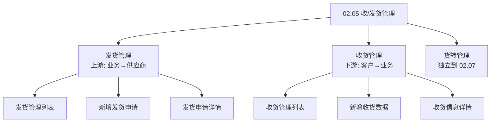
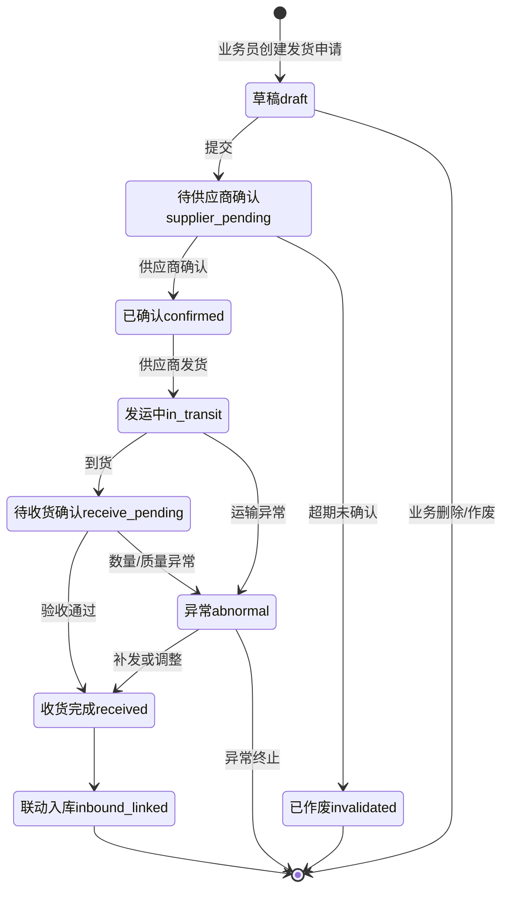
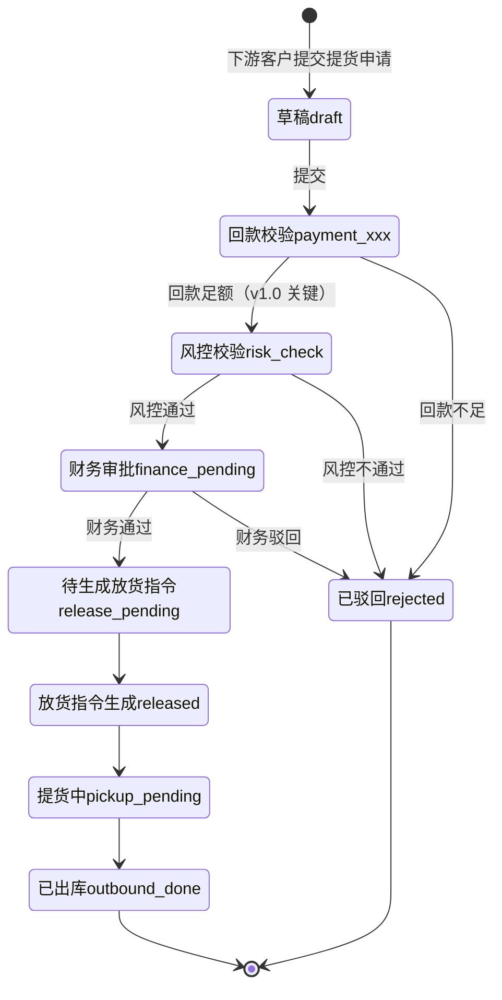
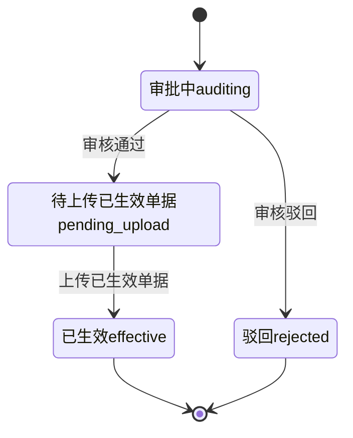

# 02.05 收/发货管理 v1.0 终版

> **状态**：v1.0 终版（**v0.1 重写版，基于原型 26-31 截图 + 新架构**）
> **生成时间**：2026-07-24 14:55
> **配套文档**：[00-项目总览与对接.md](../00-项目总览与对接.md) / [01-模块拆解大框架.md](../01-模块拆解大框架.md) / [02.03-合同管理.md](./02.03-合同管理.md) / [02.04-订单管理.md](./02.04-订单管理.md) / [02.07-货转管理.md](./02.07-货转管理.md)
> **复用度**：🟢 **80%（大幅复用）**——主产品 `t_xxx` 6 张 + `t_xxx` 5 张 + `t_xxx（业务实体）` = **11+ 张表**

---

> **当前页**：`shipment-out-detail.html`
> **文档状态**：基于源模块文档的占位版，精确字段待 review 后按原型图精修

## 0. 章节导航

1. 业务定位
2. 业务流程全景（**3 子模块**）
3. 核心实体（8 张表）
4. 3 子状态机（**v1.0 重新结构化**）
5. 角色操作矩阵
6. 字段规则
7. 按钮交互
8. 异常处理
9. 跨模块流转

---

## 1. 业务定位

**收/发货管理**是港通供应链**物流执行的核心**——订单执行后，通过收/发货指令完成货物的实际物理流转。

**3 大子模块**（基于 sitemap）：
- **发货管理**（上游）：业务人员→上游供应商（发货指令→发运登记→收货确认→入库）
- **收货管理**（下游）：下游客户→业务人员（提货申请→风控校验→放货指令→出库）
- **货转管理**：货权转移登记+智能识别+撤销（**v1.0 拆出来到独立模块 02.07**）

**关键特点**：
- **多方协同**：业务人员 + 上游供应商 + 仓储管理员 + 下游客户
- **线下+线上结合**：发货指令系统下发→供应商确认→线下发货→线上登记
- **货权凭证**：铁路运单 + 商品所有权确认单（**港通特色**——木薯淀粉通过中欧班列运输）
- **车/船/火车**：根据建设方案 V2 §3.3.2.5，港通支持**船运/火车/汽车**多式联运
- **货转凭证智能识别**：OCR 识别关键字段（**港通特色**）

---

## 2. 业务流程全景

### 2.1 3 子模块架构（**v1.0 重新结构化**）

---

## 4. 3 子状态机（**v1.0 重新结构化**）

### 4.1 发货管理状态机（上游）

### 4.2 收货管理状态机（下游）

### 4.3 货转管理状态机（**v1.0 简版，详细见 02.07**）

---

## 5. 角色操作矩阵

| 状态 / 角色 | 业务员 | 业务部 | 供应商 | 客户 | 风控部 | 财务部 | 仓储方 |
|------------|------|------|------|------|------|------|------|
| 发货-待供应商确认 | 查看 | 查看 | **确认** | - | - | - | - |
| 发货-已确认 | 查看 | 查看 | **发运登记** | - | - | - | - |
| 发货-到货 | **登记收货** | 查看 | - | - | - | - | **入库** |
| 收货-回款校验 | 查看 | - | - | - | - | **校验** | - |
| 收货-风控校验 | 查看 | - | - | - | **校验** | - | - |
| 收货-财务审批 | 查看 | - | - | - | - | **审批** | - |
| 收货-放货指令 | 查看 | - | - | - | - | - | **执行放货** |
| 货转-审核 | 查看 | - | - | - | **审核** | - | - |

---

## 6. 字段规则

### 6.1 运输方式 `delivery_method`（**港通特色**）

- 3 种：`truck`（汽车）/ `train`（火车，铁路运单）/ `ship`（船）
- **多式联运**：发货单可拆分为多段运输

### 6.2 提货方式 `pickup_method`

- 2 种：`self`（自提）/ `delegate`（委托）

### 6.3 提货回款校验（**v1.0 关键**）

- 校验提货金额 ≤ 客户已回款金额
- 校验不通过 → 状态→`rejected`

### 6.4 风控校验（**v1.0 关键**）

- 校验客户黑名单 / 风险等级
- 客户已被冻结/黑名单 → 状态→`rejected`

---

## 7. 按钮交互

### 7.1 发货管理列表（26 截图）

| 按钮 | 位置 | 可见条件 | 点击行为 |
|------|------|---------|---------|
| **+ 新增发货申请** | 右上 | 业务员 | 跳新增页 |
| 详情 | 列表行 | 所有 | 跳详情页 |

### 7.2 新增发货申请（27 截图）

- 选上游供应商（必填）
- 选关联订单（必填）
- 填运输方式 + 数量 + 提货日期
- 上传附件（铁路运单/车辆照片/质检报告）

### 7.3 发货申请详情（28 截图）

- 状态时间线
- 运输信息
- 附件列表
- 异常处理记录

### 7.4 收货管理列表（29 截图）

- 提货申请列表（按订单/客户筛选）
- 状态：草稿/回款校验/风控校验/财务审批/放货指令/已出库

### 7.5 新增收货数据（30 截图）

- 选下游客户（必填）
- 选关联销售订单（必填）
- 填提货数量 + 提货日期 + 提货方式
- 自动校验回款 + 风控

### 7.6 收货信息详情（31 截图）

- 完整提货信息
- 校验记录（回款/风控/财务）
- 放货指令
- 提货凭证

---

## 8. 异常处理

### 8.1 发货异常

| 异常场景 | 提示文案 | 处理动作 |
|---------|---------|---------|
| 供应商未确认 | "供应商 X 未确认发货指令" | 黄灯提醒 |
| 发货数量 > 订单数量 | "发货数量 X 超过订单剩余数量 Y" | 阻止 |
| 铁路运单未上传 | "火车运输必须上传铁路运单" | 阻止 |
| 收货数量不一致 | "实际收货数量 X 与发货数量 Y 不一致" | 红色提示 + 启动异常流程 |
| 质检不合格 | "质检不合格数量 X" | 启动补发/调整流程 |

### 8.2 收货异常（**v1.0 关键**）

| 异常场景 | 提示文案 | 处理动作 |
|---------|---------|---------|
| **回款不足**（v1.0 关键）| "客户 X 已回款 Y 元，不足以提货 Z 元" | 状态→`rejected` |
| **客户被冻结**（v1.0 关键）| "客户 X 已被冻结，不能提货" | 状态→`rejected` |
| **客户命中黑名单**（v1.0 关键）| "客户 X 命中黑名单，禁止提货" | 状态→`rejected` |
| 风控不通过 | "风控校验不通过" | 状态→`rejected` |
| 财务驳回 | "财务驳回" | 状态→`rejected` |

### 8.3 货转异常（**v1.0 简版**）

| 异常场景 | 提示文案 | 处理动作 |
|---------|---------|---------|
| OCR 识别失败 | "OCR 识别失败，请手动填写" | 允许手动 |
| 货转数量 > 发货/收货数量 | "货转数量 X 超过剩余数量 Y" | 阻止 |

---

## 9. 跨模块流转

### 9.1 上游触发

| 触发模块 | 触发条件 | 触发动作 |
|---------|---------|---------|
| 订单管理（02.04）| 订单 `executing` | 允许发货/收货关联 |

### 9.2 下游触发

| 触发模块 | 触发条件 | 触发动作 |
|---------|---------|---------|
| 仓储-入库（02.12）| 发货收货完成 | 联动入库 |
| 仓储-出库（02.12）| 放货指令生成 | 联动出库 |
| 货转（02.07）| 发货/收货完成 | 货转关联 |
| 业务线（02.06）| 发货/收货完成 | 更新业务线货物进度 |
| 客户额度（02.02）| 提货申请 | 校验回款 |
| 预警中心（02.11）| 发货/收货异常 | 触发预警 |

---

## 11. 文档版本

- **v0.1（2026-07-24 11:01）**：基于 5 张截图 + 建设方案 V2 初稿（旧架构）
- **v1.0（2026-07-24 14:55）**：基于 26-31 截图 + sitemap **重写**（新架构）
  - 🔴 3 子模块结构（发货/收货/货转，货转拆出到 02.07）
  - 🟡 8 张表（vs v0.1 11+ 张）
  - 🟡 3 子状态机
  - 🟡 关键校验：回款/风控/财务
- - **v1.7.99.x（2026-07-28）**：基于 30+ 版本迭代同步
  - 🟡 列表页占位 = "全部"（全站统一）
  - 🟡 状态 tag 颜色编码
  - 🟡 流程图统一用 Mermaid
  - 详见：[v1.7.99-changelog.md](./v1.7.99-changelog.md)
修改记录：见 `06-修改记录.md`