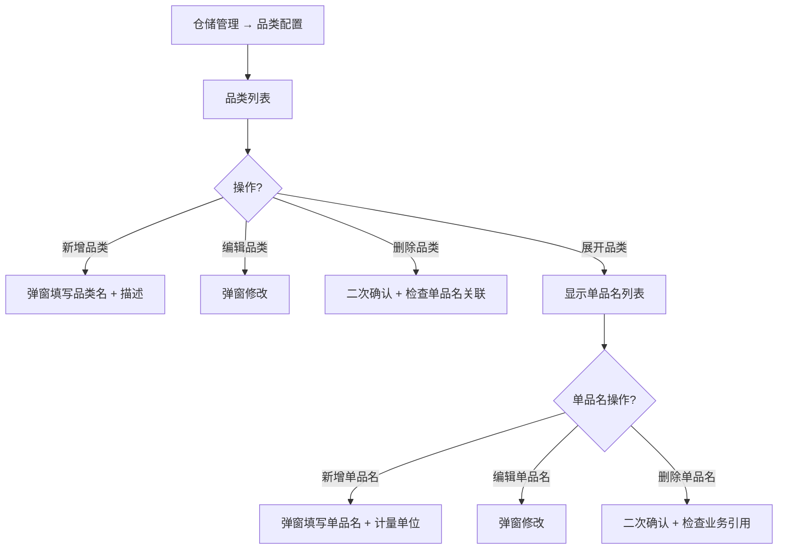

# 02.12.99 品类配置 v1.7.99.120 终版

> **状态**：v1.7.99.120 终版（**v1.0 基础上 + v1.7.99.120 品类配置重构**）
> **生成时间**：2026-09-24 17:20
> **配套文档**：[00-项目总览与对接.md](../00-项目总览与对接.md) / [01-模块拆解大框架.md](../01-模块拆解大框架.md) / [p-warehouse-system.md](./p-warehouse-system.md) / [02.12-仓储管理.md](./02.12-仓储管理.md)
> **需求来源**：本仓库 v1.7.99.120 改造 + 飞书《豫港通用户使用手册（内部版）》第 9 章"仓储管理"
> **复用度**：🟡 60%（仓储子页面通用模式 + 品类配置专属 UI）

---

> **当前页**：`warehouse-category.html`（品类配置页）
> **关联页**：`warehouse-warehouse.html`（仓房管理）/ `warehouse-point.html`（库点信息管理）/ `warehouse-inventory.html`（库存台账）

## 0. 章节导航

1. 业务定位
2. 业务流程全景
3. 字段规则
4. 按钮交互
5. 异常处理
6. 跨模块流转
7. 文档版本

---

## 1. 业务定位

**品类配置**是仓储管理的**基础数据维护页**——业务人员配置品类（如谷物/淀粉/糖粉等）+ 单品名（具体品类下的细分）+ 默认计量单位等基础数据。

| 维度 | 品类配置（本页）| 仓房管理（warehouse-warehouse）|
|------|------------------|-------------------------------|
| 数据类型 | 基础数据（品类 + 单品名）| 仓房 + 货位 |
| 配置范围 | 全平台共享 | 按仓库/库点分组 |
| 业务依赖 | 入库/出库/合同/业务线都引用 | 库存登记引用 |

### 1.1 入口

| 入口 | URL | 说明 |
|------|------|------|
| 顶部菜单"仓储管理" → **品类配置** | `./warehouse-category.html` | 主入口 |

### 1.2 v1.7.99.120 关键改动

- 从 v1.0 单列表重构为 **v1.7.99.120 品类 + 单品名二级结构**：
  - 一级：品类（如谷物）
  - 二级：单品名（如玉米/小麦/大豆）
- 每个单品名关联默认计量单位（吨/件/支）
- 支持品类批量导入（Excel）

---

## 2. 业务流程全景

---

## 3. 字段规则

### 3.1 品类列表字段

| 字段 | 类型 | 必填 | 校验 |
|------|------|------|------|
| 品类编号 | auto | - | 系统生成（不可改）|
| 品类名称 | input | 是 | 必填；不可重复 |
| 品类描述 | textarea | 否 | 选填 |
| 单品名数量 | int | - | 灰置（统计）|
| 业务引用数 | int | - | 灰置（被合同/入库引用的次数）|
| 操作 | button | - | 展开 / 编辑 / 删除 |

### 3.2 单品名字段（v1.7.99.120 二级）

| 字段 | 类型 | 必填 | 校验 |
|------|------|------|------|
| 单品名编号 | auto | - | 系统生成 |
| 单品名名称 | input | 是 | 必填；同一品类下不可重复 |
| 默认计量单位 | select | 是 | 吨/件/支 |
| 默认单价 | per item | 否 | 选填 |
| 业务引用数 | int | - | 灰置 |
| 操作 | button | - | 编辑 / 删除 |

### 3.3 校验规则

| 场景 | 校验 |
|------|------|
| 删除被业务引用的品类 | 红字提示"该品类被 N 笔业务引用，无法删除" |
| 删除被业务引用的单品名 | 红字提示"该单品名被 N 笔业务引用，无法删除" |
| 品类名称重复 | 红字提示"品类名称已存在" |
| 单品名名称重复（同一品类下）| 红字提示"该品类下已存在同名单品名" |

---

## 4. 按钮交互

### 4.1 主操作按钮

| 按钮 | 位置 | 行为 |
|------|------|------|
| **+ 新增品类** | 顶部 | 弹窗新增品类 |
| **批量导入** | 顶部右侧 | 下载 Excel 模板 + 上传 |
| **展开/收起** | 品类行 | 展开/收起单品名列表 |

### 4.2 行操作按钮

| 按钮 | 位置 | 行为 |
|------|------|------|
| 新增单品名 | 展开行内 | 弹窗新增单品名 |
| 编辑 | 行操作列 | 弹窗修改 |
| 删除 | 行操作列 | 二次确认 |

---

## 5. 异常处理

| 场景 | 处理 |
|------|------|
| URL 参数异常 | 顶部红色 bar + 返回仓储管理 |
| 删除被引用的品类/单品名 | 红字提示引用数 + 拒绝删除 |
| 批量导入格式错误 | 红字提示哪一行哪一列错误 + 提供下载错误明细 |
| Excel 文件超过 100 行 | 红字提示"批量导入单次不超过 100 行" |

---

## 6. 跨模块流转

### 6.1 与合同管理（02.03）

- 合同"品名"字段引用单品名（v1.7.99.x 通用规则）
- 合同已签订后，关联的单品名不可删除

### 6.2 与入库管理（02.12 子模块）

- 入库单"品名"字段引用单品名
- 入库已登记后，关联的单品名不可删除

### 6.3 与业务线（02.06）

- 业务线"品类库存列表"按品类分组
- 业务线关联的品类不可删除

---

## 7. 文档版本

- **v1.0（2026-07-24）**：品类配置 v1.0 终版
- **v1.7.99.120（2026-07-30）**：**品类 + 单品名二级结构** + 计量单位配置 + 批量导入
- **2026-09-24**：首次写 PRD（基于手册 9 章 + v1.7.99.120 沉淀）

修改记录：见 `v1.7.99-changelog.md`