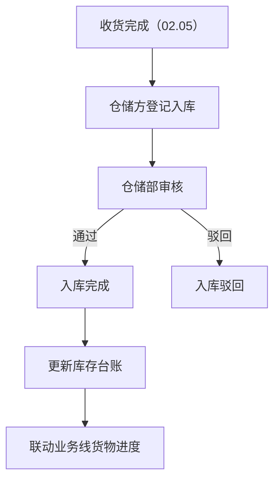
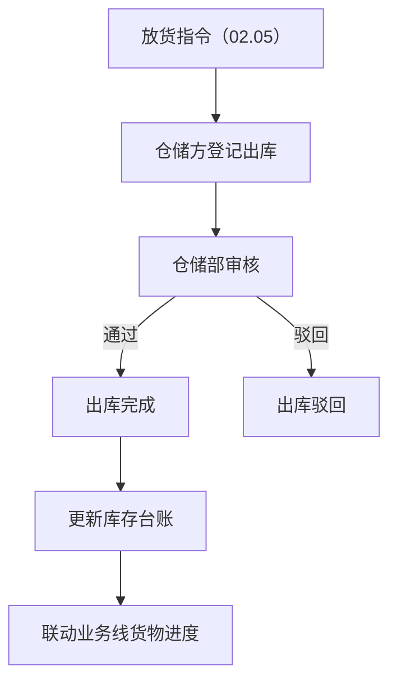
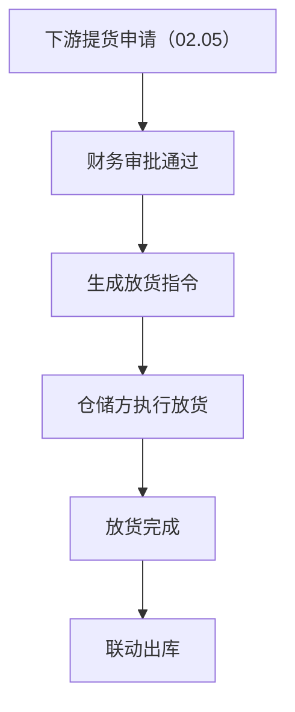
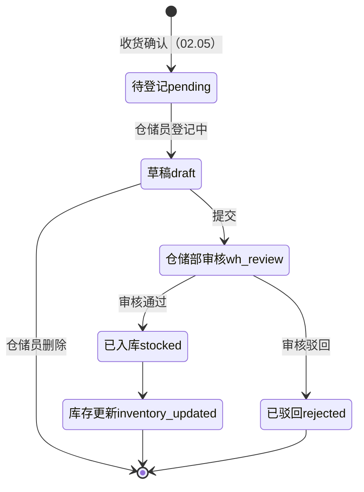
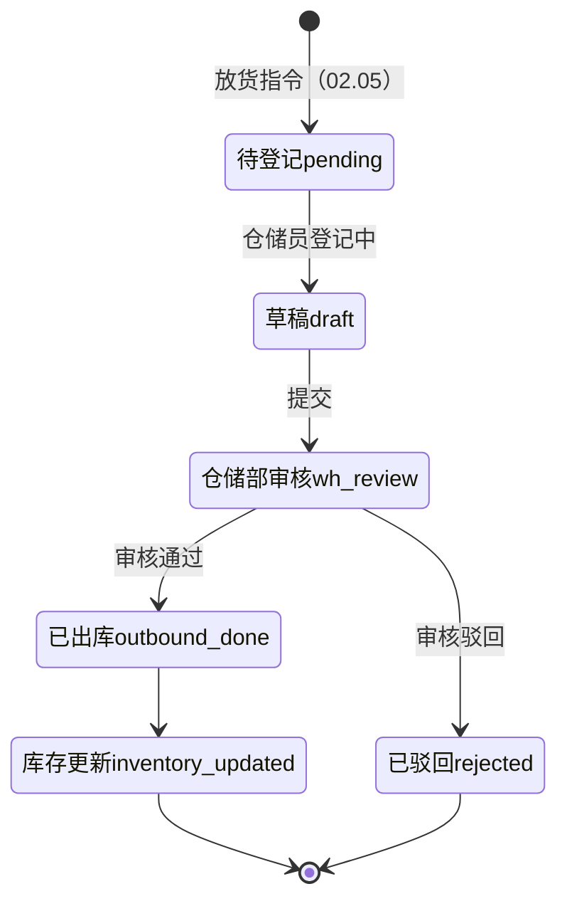
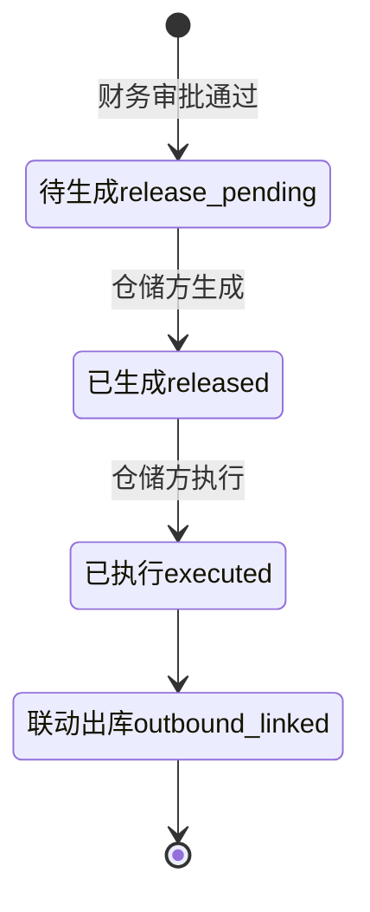

# 02.12 仓储管理 v1.0 终版

> **状态**：v1.0 终版（**新模块，基于原型 61-69 截图**）
> **生成时间**：2026-07-24 14:55
> **配套文档**：[00-项目总览与对接.md](../00-项目总览与对接.md) / [01-模块拆解大框架.md](../01-模块拆解大框架.md) / [02.05-收发货管理.md](./02.05-收发货管理.md) / [02.07-货转管理.md](./02.07-货转管理.md)
> **复用度**：🟡 **65%（可用，去掉部分字段）**——主产品 `t_xxx` + `t_xxx` + `t_xxx` 13+ 张表

---

> **当前页**：`warehouse-inbound-detail.html`
> **文档状态**：基于源模块文档的占位版，精确字段待 review 后按原型图精修

## 0. 章节导航

1. 业务定位
2. 业务流程全景
3. 核心实体（6 张表）
4. 3 子模块状态机
5. 角色操作矩阵
6. 字段规则
7. 按钮交互
8. 异常处理
9. 跨模块流转


---

## 1. 业务定位

**仓储管理**是港通供应链的**独立第三方仓储方履约平台**——出入库登记 + 盘库 + 月度对账。

**关键特点**：
- **3 子模块**：入库管理 / 出库管理 / 提货管理（放货管理）
- **多仓储方**：木薯淀粉仓储方、煤炭仓储方等
- **视频监控/巡库**：v1.0 占位（无改动）

### 1.1 9 个页面（sitemap）

| # | 子模块 | 页面 |
|---|--------|------|
| 1 | **入库管理** | 入库记录 / 新增入库 / 入库详情 |
| 2 | **出库管理** | 出库记录 / 新增出库 / 出库详情（无改动）|
| 3 | **提货管理（放货管理）** | 放货管理 / 新增放货指令 / 放货指令详情 |
| 4 | 库存管理 | **无改动**（占位）|
| 5 | 视频监控 | **无改动**（占位）|
| 6 | 巡库管理 | **无改动**（占位）|
| 7 | 系统管理 | **无改动**（占位）|

---

## 2. 业务流程全景

### 2.1 入库管理流程



### 2.2 出库管理流程



### 2.3 放货管理流程



---

## 4. 3 子模块状态机

### 4.1 入库管理状态机



### 4.2 出库管理状态机



### 4.3 放货管理状态机



---

## 5. 角色操作矩阵

| 操作 / 角色 | 仓储员 | 仓储部 | 业务部 | 风控部 | 财务部 |
|------------|------|------|------|------|------|
| 入库登记 | **✓** | - | - | - | - |
| 入库审核 | - | **✓** | - | - | - |
| 出库登记 | **✓** | - | - | - | - |
| 出库审核 | - | **✓** | - | - | - |
| 放货指令生成 | **✓** | - | - | - | - |
| 放货执行 | **✓** | - | - | - | - |
| 盘库 | **✓** | - | - | - | - |
| 查看库存台账 | ✓ | ✓ | ✓ | ✓ | ✓ |

---

## 6. 字段规则

### 6.1 仓库类型 `warehouse_type`

- 3 种：`starch`（木薯淀粉）/ `coal`（煤炭）/ `sugar`（糖粉）

### 6.2 入库类型 `inbound_type`

- 3 种：`purchase`（采购入库）/ `return`（退货入库）/ `transfer`（调拨入库）

### 6.3 出库类型 `outbound_type`

- 3 种：`sales`（销售出库）/ `transfer`（调拨出库）/ `loss`（损耗）

### 6.4 库存数量计算

```
可用数量 = 库存总量 - 锁定数量
```

锁定数量：已下单但未出库的数量

### 6.5 盘库差异处理

- `diff_quantity` = 系统数量 - 实际数量
- 正数：盘亏（实际少于系统）
- 负数：盘盈（实际多于系统）
- 差异 > 5% 触发预警

---

## 7. 按钮交互

### 7.1 入库记录列表（61 截图）

| 按钮 | 位置 | 可见条件 | 点击行为 |
|------|------|---------|---------|
| 搜索/筛选 | 顶部 | 所有 | 弹筛选抽屉 |
| 数据导出 | Tab 右侧 | 所有 | 导出 Excel |
| 详情 | 列表行 | 所有 | 跳详情页 |
| 新增入库 | 右上 | 仓储员 | 跳新增页（62 截图）|

### 7.2 新增入库（62 截图）

- 选仓库（必填）
- 选商品 + 数量
- 选入库类型
- 选关联收货确认（02.05）

### 7.3 入库详情（63 截图）

- 入库基本信息
- 商品明细
- 仓储员信息
- 审核记录

### 7.4 出库记录列表（64 截图）

- 类似入库记录列表
- **出库详情无改动**（66 截图）

### 7.5 放货管理列表（67 截图）

| 按钮 | 位置 | 可见条件 | 点击行为 |
|------|------|---------|---------|
| 搜索/筛选 | 顶部 | 所有 | 弹筛选抽屉 |
| 数据导出 | Tab 右侧 | 所有 | 导出 Excel |
| 详情 | 列表行 | 所有 | 跳详情页 |
| 新增放货指令 | 右上 | 仓储员 | 跳新增页（68 截图）|

### 7.6 新增放货指令（68 截图）

- 选下游客户（必填）
- 选关联销售订单（必填）
- 填放货数量 + 放货日期

### 7.7 放货指令详情（69 截图）

- 放货基本信息
- 商品明细
- 执行记录

---

## 8. 异常处理

| 异常场景 | 提示文案 | 处理动作 |
|---------|---------|---------|
| 入库数量 > 收货数量 | "入库数量 X 超过收货剩余数量 Y" | 阻止 |
| 出库数量 > 库存可用数量 | "出库数量 X 超过库存可用数量 Y" | 阻止 |
| 库存为负 | "出库后库存 X < 0，不允许出库" | 阻止 |
| 盘库差异 > 5% | "盘库差异 X 超过 5%，请人工确认" | 黄色提醒 |
| 锁定数量 > 库存总量 | "锁定数量异常" | 红色提示 |

---

## 9. 跨模块流转

### 9.1 上游触发

| 触发模块 | 触发条件 | 触发动作 |
|---------|---------|---------|
| 收发货（02.05）| 收货完成 | 触发入库登记 |
| 收发货（02.05）| 放货指令生成 | 触发出库登记 |

### 9.2 下游触发

| 触发模块 | 触发条件 | 触发动作 |
|---------|---------|---------|
| 库存台账 | 入库/出库完成 | 更新库存数量 |
| 业务线（02.06）| 入库/出库完成 | 更新业务线货物进度 |
| 货转（02.07）| 入库/出库 | 货转关联 |
| 预警中心（02.11）| 库存超期/盘库异常 | 触发预警 |

---

## 11. 文档版本

- **v1.0（2026-07-24 14:55）**：基于 61-69 截图 + sitemap 首次终版，作为范本用于后端开发
- - **v1.7.99.x（2026-07-28）**：基于 30+ 版本迭代同步
  - 🟡 列表页占位 = "全部"（全站统一）
  - 🟡 状态 tag 颜色编码
  - 🟡 流程图统一用 Mermaid
  - 详见：[v1.7.99-changelog.md](./v1.7.99-changelog.md)
修改记录：见 `06-修改记录.md`