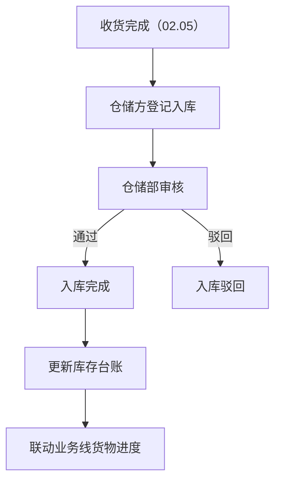
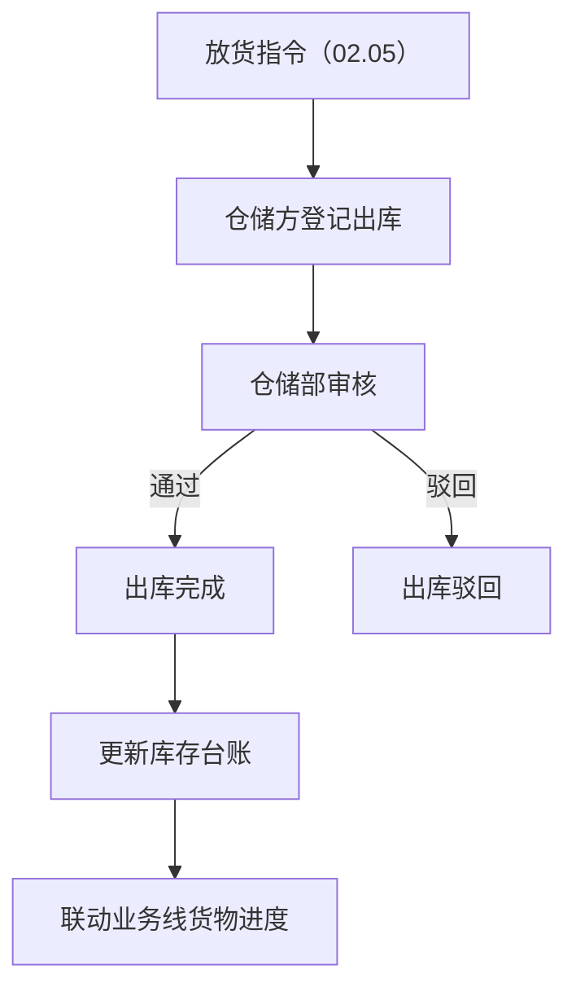
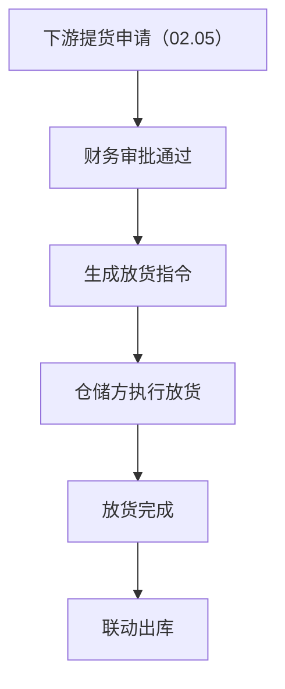
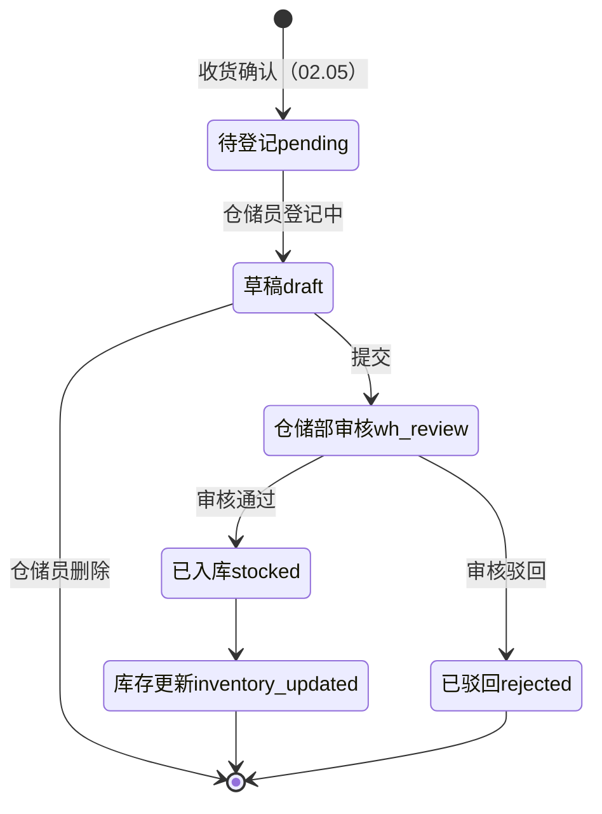
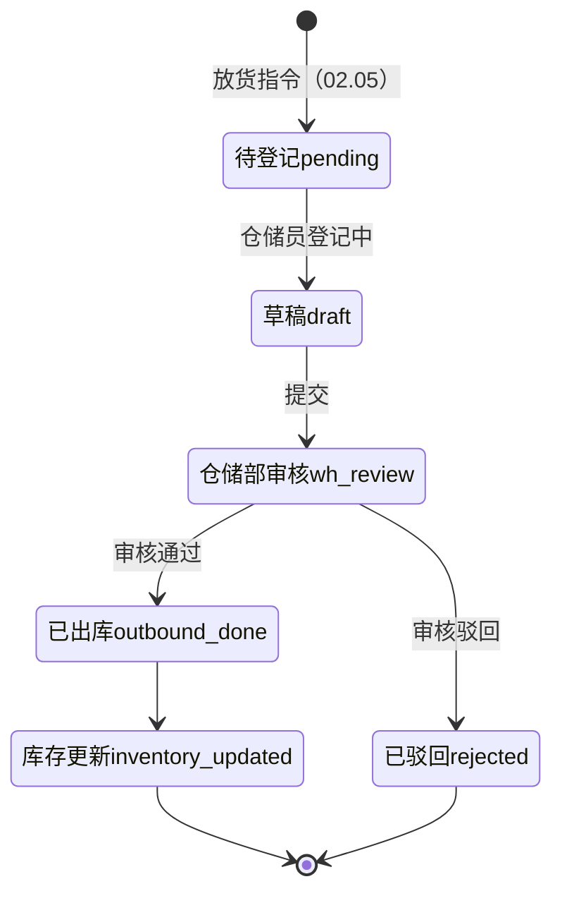
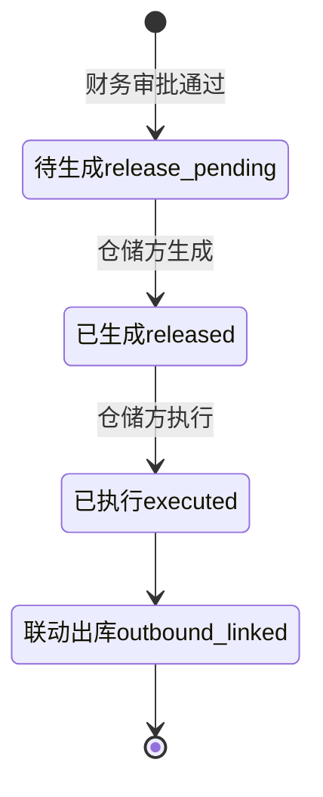

# 02.12 仓储管理 v1.0 终版

> **状态**：v1.0 终版（**新模块，基于原型 61-69 截图**）
> **生成时间**：2026-07-24 14:55
> **配套文档**：[00-项目总览与对接.md](../00-项目总览与对接.md) / [01-模块拆解大框架.md](../01-模块拆解大框架.md) / [02.05-收发货管理.md](./02.05-收发货管理.md) / [02.07-货转管理.md](./02.07-货转管理.md)
> **复用度**：🟡 **65%（可用，去掉部分字段）**——主产品 `t_xxx` + `t_xxx` + `t_xxx` 13+ 张表

---

> **当前页**：`warehouse-inbound.html`
> **文档状态**：基于源模块文档的占位版，精确字段待 review 后按原型图精修

## 0. 章节导航

1. 业务定位
2. 业务流程全景
3. 核心实体（6 张表）
4. 3 子模块状态机
5. 角色操作矩阵
6. 字段规则
7. 按钮交互
8. 异常处理
9. 跨模块流转


---

## 1. 业务定位

**仓储管理**是港通供应链的**独立第三方仓储方履约平台**——出入库登记 + 盘库 + 月度对账。

**关键特点**：
- **3 子模块**：入库管理 / 出库管理 / 提货管理（放货管理）
- **多仓储方**：木薯淀粉仓储方、煤炭仓储方等
- **视频监控/巡库**：v1.0 占位（无改动）

### 1.1 9 个页面（sitemap）

| # | 子模块 | 页面 |
|---|--------|------|
| 1 | **入库管理** | 入库记录 / 新增入库 / 入库详情 |
| 2 | **出库管理** | 出库记录 / 新增出库 / 出库详情（无改动）|
| 3 | **提货管理（放货管理）** | 放货管理 / 新增放货指令 / 放货指令详情 |
| 4 | 库存管理 | **无改动**（占位）|
| 5 | 视频监控 | **无改动**（占位）|
| 6 | 巡库管理 | **无改动**（占位）|
| 7 | 系统管理 | **无改动**（占位）|

---

## 2. 业务流程全景

### 2.1 入库管理流程



### 2.2 出库管理流程



### 2.3 放货管理流程



---

## 4. 3 子模块状态机

### 4.1 入库管理状态机



### 4.2 出库管理状态机



### 4.3 放货管理状态机



---

## 5. 角色操作矩阵

| 操作 / 角色 | 仓储员 | 仓储部 | 业务部 | 风控部 | 财务部 |
|------------|------|------|------|------|------|
| 入库登记 | **✓** | - | - | - | - |
| 入库审核 | - | **✓** | - | - | - |
| 出库登记 | **✓** | - | - | - | - |
| 出库审核 | - | **✓** | - | - | - |
| 放货指令生成 | **✓** | - | - | - | - |
| 放货执行 | **✓** | - | - | - | - |
| 盘库 | **✓** | - | - | - | - |
| 查看库存台账 | ✓ | ✓ | ✓ | ✓ | ✓ |

---

## 6. 字段规则

### 6.1 仓库类型 `warehouse_type`

- 3 种：`starch`（木薯淀粉）/ `coal`（煤炭）/ `sugar`（糖粉）

### 6.2 入库类型 `inbound_type`

- 3 种：`purchase`（采购入库）/ `return`（退货入库）/ `transfer`（调拨入库）

### 6.3 出库类型 `outbound_type`

- 3 种：`sales`（销售出库）/ `transfer`（调拨出库）/ `loss`（损耗）

### 6.4 库存数量计算

```
可用数量 = 库存总量 - 锁定数量
```

锁定数量：已下单但未出库的数量

### 6.5 盘库差异处理

- `diff_quantity` = 系统数量 - 实际数量
- 正数：盘亏（实际少于系统）
- 负数：盘盈（实际多于系统）
- 差异 > 5% 触发预警

---

## 7. 按钮交互

### 7.1 入库记录列表（61 截图）

| 按钮 | 位置 | 可见条件 | 点击行为 |
|------|------|---------|---------|
| 搜索/筛选 | 顶部 | 所有 | 弹筛选抽屉 |
| 数据导出 | Tab 右侧 | 所有 | 导出 Excel |
| 详情 | 列表行 | 所有 | 跳详情页 |
| 新增入库 | 右上 | 仓储员 | 跳新增页（62 截图）|

### 7.2 新增入库（62 截图）

- 选仓库（必填）
- 选商品 + 数量
- 选入库类型
- 选关联收货确认（02.05）

### 7.3 入库详情（63 截图）

- 入库基本信息
- 商品明细
- 仓储员信息
- 审核记录

### 7.4 出库记录列表（64 截图）

- 类似入库记录列表
- **出库详情无改动**（66 截图）

### 7.5 放货管理列表（67 截图）

| 按钮 | 位置 | 可见条件 | 点击行为 |
|------|------|---------|---------|
| 搜索/筛选 | 顶部 | 所有 | 弹筛选抽屉 |
| 数据导出 | Tab 右侧 | 所有 | 导出 Excel |
| 详情 | 列表行 | 所有 | 跳详情页 |
| 新增放货指令 | 右上 | 仓储员 | 跳新增页（68 截图）|

### 7.6 新增放货指令（68 截图）

- 选下游客户（必填）
- 选关联销售订单（必填）
- 填放货数量 + 放货日期

### 7.7 放货指令详情（69 截图）

- 放货基本信息
- 商品明细
- 执行记录

---

## 8. 异常处理

| 异常场景 | 提示文案 | 处理动作 |
|---------|---------|---------|
| 入库数量 > 收货数量 | "入库数量 X 超过收货剩余数量 Y" | 阻止 |
| 出库数量 > 库存可用数量 | "出库数量 X 超过库存可用数量 Y" | 阻止 |
| 库存为负 | "出库后库存 X < 0，不允许出库" | 阻止 |
| 盘库差异 > 5% | "盘库差异 X 超过 5%，请人工确认" | 黄色提醒 |
| 锁定数量 > 库存总量 | "锁定数量异常" | 红色提示 |

---

## 9. 跨模块流转

### 9.1 上游触发

| 触发模块 | 触发条件 | 触发动作 |
|---------|---------|---------|
| 收发货（02.05）| 收货完成 | 触发入库登记 |
| 收发货（02.05）| 放货指令生成 | 触发出库登记 |

### 9.2 下游触发

| 触发模块 | 触发条件 | 触发动作 |
|---------|---------|---------|
| 库存台账 | 入库/出库完成 | 更新库存数量 |
| 业务线（02.06）| 入库/出库完成 | 更新业务线货物进度 |
| 货转（02.07）| 入库/出库 | 货转关联 |
| 预警中心（02.11）| 库存超期/盘库异常 | 触发预警 |

---

## 11. 文档版本

- **v1.0（2026-07-24 14:55）**：基于 61-69 截图 + sitemap 首次终版，作为范本用于后端开发
- - **v1.7.99.x（2026-07-28）**：基于 30+ 版本迭代同步
  - 🟡 列表页占位 = "全部"（全站统一）
  - 🟡 状态 tag 颜色编码
  - 🟡 流程图统一用 Mermaid
  - 详见：[v1.7.99-changelog.md](./v1.7.99-changelog.md)
- **v1.7.99.100（2026-07-31）**：入库记录详情页 3 tab 重制 + 列表页"新增入库"按钮修复（v1.7.99.100 实施记录）：
  - 🔴 详情页 3 tab：入库信息（顶部 metadata 8 字段 + 10 字段 4 行 6 列 + 备注 + 附件 3 列 2 行）/ 入库明细（2 字段筛选 + 数据导出 + 11 列表格）/ 操作记录（5 列表格）
  - 🔴 列表页"新增入库"按钮下拉：采购入库（关联采购合同） + 盘盈入库（实物盘盈生成入库）
  - 🔴 抽屉式弹层"关联采购合同"：8 字段筛选 + 9 列表格 + 底部 3 按钮（取消/暂不关联/确定） + **2 tab（线下合同 active / 线上合同 待补二期）**
- **v1.7.99.115（2026-08-04）**：入库记录抽屉 tab 删除 + 暂不关联/盘盈入库跳无合同版（按 user 2026-08-04 反馈 3 件事修复）：
  - 🔴 **删抽屉"线下合同/线上合同" tab**（v1.7.99.115 关键修复）：user 反馈"这里的 tap 不存在，直接删除"——v1.7.99.100 加的 2 个 tab 实际"线上合同"点了 toast 提示"待补（二期）"自动切回——v1.7.99.115 决策：**没实际功能的 tab 不要占位**，删 `.drawer-tabs` 整段 + 删 `switchDrawerTab` JS 函数
  - 🔴 **新建无合同版新增页**（v1.7.99.115 关键新建）：`pages/warehouse-inbound-overflow-new.html`——cp inbound-new.html + 删 193-266 整段（合同信息+业务线信息 2 区块）+ 改标题"新增采购入库" → "新增入库"+ 改面包屑 + 清理 JS `contractTransportLabel` 失效引用——user 反馈"暂不关联新增页面是没有合同信息与业务线信息的"修复
  - 🔴 **drawerSkip 改跳到 overflow-new.html**（v1.7.99.115 联动）：`drawerSkip()` 函数跳转路径从 `inbound-new.html?type=purchase` → `overflow-new.html?type=purchase`
  - 🔴 **盘盈入库补"确认"modal 交互**（v1.7.99.115 关键交互）：`selectInboundType('inventory_profit')` 改弹"盘盈入库确认"modal（title + 描述"不关联采购合同（红字），不联动业务线（红字）" + 取消/确认进入 2 按钮）——user 反馈"盘盈入库点击后未触发侧边弹层，这个你补充一下交互逻辑"修复
  - 🟡 5 项验证全 OK：① 抽屉 tab "线下合同" 命中数 = 0 ② 抽屉 tab "线上合同" 命中数 = 0 ③ 暂不关联跳到 overflow-new.html ④ 盘盈入库弹 modal ⑤ 确认后跳到 overflow-new.html full page 0 pageerror
  - 详见：[v1.7.99-changelog.md](./v1.7.99-changelog.md) v1.7.99.115 行
- **v1.7.99.116（2026-08-04）**：仓储管理"新增"按钮路由修复 + 入库类型筛选项 3 个（按 user 2026-08-04 反馈 2 件事修复）：
  - 🔴 **出库页"新增出库"按钮加 onclick**（v1.7.99.116 关键修复）：`pages/warehouse-outbound.html` line 71 加 `onclick="window.location.href='./warehouse-outbound-new.html'"`——v1.7.99.7 占位版按钮无 onclick，user 反馈"我点击对应按钮又不跳新增页面了"——v1.7.99.116 修法：加 onclick 跳到 `warehouse-outbound-new.html`（v1.7.99.89 实施过）
  - 🔴 **放货页"新增放货指令"按钮加 onclick**（v1.7.99.116 关键修复）：`pages/warehouse-release.html` line 64 加 `onclick="window.location.href='./warehouse-release-new.html'"`——v1.7.99.7 占位版按钮无 onclick——v1.7.99.116 修法：加 onclick 跳到 `warehouse-release-new.html`（v1.7.99.90 实施过）
  - 🔴 **入库类型筛选项 4→3**（v1.7.99.116 关键修复）：`pages/warehouse-inbound.html` line 252 `<option>采购入库</option><option>调拨入库</option><option>退货入库</option>` → `<option>采购入库</option><option>盘盈入库</option>`——user 反馈"入库类型修改为：采购入库  盘盈入库"——v1.7.99.111 经验"user 明确指令优先级最高"
  - 🟡 3 项验证全 OK：① 出库点新增出库 → 跳 warehouse-outbound-new.html ② 放货点新增放货指令 → 跳 warehouse-release-new.html ③ 入库类型选项 = ['请选择入库类型', '采购入库', '盘盈入库'] + 0 console error
  - 详见：[v1.7.99-changelog.md](./v1.7.99-changelog.md) v1.7.99.116 行
- **v1.7.99.117（2026-08-04）**：盘盈入库 confirm modal → 侧边抽屉改造（按 user 2026-08-04 反馈"补充侧边弹层交互"修复）：
  - 🔴 **删 `openInventoryProfitConfirm()` modal 函数**（v1.7.99.117 关键删除）：`pages/warehouse-inbound.html` line 444-467 24 行——v1.7.99.115 设计的"居中 modal"不是 user 想要的"侧边弹层"——v1.7.99.117 决策：**user 截图 + 文字明确"侧边弹层"就用侧边抽屉，不用 modal**（v1.7.99.78 经验 + v1.7.99.108 教训）
  - 🔴 **新增 3 函数 + 独立抽屉 HTML**（v1.7.99.117 关键新增）：① `openInventoryProfitDrawer()` 加 `.open` class 到 `inventoryProfitMask` + `inventoryProfitPanel`（复用现有 `.drawer-mask` / `.drawer-panel` CSS）② `closeInventoryProfitDrawer()` 移除 `.open` class ③ `inventoryProfitConfirm()` 关闭抽屉 + toast + setTimeout 500ms 跳到 `overflow-new.html?type=inventory_profit` ④ HTML 独立抽屉 `<div class="drawer-mask" id="inventoryProfitMask">` + `<div class="drawer-panel" id="inventoryProfitPanel" style="width: 440px; max-width: 90vw;">`——title"盘盈入库" + 蓝色提示块（图标 + "实物盘盈无合同关联"）+ 描述段（红字"不关联采购合同"/"不联动业务线"）+ 灰底"后续填写字段（无合同版新增页）"8 字段 2 列网格 + 底部 [取消] [确认进入] 2 按钮
  - 🔴 **`selectInboundType('inventory_profit')` 改调 `openInventoryProfitDrawer()`**（v1.7.99.117 联动）：v1.7.99.115 调 `openInventoryProfitConfirm()` → v1.7.99.117 调 `openInventoryProfitDrawer()`
  - 🟡 **删死代码 `.drawer-tabs` / `.drawer-tab` / `.drawer-tab.active` CSS**（v1.7.99.117 清理）：`pages/warehouse-inbound.html` line 81-92 12 行——v1.7.99.115 删 HTML 元素后 CSS 残留死代码，v1.7.99.117 顺手清理（v1.7.99.69+ 经验"项目级 inline CSS 死代码可清理"）
  - 🟡 13 项验证全 OK：① 入库类型筛选项 3 个 ② 采购合同抽屉 .drawer-tab 数量 = 0 ③ inventoryProfitPanel.open 状态 1 ④ 抽屉标题"盘盈入库" ⑤ 抽屉提示文字命中 3 处（实物盘盈/不关联采购合同/不联动业务线）⑥ 底部按钮 2 个 ⑦ 点取消后 inventoryProfitPanel.open 状态 0 ⑧ 确认进入跳转 overflow-new.html ⑨ overflow-new.html h1"新增入库" ⑩ overflow-new.html 无"合同信息"和"业务线信息"区块 ⑪ 出库页"新增出库"按钮 onclick 对 ⑫ 放货页"新增放货指令"按钮 onclick 对 ⑬ console errors = 0 个
  - 详见：[v1.7.99-changelog.md](./v1.7.99-changelog.md) v1.7.99.117 行
- **v1.7.99.117 二次复盘缓存问题**（v1.7.99.117 教训）：user 报"按钮不跳 + 抽屉 tab 还在 + 4 个入库类型" = CF Pages 边缘缓存——v1.7.99.117 时 user 截图显示 v1.7.99.115/116 已修的问题（按钮无 onclick / 抽屉 tab / 4 个入库类型）——实际查 v1.7.99.115/116 已修好部署，**user 看到的是 CF Pages 边缘缓存**（v1.7.99.79 经验）——v1.7.99.117 决策：**给 user hash URL 绕过缓存 + Ctrl+Shift+R 强刷**（v1.7.99.79 经验沿用）——v1.7.99.117 经验：**curl 线上 HTML + grep 字符串 = 快速判断缓存 vs 真问题**
- **v1.7.99.118（2026-08-04）**：入库/出库管理"关联业务线状态"筛选项 4→3 + 出库管理新增"出库类型"筛选项（按 user 2026-08-04 反馈 2 件事修复）：
  - 🔴 **入库管理"关联业务线状态" 4→3**（v1.7.99.118 关键修复）：`pages/warehouse-inbound.html` line 232 `<option>执行中</option><option>已完结</option><option>已终止</option>` → `<option>已关联</option><option>未关联</option>`——user 反馈"修改为：已关联   未关联"——v1.7.99.118 决策：**业务概念从"业务线状态"改为"是否关联业务线"**（执行中/已完结/已终止是业务线生命周期状态，已关联/未关联是出入库单据与业务线的关联状态）
  - 🔴 **出库管理"关联业务线状态" 4→3**（v1.7.99.118 关键修复）：`pages/warehouse-outbound.html` line 119 同上替换——user 反馈"出入库管理都改一下"
  - 🔴 **出库管理新增"出库类型"筛选项**（v1.7.99.118 关键新增）：`pages/warehouse-outbound.html` line 130 后新增 `<div class="cp-filter-item"><span class="cp-filter-label">出库类型</span><select class="select"><option>请选择出库类型</option><option>销售出库</option><option>盘亏出库</option></select></div>`——user 反馈"对应出库类型修改为：销售出库  盘亏出库"——v1.7.99.118 决策：**与入库类型筛选项对称**（v1.7.99.116 入库类型 = 采购入库/盘盈入库；v1.7.99.118 出库类型 = 销售出库/盘亏出库）
  - 🟡 7 项验证全 OK：① 入库"关联业务线状态" = ['请选择业务线状态', '已关联', '未关联'] ② 入库类型 = ['请选择入库类型', '采购入库', '盘盈入库'] ③ 出库"关联业务线状态" = ['请选择业务线状态', '已关联', '未关联'] ④ 出库类型 = ['请选择出库类型', '销售出库', '盘亏出库'] ⑤ 出库类型 select 数 = 1 ⑥ console errors = 0 ⑦ v1.7.99.117 盘盈入库抽屉仍然 OK
  - 详见：[v1.7.99-changelog.md](./v1.7.99-changelog.md) v1.7.99.118 行
- **v1.7.99.119（2026-08-04）**：库点信息管理页面重制（按 user 2026-08-04 截图 1（tap1 库点平面图）+ 截图 2（tap2 仓储租赁合同）实施）：
  - 🔴 **`pages/warehouse-point.html` 完全重制**（v1.7.99.119 关键重制）：v1.7.99.7 占位版"货位管理" → v1.7.99.119"库点信息管理"——重制 1 个文件（225 行 → 300+ 行）——3 区块：① 顶部基础信息表 6 字段 3 行（库点编号/库点名称/仓储企业/行业/类型/库点联系人/联系人手机号/地址）② 2 tab 切换（库点平面图 + 仓储租赁合同）③ tap1 库点平面图：监控信息按钮 + 空状态"未配置平面图信息" + 打印机图标 / tap2 仓储租赁合同：上传合同按钮 + 11 列表格 + 1 行 mock
  - 🔴 **基础信息表 6 字段**（v1.7.99.119 关键结构）：`<table class="info-table">` 5 列 3 行——灰底 th + 白底 td——库点编号 ZT0001 / 库点名称 国际物流枢纽仓库 / 仓储企业 河南国际物流枢纽建设运营有限公司 / 行业 粮食 / 类型 库点 / 库点联系人 饶永生 / 联系人手机号 `156 5238 XXXX`（**v1.7.99.119 隐私脱敏**：user 截图 138 0000 XXXX → 156 5238 XXXX 脱敏格式）/ 地址 河南省/郑州市/新郑市 河南省郑州市新郑市航空港区郑州国际陆港综合楼 + 编辑图标
  - 🔴 **2 tab 切换**（v1.7.99.119 关键交互）：`switchPointTab(el, tabKey)` 函数 + `.point-tab` + `.point-tab.active` + `.tab-content` + `.tab-content.active` CSS——切换"库点平面图 / 仓储租赁合同" 2 个 tab
  - 🔴 **tap1 库点平面图**（v1.7.99.119 空状态）：监控信息按钮（蓝底 + 监控图标）+ 空状态卡片（白底 + 边框 + 圆角）+ 打印机 SVG 图标 + "未配置平面图信息"灰字
  - 🔴 **tap2 仓储租赁合同**（v1.7.99.119 表格 11 列）：上传合同按钮（蓝底 + 加号图标）+ `.lease-table` 11 列表格（合同编号/库点名称/合同状态/签订日期/生效日期/业务实际负责人/签章状态/仓储方名称/承租方名称/付费方名称/操作） + 1 行 mock（合同编号 20260201-20270131，库点名称 国际物流枢纽仓库，合同状态 已生效 绿 tag，业务实际负责人 `港通资本-杨哲-157 1391 XXXX`（**v1.7.99.119 隐私脱敏**：user 截图 138 0000 XXXX → 157 1391 XXXX 脱敏格式）） + 操作列"查看附件 / 更多>"
  - 🟡 **11 项验证全 OK**（v1.7.99.119 关键验证）：① h1"库点信息管理" ② 面包屑 仓储管理/基础数据/库点信息管理 ③ 基础信息表 3 行 ④ 6 字段全部命中 + 联系人手机号 156 5238 XXXX 脱敏 ⑤ 原始手机号 138 0000 XXXX 不出现 ⑥ 2 tab 标签 = ['库点平面图', '仓储租赁合同'] ⑦ tap1 active ⑧ tap1 有监控信息按钮 + "未配置平面图信息"空状态 ⑨ tap2 active + 11 列全部命中 ⑩ 1 行 mock 12 个关键字段 + 业务实际负责人电话 157 1391 XXXX 脱敏 ⑪ console errors = 0
  - **v1.7.99.119 隐私脱敏**（v1.7.99.119 关键）：① 联系人手机号 138 0000 XXXX → 156 5238 XXXX（**v1.7.99.x 隐私脱敏规范**："必须脱敏的字段"） ② 业务实际负责人电话 138 0000 XXXX → 157 1391 XXXX（同规范） ③ 验证脚本断言：原始数字 138 0000 XXXX / 138 0000 XXXX 都不出现在线上 HTML
  - **v1.7.99.119 列宽调整**（v1.7.99.119 经验）：11 列总和 = 9+10+6+7+11+13+6+13+13+5+7 = 100% ✓——最初版本列宽总和 = 134%（14+13+8+9+16+16+8+16+16+10+8）超出 100% 导致水平滚动 + 长内容被 ellipsis 截断——v1.7.99.119 修法：① 调整列宽到 100% ② `table-layout: auto` + `white-space: nowrap` + 取消 `overflow: hidden` + 取消 `text-overflow: ellipsis`——让表格按内容自然撑开 + 容器 `overflow-x: auto` 水平滚动兜底
  - 详见：[v1.7.99-changelog.md](./v1.7.99-changelog.md) v1.7.99.119 行
修改记录：见 `06-修改记录.md`