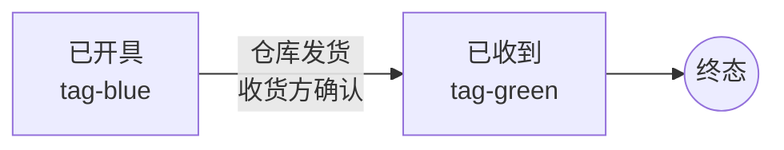

# 02.12 仓储管理-提放货管理-提货管理 v1.0 终版

> **状态**：v1.0 终版（**基于原型 67 截图 + v1.7.99.86 + v1.7.99.152 状态机交互**）
> **生成时间**：2026-08-05 17:30
> **配套文档**：[00-项目总览与对接.md](../00-项目总览与对接.md) / [01-模块拆解大框架.md](../01-模块拆解大框架.md) / [p-warehouse-inbound.md](./p-warehouse-inbound.md) / [p-warehouse-release.md](./p-warehouse-release.md)
> **当前页**：`warehouse-pickup.html`
> **文档状态**：v1.7.99.152 加枚举数据 + 优化状态机为可交互状态

---

## 0. 章节导航

1. 业务定位
2. 状态机（2 状态）
3. 核心实体
4. 字段规则
5. 按钮交互
6. mock 数据
7. 异常处理
8. 跨模块流转
9. 文档版本

---

## 1. 业务定位

**提货管理**是港通供应链的**货物出厂管理**——下游客户根据销售合同/订单，向上游开具提货单，仓库根据提货单发货。

**业务流程**：
1. 下游客户（收货方）发起提货申请
2. 上游（开具方）开具提货单 → 状态：**已开具**
3. 仓库发货、收货方确认收货 → 状态：**已收到**
4. 提货完成，进入结算环节

**v1.7.99.152 状态机交互**：
- 2 个状态 tab：**已开具** / **已收到**
- tab 可点击切换 → 切换后表格数据按 tab 筛选
- 默认显示"已开具" tab 数据

---

## 2. 状态机（2 状态）

### 2.1 状态枚举

| 状态 | 颜色 | 含义 | 触发动作 |
|------|------|------|----------|
| **已开具** | 蓝 (tag-blue) | 提货单已由开具方出具 | 仓库按提货单发货 |
| **已收到** | 绿 (tag-green) | 收货方已确认收到货物 | 提货完成，进入结算 |

### 2.2 状态流转图

### 2.3 状态机交互（v1.7.99.152）

- **tab 切换**：`onclick="switchTab(this, 'issued')"` / `switchTab(this, 'received')`
- **数据渲染**：`renderPickup(key)` 函数根据 key 渲染对应 mock 数据
- **空状态**：无数据时显示居中文件夹 SVG 图标 + "暂无数据" 文字

---

## 4. 字段规则

### 4.1 筛选字段（5 字段）

| 字段名 | 类型 | 说明 |
|--------|------|------|
| 编号 | 字符串 | 支持订单/合同/提货编号模糊查询 |
| 提货开具方 | 字符串 | 模糊查询企业名称 |
| 提货接收方 | 字符串 | 模糊查询企业名称 |
| 提货日期 | 日期范围 | yyyy-MM-dd ~ yyyy-MM-dd |
| 状态 | 枚举 | 已开具 / 已收到 |

### 4.2 列表字段（9 列）

| 字段名 | 类型 | 说明 |
|--------|------|------|
| 合同编号 | 字符串 | 关联销售合同/采购合同 |
| 提货编号 | 字符串 | 提货单号，TH{YYYYMMDD}-{0001} 格式 |
| 提货开具方 | 字符串 | 出具提货单的企业 |
| 提货接收方 | 字符串 | 收货企业 |
| 提货日期 | 日期 | yyyy-MM-dd |
| 提货数量(吨) | 数字 | 右对齐，等宽数字 |
| 状态 | 枚举 | 已开具/已收到 |
| 最新操作时间 | 日期时间 | yyyy-MM-dd HH:mm |
| 操作 | 链接 | 查看 |

---

## 5. 按钮交互

| 按钮 | 位置 | 触发 |
|------|------|------|
| 提货申请 | 右上角 | → `warehouse-pickup-new.html`（v1.0 后续） |
| 数据导出 | tab bar 右侧 | 导出当前 tab 数据 |
| 查看 | 表格行末 | → `warehouse-pickup-detail.html`（v1.0 后续） |
| tab 切换 | tab bar | 切换状态机 |

---

## 6. mock 数据（v1.7.99.152）

### 6.1 已开具（6 行）

| 合同编号 | 提货编号 | 开具方 | 接收方 | 日期 | 数量(吨) |
|----------|----------|--------|--------|------|----------|
| GTGYL-MSXS-20241115-001 | TH20241115-0001 | 中豫港通供应链 | 河南港通供应链 | 2024-11-15 | 1,200.50 |
| XSHT-TYYGJ-20241203-002 | TH20241203-0001 | 天宇源国际贸易 | 荣厚实业有限公司 | 2024-12-03 | 850.00 |
| CGHT-GQCS-20241018-003 | TH20241018-0001 | 高琦测试煤业 | 河南荣厚实业 | 2024-10-18 | 2,350.75 |
| XSHT-SXJY-20241122-001 | TH20241122-0001 | 山西锦阳鑫煤炭 | 郑州信必达国际 | 2024-11-22 | 1,800.00 |
| GTGYL-HKJC-20241208-002 | TH20241208-0001 | 河南机场物流 | 东航物流有限公司 | 2024-12-08 | 650.30 |
| CGHT-SYMT-20241128-001 | TH20241128-0001 | 陕煤物流监管 | 晋煤集团 | 2024-11-28 | 3,200.00 |

### 6.2 已收到（5 行）

| 合同编号 | 提货编号 | 开具方 | 接收方 | 日期 | 数量(吨) |
|----------|----------|--------|--------|------|----------|
| GTGYL-MSXS-20240915-001 | TH20240915-0001 | 中豫港通供应链 | 河南港通供应链 | 2024-09-15 | 950.00 |
| XSHT-TYYGJ-20241008-001 | TH20241008-0001 | 天宇源国际贸易 | 荣厚实业有限公司 | 2024-10-08 | 720.50 |
| CGHT-GQCS-20240825-002 | TH20240825-0001 | 高琦测试煤业 | 河南荣厚实业 | 2024-08-25 | 1,580.00 |
| XSHT-SXJY-20240711-001 | TH20240711-0001 | 山西锦阳鑫煤炭 | 郑州信必达国际 | 2024-07-11 | 2,100.00 |
| CGHT-SYMT-20240618-001 | TH20240618-0001 | 陕煤物流监管 | 晋煤集团 | 2024-06-18 | 1,750.80 |

### 6.3 mock 数据规范（v1.7.99.152 决策）

- **合同编号规范**：`{业务前缀}-{业务类型}-{YYYYMMDD}-{序号}` 格式
  - GTGYL = 港通供应链 / XSHT = 销售合同 / CGHT = 采购合同 / HNRNH = 河南荣厚 / HSHT = 灰石合同
  - 业务类型 = MSXS(煤炭销售) / TYYGJ(天宇源国际) / GQCS(高琦测试) / SXJY(山西锦阳) / SYMT(陕煤物流) / HKJC(河南机场) / HNJH(河南黄金)
- **提货编号规范**：`TH{YYYYMMDD}-{0001}` 格式
- **脱敏规范**：所有手机号/银行卡/信用代码/邮箱按统一脱敏规范

---

## 7. 异常处理

| 场景 | 处理 |
|------|------|
| 提货数量超过合同剩余 | 提交时拦截 + 提示"提货数量超过合同可提货数量" |
| 提货日期早于合同生效日 | 提交时拦截 + 提示"提货日期不能早于合同生效日" |
| 状态冲突 | 状态机校验 + 提示"当前状态不可流转" |

---

## 8. 跨模块流转

| 入口模块 | 流转触发 | 目标页 |
|----------|----------|--------|
| 销售合同详情 | 点击"提货" | `warehouse-pickup.html?contractId=xxx` |
| 仓储管理 | 点击"提货管理" | `warehouse-pickup.html`（当前页） |
| 提货申请 | 右上角"提货申请"按钮 | `warehouse-pickup-new.html`（v1.0 后续） |
| 放货管理 | 流转关系：放货 vs 提货（前者出厂，后者入库） | `warehouse-release.html` |

---

## 9. 文档版本

- **v1.0（2026-07-24 14:55）**：基于 67 截图首次终版
- - **v1.7.99.86（2026-08-02）**：列表页占位 + 2 tab 静态（已开具/已收到）
- - **v1.7.99.152（2026-08-05 17:30）**：加枚举数据 + 优化状态机为可交互状态
  - 🔴 2 tab 加 mock：已开具 6 行 + 已收到 5 行
  - 🔴 PICKUP_MOCK 对象 + renderPickup(key) 函数 + switchTab 交互
  - 🔴 合同编号规范：{业务前缀}-{业务类型}-{YYYYMMDD}-{序号} 格式
  - 🔴 提货编号规范：TH{YYYYMMDD}-{0001} 格式
  - 🟡 不修改全局 design-system.css / list-page.css（v1.7.99.69+ 经验）
  - 🟡 不修改其他模块页面（v1.7.99.86 经验）
  - 详见：[v1.7.99-changelog.md](./v1.7.99-changelog.md) v1.7.99.152 节

修改记录：见 `06-修改记录.md`
