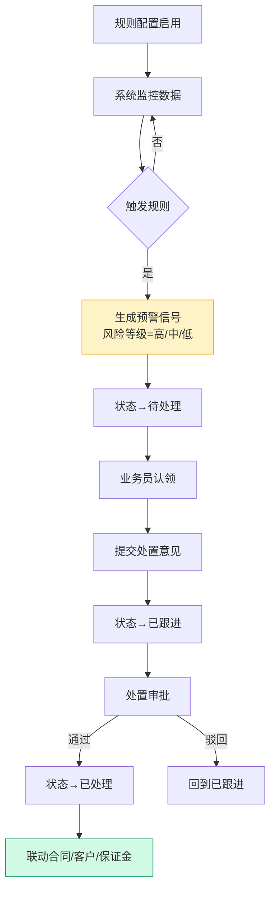
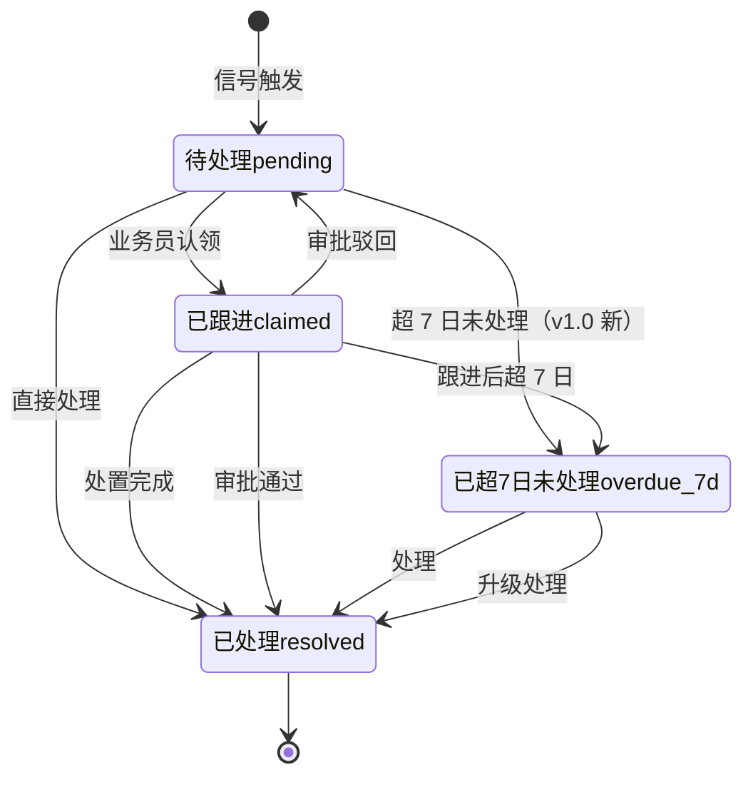

# 02.11 预警中心 v1.0 终版

> **状态**：v1.0 终版（**新顶级模块，基于原型 79-81 截图**）
> **生成时间**：2026-07-24 14:55
> **配套文档**：[00-项目总览与对接.md](../00-项目总览与对接.md) / [01-模块拆解大框架.md](../01-模块拆解大框架.md) / [02.10-保证金管理.md](./02.10-保证金管理.md) / [02.08-盯市价格管理.md](./02.08-盯市价格管理.md)
> **复用度**：🟢 **90%（大幅复用）**——主产品 `bo_risk_alert_xxx` + `bo_risk_alert_xxx` + `bo_risk_alert_xxx` 高度匹配

---

> **当前页**：`warning-detail.html`
> **文档状态**：基于源模块文档的占位版，精确字段待 review 后按原型图精修

## 0. 章节导航

1. 业务定位
2. 业务流程全景
3. 核心实体（3 张表）
4. 5 状态机
5. 字段规则
6. 按钮交互
7. 异常处理
8. 跨模块流转

---

## 1. 业务定位

**预警中心**是港通供应链的**预警信号监控中心**（**v1.0 新顶级模块**）——基于规则配置，监控企业/交易/价格波动，触发预警信号并跟踪处置。

**港通特色**——3 大预警类型：**企业监控** / **交易监控** / **价格波动**（基于 79 截图）。

### 1.1 关键规则

1. **2 个子菜单**（基于 79 截图）：**预警查询** / **预警设置**
2. **3 大预警类型**：
   - **企业监控**（客户黑名单/失信被执行/风险等级变化等）
   - **交易监控**（合同超期/订单异常/付款逾期等）
   - **价格波动**（指数跌破预警线/红线）
3. **3 风险等级**：高/中/低（带颜色标记）
4. **4 状态**：待处理 / 已跟进 / 已处理 / 已超 7 日仍未处理

### 1.2 3 个页面（sitemap）

| # | 页面 | 说明 |
|---|------|------|
| 1 | **预警列表页**（数据概览 + 预警数据）| 3 卡片统计 + 3 Tab 列表 |
| 2 | **预警详情页** | 单个预警信号详情 + 处置 |
| 3 | **预警规则配置** | 规则新增/编辑/启用/停用 |

---

## 2. 业务流程全景

### 2.1 预警信号流转流程

---

## 4. 4 状态机（**v1.0 新增第 4 状态**）

### 4.1 4 状态说明（基于 79 截图）

| # | 状态 | 中文 | 触发 | 出口 |
|---|------|------|------|------|
| 1 | `pending` | 待处理 | 信号触发 | 已跟进 / 已处理 / 已超 7 日未处理 |
| 2 | `claimed` | 已跟进 | 业务员认领 | 已处理 / 回到待处理 / 已超 7 日未处理 |
| 3 | `resolved` | 已处理 | 处置完成/审批通过 | 终态 |
| 4 | `overdue_7d` | **已超 7 日仍未处理**（v1.0 新）| 超 7 日未处理 | 已处理 / 升级处理 |

---

## 5. 字段规则

### 5.1 预警类型 `rule_type` / `signal_type`

- 3 种（基于 79 截图）：
  - **`enterprise`**（企业监控）
  - **`transaction`**（交易监控）
  - **`price`**（价格波动）

### 5.2 风险等级 `risk_level`（**v1.0 新增**）

- 3 种：`high` / `medium` / `low`（带颜色标记）

### 5.3 是否超 7 日未处理 `is_overdue_7d`（**v1.0 新增**）

- 0/1
- 系统自动计算：当前日期 - signal_date > 7 天

---

## 6. 按钮交互

### 6.1 列表页（基于 79 截图）

#### 6.1.1 顶部数据概览（3 卡片）

| 卡片 | 字段 |
|------|------|
| **预警总计** | 总数（如 10000 条）|
| **未处理预警** | 待处理 + 已跟进 + 已超 7 日未处理（如 5000 条）|
| **超 7 日未处理** | 已超 7 日未处理（如 3000 条）|

每个卡片有 4 个图例：全部 / 高风险 / 中风险 / 低风险 + 3 维度柱状图：企业监控 / 交易监控 / 价格波动

#### 6.1.2 预警数据列表

| 筛选 | 说明 |
|------|------|
| **预警日期** | 开始日期 ~ 结束日期 |
| **规则名称** | 模糊搜索 |
| **规则类型** | 下拉（企业监控/交易监控/价格波动）|
| **触发预警指标** | 文本输入 |
| **风险等级** | 下拉（高/中/低）|
| 按钮 | 查询 / 重置 / 导出 |

#### 6.1.3 3 大 Tab

| Tab | 说明 |
|-----|------|
| **企业监控** | 客户风险/黑名单/失信被执行等 |
| **交易监控** | 合同超期/订单异常/付款逾期等 |
| **价格波动** | 指数跌破预警线/红线 |

#### 6.1.4 4 状态 Tab

| Tab | 说明 |
|-----|------|
| 全部 | 所有 |
| 待处理 (70) | `pending` |
| 已跟进 (30) | `claimed` |
| 已处理 (300) | `resolved` |
| **已超 7 日仍未处理 (20)**（v1.0 新）| `overdue_7d` |

#### 6.1.5 列表字段

| 列 | 说明 |
|---|------|
| 预警日期 | signal_date |
| 预警内容 | signal_content |
| 风险等级 | 高/中/低（带颜色）|
| 预警状态 | 4 状态之一 |
| 规则名称 | rule_name |
| 规则类型 | enterprise/transaction/price |
| 触发[指标] | trigger_indicator |
| 操作 | 详情/认领/处置 |

---

## 7. 异常处理

| 异常场景 | 提示文案 | 处理动作 |
|---------|---------|---------|
| 信号未配置模板 | "规则 X 未配置预警模板" | 阻止信号生成 |
| 触发值超出指标范围 | "触发值 X 超出指标 Y 范围" | 黄灯提醒 |
| 已超 7 日未处理 | "预警 X 已超 7 日未处理" | 升级通知到上级 |
| 同规则 24h 内重复触发 | "同规则 24h 内已触发 X 次，合并为 1 条" | 合并信号 |

---

## 8. 跨模块流转

### 8.1 上游触发

| 触发模块 | 触发条件 | 触发动作 |
|---------|---------|---------|
| 客户管理（02.02）| 客户风险等级变化/黑名单命中 | 触发企业监控 |
| 合同/订单（02.03/02.04）| 合同超期/订单异常/付款逾期 | 触发交易监控 |
| 盯市价格（02.08）| 指数跌破预警线/红线 | 触发价格波动 |
| 保证金（02.10）| 余额跌破预警线/红线 | 触发企业监控/交易监控 |

### 8.2 下游触发

| 触发模块 | 触发条件 | 触发动作 |
|---------|---------|---------|
| 客户管理（02.02）| 高风险预警已处理 | 更新客户风险等级 |
| 合同管理（02.03）| 交易监控预警已处理 | 通知业务员 |
| 追保函（02.09）| 价格波动预警已处理 | 触发追保函 |

---

## 10. 文档版本

- **v1.0（2026-07-24 14:55）**：基于 79 截图 + sitemap 首次终版，作为范本用于后端开发
- - **v1.7.99.x（2026-07-28）**：基于 30+ 版本迭代同步
  - 🟡 列表页占位 = "全部"（全站统一）
  - 🟡 状态 tag 颜色编码
  - 🟡 流程图统一用 Mermaid
  - 详见：[v1.7.99-changelog.md](./v1.7.99-changelog.md)
修改记录：见 `06-修改记录.md`