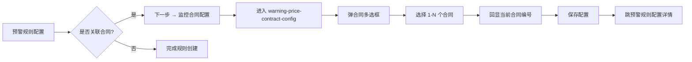

# 08.1.99 监控合同配置 v1.7.99.250 终版

> **状态**：v1.7.99.250 终版（**v1.0 基础上 + v1.7.99.250 重构**）
> **生成时间**：2026-09-24 16:00
> **配套文档**：[00-项目总览与对接.md](../00-项目总览与对接.md) / [01-模块拆解大框架.md](../01-模块拆解大框架.md) / [p-warning-config.md](./p-warning-config.md) / [p-warning-detail.md](./p-warning-detail.md) / [02.11-预警中心.md](./02.11-预警中心.md)
> **需求来源**：本仓库 v1.7.99.250 改造 + 飞书《豫港通用户使用手册（内部版）》第 8.1 节"预警管理"
> **复用度**：🟡 70%（复用 v1.0 预警规则 + v1.7.99.250 监控合同配置专属 UI）

---

> **当前页**：`warning-price-contract-config.html`（监控合同配置页）
> **关联页**：`warning-config.html`（预警规则配置）/ `warning-detail.html`（预警详情）

## 0. 章节导航

1. 业务定位
2. 业务流程全景
3. 字段规则
4. 按钮交互
5. 异常处理
6. 跨模块流转
7. 文档版本

---

## 1. 业务定位

**监控合同配置**是预警中心的**规则配置子页**——业务人员在"预警规则配置 → 价格波动 → 监控合同配置"路径下，**为已选定的价格波动规则绑定具体合同**（可多选框架及单批次合同）。

| 维度 | 监控合同配置（本页）| 价格波动规则（warning-config）|
|------|---------------------|-------------------------------|
| 业务语义 | 规则绑定到具体合同 | 规则配置（15+ 规则类型）|
| 触发场景 | 创建价格规则后"下一步" | 创建价格规则时"是否关联合同"=是 |
| 选择范围 | 单选/多选合同（框架或单批次）| 业务类型/规则类型/考核项/阈值 |

### 1.1 入口

| 入口 | URL | 说明 |
|------|------|------|
| 预警规则配置 → 价格波动 → 监控合同配置 | `./warning-price-contract-config.html?ruleId={规则ID}` | 主入口 |
| 顶部面包屑：预警中心 / 预警规则配置 / 价格波动 / **监控合同配置** | - | 面包屑显示 |

### 1.2 v1.7.99.250 关键改动

- 从 v1.0 单页面重构为**专门子页**——监控合同配置从价格波动配置中拆出独立
- v1.7.99.250 关键 UI：
  - 顶部"当前：{已选合同编号}"指示器（v1.7.99.250 加）
  - 弹窗支持多选合同（框架 + 单批次）
  - 选中后实时回显"当前合同编号"

---

## 2. 业务流程全景



**关键决策**：
- **关联合同 vs 不关联合同**（来自手册 8.1）：选择关联合同时按实际需求选对应合同（可多选框架及单批次合同）；选择否，所设置的规则仅监听本期价格与往期价格的预警信息

---

## 3. 字段规则

### 3.1 顶部指示器

| 字段 | 类型 | 说明 |
|------|------|------|
| 当前合同编号 | display | 单选时显示合同编号；多选时显示"+N 个" |

### 3.2 合同选择弹窗

| 字段 | 类型 | 必填 | 校验 |
|------|------|------|------|
| 合同编号 | input | - | 模糊匹配 |
| 销售方/采购方 | input | - | 模糊匹配 |
| 业务类型 | select | - | 全部/存货业务/预付业务/账期业务/购销业务 |
| 签订日期 | date-range | - | 起止日期 |
| 合同类型 | select | - | 全部/框架合同/单批次合同 |
| 合同状态 | select | - | 全部/执行中/待上传双签合同/已结清 |
| 选择 | checkbox | - | 支持多选 |

### 3.3 业务规则

| 业务类型 | 适用合同范围 |
|----------|--------------|
| **存货业务** | 全部 |
| **预付业务** | v1.7.99.x 待补 |
| **账期业务** | v1.7.99.x 待补 |
| **购销业务** | v1.7.99.x 待补 |

**v1.7.99.250 决策**：当前监控合同配置支持**框架 + 单批次合同**，且仅支持"执行中"或"待上传双签合同"状态。

---

## 4. 按钮交互

### 4.1 主操作按钮

| 按钮 | 位置 | 行为 |
|------|------|------|
| **保存** | 底部 | 保存所选合同到规则 |
| **取消** | 底部 | 返回预警规则配置 |

### 4.2 辅助按钮

| 按钮 | 位置 | 行为 |
|------|------|------|
| 选择合同 | 顶部 | 弹合同多选框 |
| 清除选择 | 顶部（已选时显示）| 清空已选合同 |
| 单个合同删除 | 当前合同编号右侧 | 移除该合同 |

### 4.3 合同多选框交互

```javascript
// 伪代码示意
function toggleContract(contractNo) {
  if (_selectedContracts.has(contractNo)) {
    _selectedContracts.delete(contractNo);
  } else {
    _selectedContracts.add(contractNo);
  }
  updateIndicator();  // 更新顶部指示器
}
```

---

## 5. 异常处理

| 场景 | 处理 |
|------|------|
| URL 参数 `ruleId` 缺失 | 顶部红色 bar 提示"规则不存在" + 返回预警规则配置 |
| 规则已删除 | 顶部红色 bar 提示"该规则已删除" |
| 选择已作废合同 | 红字提示"该合同已作废，无法监控" |
| 选择非"执行中/待上传双签合同"状态 | 红字提示"请选择执行中或待上传双签合同" |
| 取消操作 | 保留当前选择，下次进入仍可继续 |

---

## 6. 跨模块流转

### 6.1 与预警规则配置（warning-config）

- "下一步"按钮 → 进入本页
- 保存成功 → 跳预警规则配置详情（含已选合同列表）

### 6.2 与销售/采购合同（02.03）

- 合同选择弹窗 → 从 `contract-purchase.html` / `contract-sales.html` 取合同数据
- 仅显示"执行中/待上传双签合同"

### 6.3 与价格波动规则（v1.7.99.250）

- 监控合同配置绑定到**具体的价格波动规则**
- 一个价格波动规则可绑定**多个合同**
- 价格波动规则触发时 → 监控的合同同步触发预警

---

## 7. 文档版本

- **v1.0（2026-07-24）**：预警规则配置 v1.0 终版（合并监控合同配置）
- **v1.7.99.250（2026-08-31）**：**监控合同配置独立子页** + 合同多选框 + 顶部"当前合同编号"指示器
- **2026-09-24**：首次写 PRD（基于手册 8.1 + v1.7.99.250 沉淀）

修改记录：见 `v1.7.99-changelog.md`