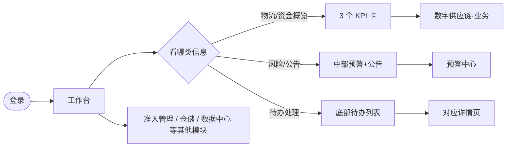
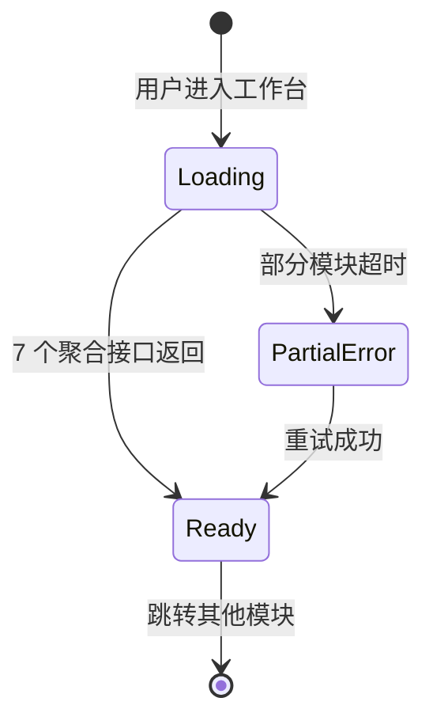

# 工作台

> 一级菜单 · 业务端第 1 个页面

## 1. 元信息

| 项目 | 内容 |
|---|---|
| 页面名称 | 工作台 |
| 页面文件 | `pages/workbench.html` |
| 文档版本 | v1.0（2026-07-24） |
| 对应原型 | 84 / 83 张图（工作台为新增首页） |
| 所属模块 | 工作台（一级菜单第 1 个） |
| 角色覆盖 | 全部业务角色（港通供应链业务端用户） |
| 页面定位 | **业务端首页 / 数据聚合页**——不处理具体业务，作为 7 个一级模块的入口汇总 |

---

## 2. 用户旅程图

工作台是首页，无前置流程。用户登录后默认进入工作台，再从工作台进入各业务模块。



**当前节点高亮**：本页面即节点 B「工作台」。

---

## 3. 角色操作矩阵

工作台是数据聚合页，所有业务角色看到的模块一致，差异在于"看到的数据范围"（按角色权限过滤）：

| 角色 | 看到的卡/区块 | 备注 |
|---|---|---|
| 港通供应链-业务员 | 全部 3 KPI + 预警 + 公告 + 待办 | 默认视图（图 2 截图） |
| 港通供应链-业务主管 | 同上 + 团队待办汇总 | — |
| 港通供应链-风控 | 同上 + 风险预警加重 | 预警栏"立即处理"按钮加红点 |
| 港通供应链-财务 | 同上 + 资金卡详情 | 资金卡默认展开本年 |
| 港通供应链-管理员 | 全部 + 系统设置入口 | 公告区显示"发布公告"按钮 |

---

## 4. 页面结构 + 字段规则

### 4.1 整体布局

```
┌─────────────────────────────────────────────────────────────┐
│  Topbar（logo · 7 一级菜单 · 消息 · 用户）                  │
├─────────────────────────────────────────────────────────────┤
│  ┌──────────┐ ┌──────────┐ ┌──────────────┐               │
│  │ 物流量   │ │ 订单数   │ │ 融资资金     │ ← 3 KPI       │
│  │ 运输分布 │ │ 运输分布 │ │ 放款 / 还款  │               │
│  └──────────┘ └──────────┘ └──────────────┘               │
│  ┌─────────────────────┐ ┌──────────────────┐             │
│  │ 预警提醒（高/中/低）│ │ 公告             │ ← 中部       │
│  └─────────────────────┘ └──────────────────┘             │
│  ┌──────────────────────────────────────────┐             │
│  │ 待办事项（11 tabs + table + 分页）        │ ← 底部      │
│  └──────────────────────────────────────────┘             │
└─────────────────────────────────────────────────────────────┘
```

### 4.2 区块 1：3 个 KPI 卡

#### 卡 1：物流量（吨）运输方式分布

| 字段 | 规则 |
|---|---|
| 卡片标题 | "物流量（吨）运输方式分布"（14px 文本） |
| 右上 meta | 时间范围筛选，默认"本月"，下拉：本月/本季/本年/全部 |
| 中心数字 | 物流总量（如 20,000 吨），22px 粗体 |
| 环形图 | 火运占比段（橙色 #FB923C）+ 其他占比段（浅灰 #FEE2E2） |
| 左侧标注 | "● 火运 X吨 XX%"（左下角，引线引到环形图） |
| 底部图例 | "● 其他" + "● 火运" 两点 |
| 数据源 | 发货管理 · `shipmentList` 聚合（按 transportWay 维度） |

#### 卡 2：订单数（笔）运输方式分布

| 字段 | 规则 |
|---|---|
| 卡片标题 | "订单数（笔）运输方式分布" |
| 中心数字 | 订单总吨数（与"笔"不同，此处展示按订单维度聚合后的吨数） |
| 环形图配色 | 同卡 1（火运橙 + 其他灰） |
| 左侧标注 | "● 火运 X吨 XX%" |
| 数据源 | 订单管理 · `orderList` 聚合 |

> **设计说明**：图 2 实际数据（20000 吨 / 3037 吨 / 100%）表明该业务方目前只有"火运"一种运输方式，其他类型为 0。环形图保持"火运=100%"状态，但保留"其他"图例以便未来扩展（水运/汽运/联运）。

#### 卡 3：融资资金

| 字段 | 规则 |
|---|---|
| 卡片标题 | "融资资金" |
| 右上筛选 | "全部 \| 本年 \| ↓"（默认"全部"） |
| 放款金额卡 | 蓝紫色背景（`#EFF6FF`） + "+" 图标 + 数值（如 0 元） |
| 还款金额卡 | 橙色背景（`#FFF7ED`） + "−" 图标 + 数值 |
| 数值格式 | 整数显示 0；>10000 自动转换为"万"；保留 2 位小数 |
| 数据源 | 付款管理-放款 + 回款管理-还款 |

### 4.3 区块 2：预警提醒 + 公告

#### 预警提醒卡

| 字段 | 规则 |
|---|---|
| 标题 | "预警提醒" + 红色小圆点（存在未读时显示） |
| 3 张子卡 | 高风险（红）/ 中风险（黄）/ 低风险（蓝） |
| 数字 | 当前级别预警数（如 0/项） |
| Tag 标签 | "高风险" / "中风险" / "低风险"（同色系背景） |
| 描述文案 | 高/中："有风险记得要及时处理"<br>低："很棒!目前暂无风险存在" |
| 立即处理 | 点击跳 `pages/warning-list.html?level=high/mid/low` |
| 右上 | "查看全部 ›" 跳预警中心列表页 |
| 数据源 | 预警中心 · `warningList` 聚合 |

#### 公告卡

| 字段 | 规则 |
|---|---|
| 标题 | "公告" |
| 右上 | "更多 ›" 跳公告列表 |
| 空状态 | "暂无公告"（图 2 当前状态，灰色 13px 居中） |
| 有数据时 | 公告列表（标题 + 发布时间 + 摘要），最多展示 5 条 |
| 数据源 | 公告管理（待建） |

### 4.4 区块 4：待办事项（v1.7.99.225 重做）

| 字段 | 规则 |
|---|---|
| 标题 | "待办事项" + 右上"查看全部 ›" 跳待办总览 |
| Tabs | 10 个一级 tab，**横排可换行**（flex-wrap） |
| 默认 tab | "上下游合同审批"（业务方最高频） |
| 表格列 | 合同编号 / 买/卖方企业名称（带徽章）/ 收货人 / 数量(吨) / 基准价格(元) / 运输方式 / 操作 |
| 操作列 | 文本链接"查看" → 跳对应详情页 |
| 分页 | 底部右下，"共 X 条 · 第 1/N 页" + 翻页按钮 |
| 数据源 | 各模块聚合（按 tab 类型路由到不同 list） |
| 切换交互 | tab 切换 = 切 active class + 重渲染表格（10.2/10.8 教训避免只切 active 不切数据） |

#### 10 个 Tab 列表（v1.7.99.225 重做）

| # | Tab 名称 | data-tab | 跳转发货源 | 跳详情页 |
|---|---|---|---|---|
| 1 | 上下游合同审批 | `contract-approval` | 合同列表待审批 | `contract-purchase-order-detail` |
| 2 | 上下游双签合同上传 | `contract-dual-sign` | 合同列表待双签 | `contract-purchase-order-detail` |
| 3 | 待关联业务线 | `bizline-pending-link` | 业务线列表未关联 | `business-line-detail` |
| 4 | 待收货确认 | `recv-confirm` | 发货列表待收货 | `shipment-in-detail` |
| 5 | 货转待审批 | `goods-transfer-approval` | 货转列表待审批 | `goods-transfer` |
| 6 | 待上传上下游货转生效单据 | `goods-transfer-voucher` | 货转列表已生效待上传 | `goods-transfer` |
| 7 | 待审批结算单 | `settlement-approval` | 结算单列表待审批 | `settlement-purchase` / `settlement-sales` |
| 8 | 待付款审批 | `payment-approval` | 付款列表待审批 | `payment-list` |
| 9 | 回款待认领 | `receipt-claim` | 回款列表待认领 | `receipt-claim-detail` |
| 10 | 待上传发票 | `invoice-upload` | 发票列表待上传 | `invoice-list` |

> 相比 v1.7.99.224 旧版 11 个 tab：合并"上游合同签署+上游合同确认"为"上下游合同审批+上下游双签合同上传"；增加"货转待审批/待上传上下游货转生效单据/待审批结算单/待付款审批/待上传发票"5 个新 tab；删除"缴权发/待完善资产/出仓单管理/仓单管理/确认单开具/商品确认"6 个旧 tab。

#### 表格列详细规则（v1.7.99.225 重做）

| 列名 | 类型 | 规则 |
|---|---|---|
| 合同编号 | string | `SK + 业务前缀 + 8位日期 + 3位流水`（等宽字体） |
| **买/卖方企业名称** | object | **徽章 + 公司名**：徽章区分"卖方"（绿底 #ECFDF5 + #047857）/ "买方"（蓝底 #EFF6FF + #1E40AF），公司名完整不截断（超过列宽省略号 + title 提示） |
| 收货人 | string | "—" 表示无（v1.7.99.225 改 "收货人简称" → "收货人"） |
| 数量(吨) | number | 千分位逗号，无小数 |
| 基准价格(元) | number | 千分位逗号 + 2 位小数 |
| 运输方式 | enum | 火运 / 水运 / 汽运 / 联运 |
| 操作 | action | "查看" 文本链接 |

#### 徽章样式（v1.7.99.225 新增）

| 角色 | 背景色 | 文字色 | 边框 |
|---|---|---|---|
| 卖方 (party: 'seller') | `#ECFDF5` 淡绿 | `#047857` 深绿 | `#A7F3D0` 浅绿 |
| 买方 (party: 'buyer')  | `#EFF6FF` 淡蓝 | `#1E40AF` 深蓝 | `#BFDBFE` 浅蓝 |

#### 切换交互（v1.7.99.225 新增）

- **tab 切换** = 切 active class + 调用 `renderTodoTable(tabKey)` 重渲染 `<tbody>` + 更新 `<span id="todoCount">` 数字
- **初始渲染** = 页面加载时调用 `renderTodoTable('contract-approval')`（默认 active tab）
- **空状态** = `TODO_MOCK[tabKey]` 为空时显示"暂无待办"灰色居中提示
- **MOCK 数据** = `var TODO_MOCK = { 'contract-approval': [...], 'contract-dual-sign': [...], ... }` 共 10 个 key
- **防翻车**（10.2 教训）：JS 字符串里 `</script>` 必须转义为 `<\/script>` —— 已 `node --check` 验证通过
- **防假切**（10.8 教训）：tab onclick 必须真的调 `renderTodoTable(key)`，不能只切 active class

#### 工作台 size

v1.7.99.224 workbench.html size → v1.7.99.225（待部署后回填）
---

## 5. 状态机

> **本页面无独立业务状态机**。所有数字和待办都是**对下游 7 个一级模块的实时聚合**，本身不维护任何状态。



- **数据刷新策略**：进入页面时一次性拉取，5 分钟内不重复请求；tab 切换不刷新（数据已就绪）
- **待办 tab 状态**：仅前端高亮状态，无业务副作用
- **数字与下游同步**：待办数字 30s 轮询一次（或 SSE），保证"立即处理"按钮的数字与预警中心列表一致

---

## 6. 按钮交互

| 按钮 | 位置 | 点击行为 |
|---|---|---|
| 顶 nav 7 一级菜单 | topbar | 切换模块（准入/数字供应链/仓储/预警/数据中心/账户） |
| 通知 icon | topbar 右侧 | 跳通知中心（未读数 +1） |
| 用户头像 | topbar 右侧 | 下拉菜单（个人中心 / 退出） |
| KPI 卡 1/2 右上"本月" | 区块 1 | 下拉切换时间维度（本月/本季/本年/全部） |
| KPI 卡 3 右上"全部/本年" | 区块 1 | 切换资金统计维度 |
| 预警"立即处理" | 区块 2 | 跳预警中心列表 + level 过滤 |
| 公告"更多" | 区块 2 | 跳公告列表页（待建） |
| 待办 tabs（11 个） | 区块 3 | 切换 tab + 重新加载对应列表 |
| 待办"查看" | 区块 3 列表 | 跳对应单据详情页 |
| 待办分页 | 区块 3 | 翻页（数据 mock 仅 1 页） |

---

## 7. 异常处理

| 异常场景 | 系统行为 |
|---|---|
| 聚合接口超时（>5s） | 该区块降级为"暂无数据"，其他区块正常显示 |
| 全部接口失败 | 页面顶部红色横幅"数据加载失败，请 [重试]" |
| 某 KPI 卡数据为 0 | 仍展示环形图，中心数字显示 "0"，图例保留 |
| 某预警级别为 0 | 数字显示 "0/项"，描述文案保留（高/中"有风险记得要及时处理"即使 0 也保留提示） |
| 待办列表为空 | 表格显示空状态行"暂无待办" |
| 11 个 tab 中某个无数据 | 仍可点击，列表显示空状态 |
| 用户无任何模块权限 | 工作台所有区块均显示"无访问权限"占位 |
| 浏览器禁用 JS | 静态展示页面骨架（环形图/数字/列表/分页按钮可见，不可交互） |

---

## 9. 待确认事项

- [ ] 11 个待办 tab 是否完整（"待完善资产"/"仓库管理"/"确认单开具"对应的源模块需进一步明确）
- [ ] "公告"模块是否本期开发（目前为空状态，建议先做静态展示）
- [ ] 资金卡"放款/还款"是否需要按"本年/本季"细分维度切换
- [ ] 工作台数据刷新策略：5 分钟缓存 vs 30s 轮询 vs SSE 实时
---

## 修改记录

### v1.7.99.x（2026-07-28）

- 🟡 工作台 v1.7.97 4 card 独立版本
- 🟡 列表页占位 = "全部"（全站统一）
- 详见：[v1.7.99-changelog.md](./v1.7.99-changelog.md)
